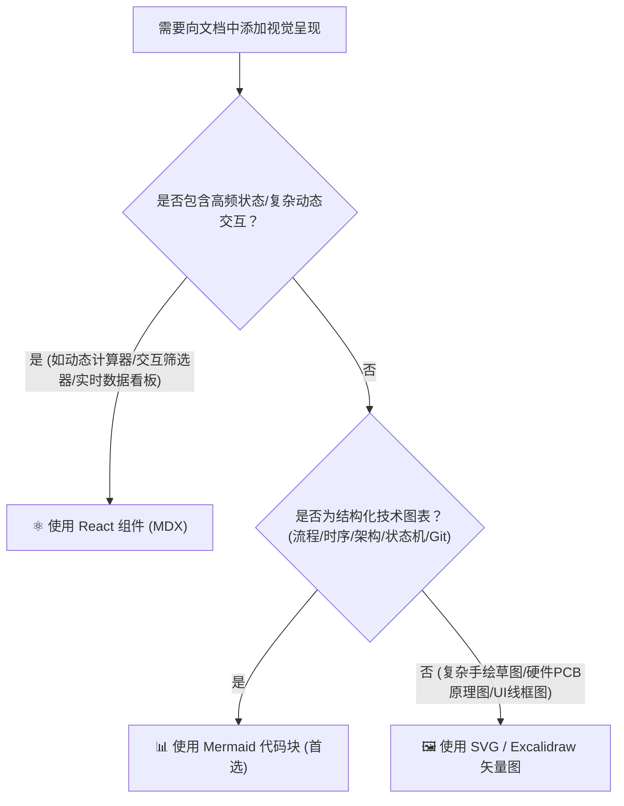

# PandaWiki 知识库写作与构建规范

本规范为 **PandaWiki**（基于 Docusaurus + Anthropic Claude Editorial 主题）的官方写作与可视化决策准则。所有 Agent 在为本仓库编写技术文档、设计图表或添加交互时，必须严格遵循以下规则。

---

## 1. 可视化图表选型矩阵（Mermaid vs React vs SVG）

在文档中需要呈现图表、架构或交互时，按以下决策树进行选型：



### 1.1 什么时候必须使用 Mermaid？（首选方案）
* **适用场景**：
  * **系统架构与数据流转**：`flowchart TD / LR`
  * **通信协议与调用时序**：`sequenceDiagram`
  * **生命周期与状态迁移**：`stateDiagram-v2`
  * **Git 分支模型与提交历史**：`gitGraph`
  * **类关系与模块依赖**：`classDiagram`
* **选用理由**：
  * 纯文本 Markdown 代码管理，Git diff 清晰可追溯；
  * 自动跟随 Claude 主题（深色/浅色）自适应反色与高亮；
  * 零打包体积负担，渲染速度极快。
* **样式规范**：
  * 节点颜色优先使用 Claude 调色板：`#f4f2ec`（暖白底）、`#d97757`（陶土重点）、`#c15f3d`（深红线条）。

### 1.2 什么时候使用 React 组件（MDX）？
* **适用场景**：
  * **动态交互小工具**：例如输入波特率自动计算传输时间的计算器；
  * **复杂多维数据图表**：需要鼠标悬停 Tooltip、动态缩放、点击切换数据集的专业图表（使用 Recharts / Chart.js）；
  * **多状态 Tab / 过滤面板**：需要复杂前端状态（`useState` / `useEffect`）的自制组件；
  * **硬件针脚交互示意**：点击针脚高亮显示对应 GPIO 功能的交互式卡片。
* **MDX 语法规范**：
  * 组件放在 `src/components/` 目录下统一导出；
  * 在 `.mdx` 文件顶部显式 `import Component from '@site/src/components/...'`；
  * 避免在 Markdown 中书写未闭合的 JSX 标签或未转义的 `<` / `{` 字符。

### 1.3 什么时候使用 SVG / Excalidraw？
* **适用场景**：
  * 极富艺术感的手绘草图（Excalidraw 导出 SVG）；
  * 高精度硬件电路板实物拓扑图、物理接线图。
* **存放位置**：统一保存在 `static/img/`，并在文档中通过相对根路径引用：``。

---

## 2. 视觉设计语言与排版规范（Anthropic Claude Style）

PandaWiki 的核心设计哲学是 **“人文社科级的极简手稿质感（Editorial Aesthetics）”**：

### 2.1 色彩与质感规范
* **主色调**：Claude 标志性陶土红（Terracotta `#D97757` / Hover `#C15F3D`）；
* **画布底色**：
  * 浅色模式：象牙温润白（Ivory Cream `#FAF9F5`），绝不使用刺眼的 `#FFFFFF` 全屏纯白；
  * 深色模式：暖木炭黑（Warm Charcoal `#181716`），绝不使用死黑 `#000000` 或冷蓝黑；
* **边框质感**：统一使用极细发丝暖边（Light: `#E6E2D8` / Dark: `#33312D`），圆角为 `12px` - `16px`；
* **阴影规范**：柔和的环境微光散斑，避免重度生硬投影。

### 2.2 字体排印规范
* **大标题（H1/H2/H3）**：古典衬线体（`Newsreader` / `Georgia`），字重 `550~600`，字距稍微收紧（`-0.015em`）；
* **正文与段落**：现代人文无衬线（`Inter`），行高扩展至舒展的 `1.78`，段间距适中；
* **代码与命令**：`JetBrains Mono`，搭配暗调圆角背景与行内陶土色点缀；
* **引用块（Blockquote）**：左侧 `3px solid var(--claude-clay)` 陶土条 + 柔和暖色衬底 + 衬线斜体。

### 2.3 文风与叙事原则
* **克制与精准**：剥离浮夸营销词汇，聚焦第一性原理与落地步骤；
* **结构化分层**：标题层级严格遵循 `H1 -> H2 -> H3`，严禁跨级；
* **代码完整性**：提供具备上下文的可直接运行代码，关键路径必须包含排错日志或避坑提醒。

---

## 3. 文档目录结构与 Frontmatter 标准

### 3.1 文件命名与组织
* 文档文件统一放在 `docs/<category>/` 目录下；
* 文件名使用小写连字符命名：`01-topic-name.mdx`（数字前缀用于控制默认自然排序）；
* 每个专题目录必须包含 `_category_.json` 定义侧边栏标题、排序和索引页。

### 3.2 必需的 Frontmatter 元数据
每个 `.mdx` 文件顶部必须包含以下 YAML Frontmatter：

```yaml
---
title: 页面直观标题（无需包含项目名前缀）
sidebar_position: 1
description: 简明扼要的一句话摘要（用于 SEO 与专题索引卡片）
---
```

---

## 4. 快速检查清单（Checklist）

在 Agent 完成文档撰写或修改后，必须执行以下三项自检：
1. [ ] 是否存在技术流程图？若有，是否优先采用了 **Mermaid** 代码块？
2. [ ] 文档中的排版是否符合宽松行高与 Claude 标题字族约定？
3. [ ] 运行 `npm run build` 确保无破损链接（Broken Links）且 MDX 语法编译通过。
