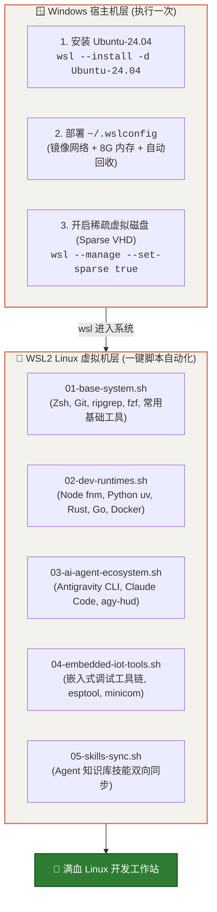

# WSL2 Linux 必备环境与开发全家桶手册

本手册记录了在 Windows 宿主机下通过 WSL2 部署极致、纯净且全自动化的 Linux 开发环境。涵盖外围宿主机配置、自动瘦身稀疏磁盘、现代化开发运行时以及基于 `scripts/` 的一键环境重现方案。

---

## 1. WSL2 架构与全自动初始化流程



---

## 2. 宿主机外围关键配置 (Windows 端先做)

在启动进入 Linux 前，必须先在 Windows 端完成底层资源与虚拟磁盘的约束调优。

### 2.1 安装指定发行版
在 Windows PowerShell 中执行：

```powershell
wsl --install -d Ubuntu-24.04
```

### 2.2 部署生产级 `~/.wslconfig`
在 Windows 用户根目录创建 `C:\Users\<用户名>\.wslconfig`：

```ini
[wsl2]
# 针对 16GB 内存宿主机，为 WSL 分配 6GB~8GB 即可
memory=8GB
processors=10
swap=1GB

# 镜像网络模式（与 Windows 共享 IP，无缝走宿主机代理，无端口映射烦恼）
networkingMode=mirrored
dnsTunneling=true
autoProxy=true
firewall=true
guiApplications=true

# Linux 内核微调（避免过于积极消耗 Swap）
kernelCommandLine=sysctl.vm.swappiness=10 sysctl.vm.vfs_cache_pressure=50

[experimental]
# 自动内存回收（逐步将未使用的 Linux 缓存还给 Windows 宿主机）
autoMemoryReclaim=gradual
```

### 2.3 转换为「稀疏虚拟磁盘 (Sparse VHDX)」—— 彻底告别虚胖
默认情况下 WSL 虚拟磁盘只会单向变大，Linux 中删了文件宿主机空间也不会释放。运行以下命令一劳永逸开启自动回收：

```powershell
# 1. 先安全关闭 WSL
wsl --shutdown

# 2. 将 Ubuntu-24.04 转换为稀疏磁盘
wsl.exe --manage Ubuntu-24.04 --set-sparse true --allow-unsafe
```

> 转换完成后，后续无论在 Linux 内部拉取多大的 Docker 镜像或编译项目，执行 `rm` 删除后，Windows C 盘空间会**秒级自动还给宿主机**！

---

## 3. WSL2 必备软件清单与模块架构

进入 WSL 终端后，环境按照职责清晰划分为 5 大软件栈模块：

| 模块 | 包含的核心工具 / 软件 | 核心用途 |
| :--- | :--- | :--- |
| **01. 基础系统运维** | `zsh`, `curl`, `wget`, `build-essential`, `fzf`, `ripgrep`, `fd-find`, `jq`, `tmux`, `eza`, `bat`, `btop` | 现代化命令行交互与极速文本检索体系 |
| **02. 多语言运行时** | **Node.js** (via fnm), **Python 3** (via uv), **Go**, **Rust** (via rustup), **Docker CE + Compose** | 生产级全栈开发运行时与轻量包管理器 |
| **03. AI Agent 生态** | **Antigravity CLI** (`agy`), **Claude Code**, **Gemini CLI**, **`agy-hud`** 状态栏, **MCP Tools** | 现代化 Agentic Pair-Programming 工作流 |
| **04. 嵌入式与 IoT** | `picocom`, `minicom`, `openocd`, `esptool`, `adb`, `fastboot` | 硬件烧录、串口调试与嵌入式开发工具 |
| **05. 知识库与技能** | Agent Skills 知识库 (`.agents/skills/`) | 个人积累的 Agent 自动化扩展技能同步 |

---

## 4. 全套自动化脚本一键部署流

无需逐行敲命令安装，Wiki 仓库内已内置全套模块化 Shell 脚本，一键执行即可：

### 4.1 获取脚本并准备环境
首次进入全新的 Ubuntu-24.04 终端，执行：

```bash
# 1. 安装基础 git 并克隆 Wiki 仓库
sudo apt update && sudo apt install -y git
git clone https://github.com/Xepanda/wiki.git ~/wiki

# 2. 进入脚本目录并配置环境变量
cd ~/wiki/scripts
cp env.template .env
chmod +x *.sh
```

### 4.2 编辑凭据配置 (`.env`)
根据 `env.template` 填写常用的个人配置（如 Git 用户名、邮箱、常用的 API Token 等）：

```bash
nano .env
```

### 4.3 一键全自动串联执行 (`install-all.sh`)
```bash
./install-all.sh
```

该脚本将自动按顺序流水线执行：
1. `01-base-system.sh`：配置 apt 快速源，安装 Zsh、Oh My Zsh、p10k 主题及 `ripgrep`/`fzf` 等现代 CLI 增强工具。
2. `02-dev-runtimes.sh`：自动配置 `fnm` 安装最新 Node LTS、安装 `uv` 超高速 Python 管理器、配置 Rust/Go 编译链，并安装原生 Linux Docker。
3. `03-ai-agent-ecosystem.sh`：配置 Google Antigravity CLI、Claude Code 及轻量级状态栏探针。
4. `04-embedded-iot-tools.sh`：安装泰山派、Kindle 及 ESP32 相关的硬件烧录与串口工具。
5. `05-skills-sync.sh`：同步自定义技能至 `~/.agents/skills/` 目录。

---

## 5. 日常使用与维护技巧速查

### 5.1 快速关机释放内存（可在 Linux 内部直接执行）
不用切换回 Windows PowerShell，直接在 WSL Linux 终端输入：

```bash
wsl.exe --shutdown
```

**💡 终极偷懒技巧**：在 `~/.zshrc` 或 `~/.bashrc` 中加入别名：
```bash
alias off='wsl.exe --shutdown'
```
平时想完全退出并释放数 GB 内存时，直接在终端敲一个字母 **`off`** 按回车即可！

### 5.2 跨系统文件存储与性能黄金法则
* **✅ 代码放在 Linux 内部（`~/Projects` 或 `/home/<user>/`）**：
  文件系统走原生 ext4 驱动，`git status`、`npm install` 和编译性能是极致满速。
* **⚠️ 避免将大量小文件项目放在挂载盘（`/mnt/c` 或 `/mnt/d`）**：
  跨系统 9P 文件协议会产生额外的系统调用开销，大型工程项目（如带 `node_modules`）在 `/mnt/` 下读写速度明显慢于原生 Linux 目录。
