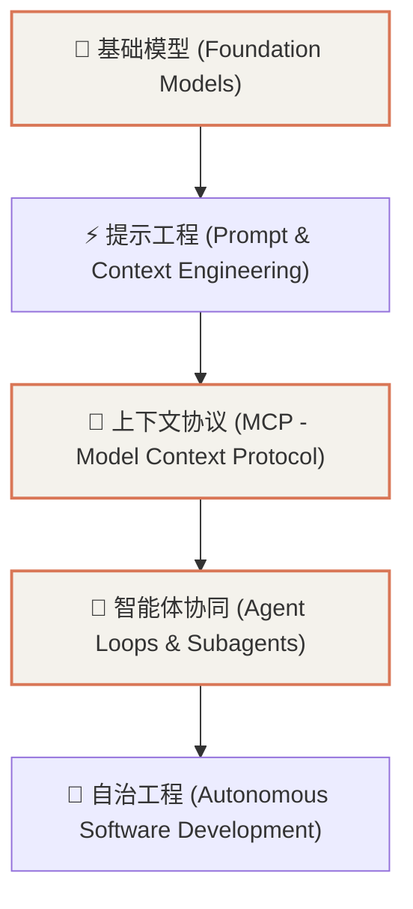

# AI 与 Agent 生态概览与知识地图

> “大模型重塑了人机交互，而 Agent 正在重构软件工程范式。”

本专题致力于沉淀现代人工智能、大语言模型（LLM）与自动化编程智能体（AI Coding Agent）的核心技术与落地实践。

---

## 1. 核心技术演进层级

---

## 2. 规划子专题

* **基础与原理**：Token 机制、Attention 架构、量化与本地推理（Ollama / vLLM）；
* **上下文与工具集成**：Model Context Protocol (MCP) 架构、Tool Calling 规范；
* **Agent 实战**：Claude Code、Codex CLI、Antigravity 自治开发链路。
