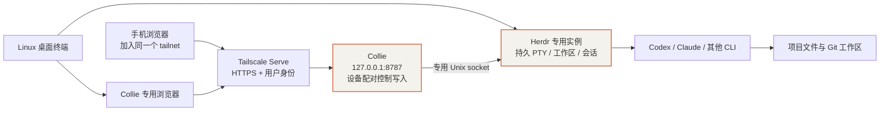

# 方案演进、组件分工与完成情况

本专题记录截至 **2026-10-03（Asia/Shanghai）** 的实施过程。最终优先落地的是 **Linux 上的 Herdr + Collie + Tailscale**：目标是让电脑和手机访问同一套持久终端。本次已完成 Linux 浏览器端的实际访问与输入验证，手机端仍待实测；真正执行任务的是终端中的 Codex、Claude 等 CLI。

初始目标还包括 Paperclip 自动任务编排、飞书消息入口、GitHub PR 交付和 Cloudflare Zero Trust。部分组件已经部署或完成本地开发，但不能把这些成果等同于整个平台上线。

:::note 阅读方式
先看本篇理解范围，再读[部署记录](./02-linux-deployment.mdx)、[日常使用](./03-daily-use.mdx)和[排障与验收](./04-troubleshooting-and-verification.mdx)。文中的账户、用户名、IP 和域名使用示例值；真实凭证和个人网络信息不进入公开仓库。
:::

## 1. 最终采用的交互链路

| 组件 | 负责什么 | 不应混淆的边界 |
|---|---|---|
| Herdr | 组织终端、工作区和 Agent 会话，保持后台进程 | 可以独立使用；不是 AI 模型，也不专门依赖 Collie |
| Collie | 在浏览器中显示终端、发送输入、提供特殊按键 | 接入指定 multiplexer，不会自动接管普通终端中的已有进程 |
| Tailscale | 连接访问设备与 Linux，提供 tailnet 内的 HTTPS 入口 | 使用 Serve；没有发布 Funnel 公网入口 |
| Codex / Claude CLI | 在 Linux 上理解需求、调用工具、修改文件 | 手机和浏览器只是操作入口，模型执行不在手机上 |
| Paperclip | 独立的自动任务编排与运行记录 | 不是本轮手动终端访问的前置条件，也没有被证明以 Herdr 为所有原生 Run 的执行后端 |

Herdr 中的交互会话与 Paperclip 原生 Run 分别管理自己的生命周期。架构图上的连线是目标设计，不能代替实际集成证据。

## 2. 方案为什么收敛

实施初期同时推进安装、接入开发和平台工程验收。后续确认：先使用开源组件，并不要求先开发一套跨项目调度、维护锁和统一备份框架。

| 阶段 | 决策与结果 |
|---|---|
| 初始方案评审 | 核对组件职责、本机环境、CLI 授权、网络边界和备份要求；原始文档作为方案输入 |
| 本机准备 | 安装并登录 Tailscale，保留原有企业网络、代理/TUN 和 CLI 认证 |
| 基础部署 | 安装 Paperclip 主/测试实例，Herdr 与 Collie 用户服务；使用专用工作区测试 |
| Gateway 本地开发 | 为飞书接入准备持久化 Gateway，完成本地测试和两轮修复评审；未接真实飞书 |
| Linux 优先 | 把自研全局资源控制和统一加密备份框架列为后续增强；先验证现有组件可用 |
| Cloudflare 准备 | 本机已有 cloudflared，准备 Tunnel / Access 资料；没有固定域名，未启用真实 Tunnel |
| 改用 Tailscale | 明确将 Cloudflare 和飞书后置；使用已有 tailnet 的 HTTPS 域名 |
| 当前落地 | 开启 HTTPS、授权本机 operator、发布 Collie Serve、处理本机假 IP 解析、配对 Linux 浏览器并验证真实 PTY 输入 |

这个调整减少了首次使用的前置条件，没有把尚未实现的工程能力标记为完成。

## 3. 当前组件状态

| 模块 | 已完成 | 仍未验收或已后置 |
|---|---|---|
| Herdr | 固定版本安装、专用 socket、用户服务、会话与 PTY 本地验证 | 与业务项目中的长期任务结合使用 |
| Collie | 固定版本安装、loopback 监听、Tailscale HTTPS、浏览器配对、真实终端输入 | 手机真实访问与输入没有完整验收记录 |
| Tailscale | Linux 登录、MagicDNS、HTTPS 证书能力、operator 授权、Serve 映射 | 外部手机/Windows 客户端实测 |
| Codex | Paperclip 测试实例原生执行两轮成功，保持同一会话 | 真实项目的交互任务和 PR 交付 |
| Claude / agy | 已有 CLI 可用于部分辅助任务，原配置保留 | CLI 可调用不代表 Paperclip 原生适配器验收；agy 后续一次调用遇到地域限制 |
| Paperclip | 主实例与测试实例部署，本机健康检查通过 | 主实例仍待管理员认领；正式角色、项目和端到端业务流程后置 |
| 飞书 Gateway | 本地代码与独立评审完成，44 项 Gateway 测试、23 项安装前置测试和类型检查通过 | 专用用户实际边界、正式网络接入、飞书凭证、真实消息和通知 |
| Cloudflare | cloudflared 已安装，服务模板和操作资料有准备 | Tunnel / Zero Trust 未上线，本轮已后置 |
| PostgreSQL 备份工具 | 私有 PG18 客户端准备并核验来源与版本 | 尚无一致性加密备份、恢复或 VM 外副本验收 |
| 全局资源控制 | 做过原生能力和接口研究 | 自研实现、全局单重任务/OOM/维护锁均未完成，已后置 |

## 4. 安装版本与可重复性

这些是本次部署和测试使用的版本，不是“永远推荐的最新版”。

| 组件 | 记录版本 |
|---|---|
| Linux | Ubuntu 26.04.1，VMware 虚拟机 |
| Tailscale | 1.102.4 |
| Herdr | 0.9.3，协议 22 |
| Collie | 1.14.2，提交 `887a37d` |
| Paperclip | `paperclipai@2026.916.1`，源码提交 `d554c4789ed3930f8a53ac9fdf6503b3187097da` |
| 服务端 Node.js | 24.21.0，私有运行时 |
| CLI 子进程 Node.js | 原有 Node 22 路径优先，未迁移 CLI 认证 |
| 飞书 Node SDK | 1.74.0，仅本地 Gateway 开发使用 |
| PostgreSQL | Paperclip 嵌入式 18.1；私有客户端 18.6 |
| cloudflared | 2026.6.0，仅安装/准备 |

Herdr、Collie 发布资产使用官方摘要核验；npm 包使用锁文件完整性校验。下载、解压与服务启动属于不同检查，任何一步成功都不能替代实际功能验证。

## 5. 后续按需推进

当前可以先使用终端，再逐项验证手机访问、真实 CLI 任务和业务项目隔离。以后需要自动编排，再处理 Paperclip 主实例认领和角色配置；需要消息入口，再继续飞书；需要 Cloudflare，再选择域名和 Access 策略。

此前准备的方案、研究与模板保留，不视为已部署。主机重启恢复、统一备份和完整 GitHub PR 工作流没有通过验收。
