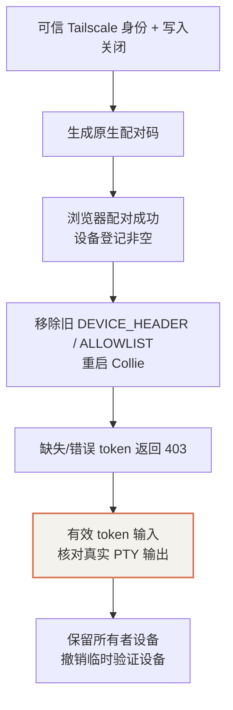

# Linux 部署与接入记录

本篇保留 **2026-10-03 Tailscale 阶段**已经执行过的配置顺序。当前 Cloudflare 入口与主实例进度见[Cloudflare 接入](./05-cloudflare-access-and-tunnel.mdx)及[Paperclip 首次使用](./06-paperclip-first-use.mdx)。它是部署记录和复现检查表，不是一键安装脚本；新机器仍需先下载固定版本、核验资产并安装服务。日常使用见[使用指南](./03-daily-use.mdx)。

## 1. 环境与路径约定

初始环境为约 6 vCPU、9 GiB 内存的 Ubuntu 虚拟机。CLI 已有认证和代理设置，实施中没有重置这些配置，也没有修改全局 DNS/TUN 来解决访问问题。

工具执行示例通常使用 `rtk proxy`，以符合本次环境的 RTK 约定。日常交互中的 `herdr`、`cd`、`source` 按原生 shell 写法展示；无需假设存在自动改写 hook。未安装 RTK 的机器可以运行代理前缀后面的原生命令。

本文使用 `you@example.com`、`agent-host.tail1234.ts.net` 和 `100.100.20.30` 作为占位值；它们不是需要额外导出的 Collie 配置变量。复现时替换成自己的用户名、登录身份、域名和地址。

| 用途 | 路径或端口 |
|---|---|
| 固定运行时 | `$HOME/.local/share/agent-platform/runtimes/` |
| Herdr 配置 | `$HOME/.config/herdr-interactive/config.toml` |
| Herdr socket | `$XDG_RUNTIME_DIR/herdr-interactive/server.sock` |
| Collie 配置 | `$HOME/.config/collie/.env`，权限 0600 |
| Collie 状态 | `$HOME/.local/state/collie-interactive`，目录权限 0700 |
| Collie 监听 | `127.0.0.1:8787` |
| Serve 入口 | 当前机器 tailnet 域名的 HTTPS 443 |
| Shell 环境变量 | 当前用户 `.zshrc`，与用户服务配置分开管理 |

示例 IP 和域名不可直接用于别人的机器。用 `rtk proxy tailscale status` 查看自己的设备地址，完整的状态 JSON 只在本机检查，不上传到公开仓库。

## 2. 安装并登录 Tailscale

本次先安装 Tailscale，再由账号所有者执行登录。软件安装结束不等于设备已经加入 tailnet。

```bash
rtk proxy tailscale up
rtk proxy tailscale status
```

新机器按 [Tailscale 官方安装文档](https://tailscale.com/docs/install/linux)完成安装后再登录。已有企业代理、子网路由或 Tailscale 偏好时，先检查并保留现有配置，不照抄会覆盖偏好的完整启动参数。

本机保留了原有 DNS 处理方式。后续的 `resolv.conf overwritten` 健康提示另行定位，没有直接覆盖 `/etc/resolv.conf`。

## 3. 固定安装 Herdr 和 Collie

本次使用官方 Linux 发布资产：Herdr 0.9.3、Collie 1.14.2。固定目录部署后，将 `$HOME/.local/bin/herdr` 与 `$HOME/.local/bin/collie` 链接到对应二进制。

- [Herdr 项目与文档](https://herdr.dev/)
- [Collie 发布与源码](https://github.com/AltanS/collie)

```bash
rtk proxy herdr --version
rtk proxy collie version --plain
```

保留资产摘要、版本和安装路径。当前 Collie 采用解压固定目录的布局，`collie update` 不能可靠识别其安装方式；升级要重新核验目标版本，不依赖自动更新。

## 4. 专用 Herdr 实例与用户服务

为避免把其他终端和业务会话混进 Collie，本次使用专用配置和 socket。Herdr 服务启动 `herdr server`，对应用户服务名为 `herdr-interactive.service`。

有效服务配置包含：

- 以普通 Linux 用户运行；
- 明确 `HOME`、配置路径和 socket 路径；
- `NoNewPrivileges=true`；
- 本次部署的 `PrivateTmp=false`；
- 私有服务网络环境文件，没有把代理凭证写进仓库。

```bash
rtk proxy systemctl --user status herdr-interactive.service --no-pager
rtk proxy env \
  HERDR_CONFIG_PATH="$HOME/.config/herdr-interactive/config.toml" \
  HERDR_SOCKET_PATH="$XDG_RUNTIME_DIR/herdr-interactive/server.sock" \
  herdr status server --json
```

本次状态返回 `running: true`、`compatible: true`、协议 22。用户服务已启用；这不等于完成了虚拟机重启或断电恢复测试。

## 5. Collie 初始配置：先关闭写入

Collie 使用同一个 Herdr socket，用户服务名为 `collie.service`。最终部署模式为 Tailscale Serve，先在 ingress 尚未发布时保留独立写入关闭门。

```dotenv
COLLIE_HOST=127.0.0.1
COLLIE_PORT=8787
COLLIE_MUX=herdr
HERDR_SOCKET_PATH=/run/user/1000/herdr-interactive/server.sock
COLLIE_MULTI_SESSION=off
COLLIE_STATE_DIR=/home/alice/.local/state/collie-interactive
COLLIE_TRUSTED_USER=you@example.com
COLLIE_SKIP_SERVE=1
COLLIE_DEVICE_HEADER=X-Collie-Device
COLLIE_DEVICE_ALLOWLIST=
```

这是环境文件示例：把 UID 1000、`alice` 和登录邮箱替换成自己的值；不要写入字面量 `$HOME` 来期待 systemd 的 EnvironmentFile 做 shell 展开。

初始空 allowlist 拒绝全部写入。它不是正式设备授权方案，因为 Tailscale Serve 不注入 `X-Collie-Device`；最终将使用原生配对凭证。

```bash
rtk proxy systemctl --user status collie.service --no-pager
rtk proxy collie doctor --plain
rtk proxy tailscale serve status
```

## 6. 开启 HTTPS 与本机 operator

账号所有者在 [Tailscale DNS 管理页](https://login.tailscale.com/admin/dns)启用 **HTTPS Certificates**。本次 MagicDNS 已开启，但一开始 `CertDomains` 为空；启用后机器取得可用的 `*.ts.net` 域名。

接着只把 `COLLIE_SKIP_SERVE` 改为 `0`，保留可信身份与关闭写入的 header gate，重启 Collie。这个顺序避免在 ingress 发布后仍使用跳过身份要求的模式。

```bash
rtk proxy systemctl --user restart collie.service
rtk proxy collie start --plain
```

首次 Serve 配置被系统拒绝：`Access denied: serve config denied`。账号所有者在本机终端执行一次：

```bash
rtk proxy sudo tailscale set --operator="$USER"
```

它授予当前 Linux 用户管理本机 Tailscale 的权限，属于本机 sudo 操作，不是模型或 Collie 登录。随后再次执行：

```bash
rtk proxy collie start --plain
rtk proxy tailscale serve status
```

本次实际得到的映射形态：

```text
https://agent-host.tail1234.ts.net (tailnet only)
|-- / proxy http://127.0.0.1:8787
```

使用 Collie 原生命令建立映射，并保留其 ownership 记录。若已有 Serve 映射，先核对归属，不能用 `tailscale serve reset` 清空其他服务。

## 7. 配对并启用写入



1. 已发布的 HTTPS 入口必须仍要求配置的 Tailscale 身份；先验证读取和关闭写入状态。
2. 账号所有者运行 `rtk proxy collie pair --plain`，在浏览器 **Settings → Paired devices** 输入配对码，名称使用 `linux-browser`。
3. 确认设备注册成功后，删除 `.env` 中的 `COLLIE_DEVICE_HEADER` 和 `COLLIE_DEVICE_ALLOWLIST` 两行，保留 `COLLIE_SKIP_SERVE=0` 与 `COLLIE_TRUSTED_USER`。
4. 重启 Collie，在专用测试 pane 验证缺失/错误 token 均拒绝，有效 token 实际产生输出。
5. 失败时恢复独立关闭写入门并重新检查；本次成功后移除了临时验证设备，保留所有者浏览器。

配对码有效期 10 分钟，失败尝试受限。它和返回的设备 token 不进入日志、聊天记录、Git 或截图附件。浏览器保存自己的 token，服务端保存哈希。

:::warning 最后一个设备的撤销
固定版本 Collie 在配对列表为空时会关闭配对写入检查。撤销最后一个设备前，先恢复空 header allowlist 的独立关闭写入门、重启并确认写入 403，再撤销。不要将“撤销最后一个设备”误认为“自动禁止所有写入”。
:::

## 8. 配置裸命令 herdr

当前专用实例与默认 Herdr 实例不同。为了让新开的交互终端直接运行 `herdr` 就进入 Collie 对应实例，在 `.zshrc` 加入：

```bash
export HERDR_CONFIG_PATH="$HOME/.config/herdr-interactive/config.toml"
export HERDR_SOCKET_PATH="$XDG_RUNTIME_DIR/herdr-interactive/server.sock"
```

本次机器实际写入的是对应的绝对路径，并验证新交互 zsh 的环境变量及 `herdr status server --json` 均指向专用 socket。需要当前终端立即生效时：

```bash
source ~/.zshrc
herdr
```

使用 Bash 的机器要检查 `.bashrc` 和登录 shell 的加载方式；本次没有修改 Bash 配置，也没有把这些变量放进所有非交互进程的全局环境。

## 9. Paperclip 与其他准备工作的记录

初始部署还建立了 Paperclip 主实例 `127.0.0.1:3100` 与测试实例 `127.0.0.1:3101`，独立嵌入式 PostgreSQL 分别为 54329 / 54330，服务端使用私有 Node24，CLI 子进程保留原有 Node22 路径。

测试实例已完成原生 Codex 两轮运行及会话续接；在本篇对应的 10 月 3 日，主实例仍等待所有者创建账户和认领管理员；后续已完成认领与独立 CLI 登录，网页任务尚待验收。它们没有参与当前 Collie 配对或 Herdr 手动会话。

Gateway 曾准备专用系统用户、持久化 SQLite、受限 Paperclip 访问与禁用态安装脚本。实际 root 安装、飞书应用凭证和真实消息接入未执行。本阶段 Cloudflare 只保留安装与模板，10 月 10 日已上线 Access / Tunnel；统一资源控制和一致性加密备份也没有上线。完整状态见[方案与进度](./01-architecture-and-progress.mdx)。
