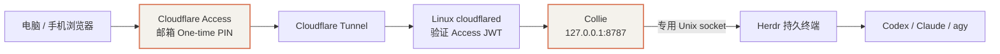

# 免费域名、Cloudflare Access 与 Tunnel 接入

截至 **2026-10-10（Asia/Shanghai）**，Cloudflare 入口已上线，所有者浏览器登录后能够打开 Collie，浏览器设备已配对。本机写入门禁和实际 PTY 输出通过验证；**公网浏览器实际发送终端命令、手机通过新域名访问和主机重启恢复仍待完整验收**。

本文域名、邮箱、团队名均为示例。实际 Tunnel token、配对码、设备 token 和私有配置只保存在主机，不进入公开仓库。

## 1. 当前访问链路



Cloudflare Access 决定谁能访问站点，Collie 配对决定哪个浏览器能向终端发送输入。两者分别验证。此入口不要求手机加入 tailnet；Linux 虚拟机、Herdr、Collie 和 cloudflared 必须保持运行。

10 月 3 日的 Tailscale Serve 是前一阶段方案。10 月 10 日没有确认其 HTTPS 映射仍然存在，不能把旧入口的验收结果当作两个入口同时可用的证明。

## 2. 免费域名与 Cloudflare 委派

本次使用 [DigitalPlat FreeDomain](https://github.com/DigitalPlatDev/FreeDomain)。注册页最初选择的 `qzz.io` 后缀要求付费名额，随后改用当时允许免费名额注册的 `dpdns.org`。是否免费以账户当时显示的名额和后缀规则为准，项目列出的后缀不保证全部免费。

1. 完成注册平台要求的账户验证。
2. 选择可用域名，例如 `example.dpdns.org`，给 Collie 预留 `collie.example.dpdns.org`。
3. 在 Cloudflare 添加 `example.dpdns.org`，获取分配给该区域的两条名称服务器。
4. 注册平台选择 **外部名称服务器**，填写 Cloudflare 提供的两条 NS。不要混入 DigitalPlat 的名称服务器；界面上的占位文字不算已填写值。
5. 等待委派传播，确认 Cloudflare 区域激活后继续。

`example.dpdns.org` 在 DNS 层级上是三级名称。本次能够作为区域接入 Cloudflare，依赖注册平台允许 NS 委派，以及公共后缀识别；不能把任意免费子域服务都视为具有相同能力。参考 [名称服务器配置教程](https://github.com/DigitalPlatDev/FreeDomain/blob/main/documents/tutorial/platform/1.3-connect-nameservers.md)与[公共后缀列表](https://publicsuffix.org/list/)。

新域名扫描到 0 条 DNS 记录符合本次环境。先完成 NS 委派，Collie 记录随后由 Tunnel 发布流程创建；没有部署根域网站、`www` 或邮箱时，不需要先虚构 A、AAAA、MX 记录。Wiki 自定义域名是另一个部署任务，本次没有配置。

## 3. 先创建 Access 应用

在 Zero Trust 的 Access 应用页面，选择 **自托管和私有 → 公共 DNS**。保存如下配置后，再发布 Tunnel 路由：

| 项目 | 配置 |
|---|---|
| 应用名称 | Collie |
| 公共主机名 | `collie.example.dpdns.org` |
| 路径 | 留空，保护整个站点 |
| 策略 | Allow → Include → Emails → `owner@example.com` |
| 登录方式 | 仅 One-time PIN |
| 接受所有身份提供程序 | 关闭 |
| Cloudflare One Client 身份验证 | 关闭 |
| 浏览器渲染 SSH / RDP / VNC | 关闭，Collie 自己提供网页界面 |
| 应用会话持续时间 | 本次设为 24 hours |

没有添加 Everyone 或 Bypass。One-time PIN 会向邮箱发送验证码，启用该方式也涉及账户级身份提供程序配置。应用中只选择所需方式，不把账户里其他登录方式全部放行。参考 [自托管应用](https://developers.cloudflare.com/cloudflare-one/access-controls/applications/http-apps/self-hosted-public-app/)和 [One-time PIN](https://developers.cloudflare.com/cloudflare-one/integrations/identity-providers/one-time-pin/)。

账户曾保留一条同名但未关联的重复 Allow 策略。实际生效范围以应用关联策略为准，不能仅凭策略名称判断。

## 4. 安装连接器并发布路由

创建名为 `collie-linux` 的 remotely-managed Tunnel，在 **Linux 主机**执行安装页提供的命令。本次由所有者完成系统级安装，日志为 `Linux service for cloudflared installed successfully`。

安装命令包含 token，只在主机操作，不发到聊天或 Wiki。准备过隐藏输入保存工具，但本次实际安装没有使用它；不能把准备工具的 token-file 路径写成已生效的凭据存储方式。后续可按上游支持迁移到私有 token-file，另行验证。

先检查系统服务，避免混淆用户服务：

```bash
rtk proxy systemctl is-active cloudflared.service
rtk proxy systemctl is-enabled cloudflared.service
rtk proxy systemctl --user is-active herdr-interactive.service collie.service
```

检查 `cloudflared` 的完整 unit、命令行或日志时可能看到 token，只在本机查看必要字段，不复制原始输出。

在 Tunnel 发布路由页配置：

| 项目 | 配置 |
|---|---|
| 主机名 | `collie.example.dpdns.org` |
| 路径 | 留空 |
| 服务类型与地址 | HTTP → `127.0.0.1:8787` |
| Access JWT 验证 | 启用，关联 Collie 应用 |
| 未匹配请求 | `http_status:404` |

本次页面通过关联应用配置验证，没有单独填写团队名和 AUD 的输入框。随后从 Linux 连接器收到的路由确认 `access.required=true`、`teamName` 和 `audTag` 对应预期应用。仅保存表单不代替这项核对。

这是 remotely-managed Tunnel，路由由 Cloudflare 管理；不要另写一份本地 ingress YAML 并假定它会覆盖控制台配置。参考 [远程管理 Tunnel](https://developers.cloudflare.com/cloudflare-one/networks/connectors/cloudflare-tunnel/get-started/create-remote-tunnel-api/)。

## 5. Collie 的公网入口适配

本次保留 loopback 监听和原 Herdr socket，在私有 Collie 环境文件中配置：

```dotenv
COLLIE_HOST=127.0.0.1
COLLIE_PORT=8787
COLLIE_SKIP_SERVE=1
COLLIE_PUBLIC_HOSTS=collie.example.dpdns.org
COLLIE_ALLOWED_ORIGINS=https://collie.example.dpdns.org
COLLIE_PUBLIC_URL=https://collie.example.dpdns.org
```

上面是相关配置节选，不能覆盖原文件中的状态目录和 Herdr 连接配置。修改前备份私有环境文件，保留原权限，然后重启用户服务，并轮询到就绪。

`COLLIE_SKIP_SERVE=1` 用于不再由 Collie 启动 Tailscale Serve；本版本下缺少身份 header 的本地读取仍可能返回 200。**公网身份由 Access 和连接器 JWT 验证负责**，原有 `COLLIE_TRUSTED_USER` 不能替代这层验证，loopback 也不隔离其他本机用户。

首次切换先用空 allowlist 的独立设备 header 门禁关闭写入，确认 Access、路由和浏览器配对后，才移除该临时门禁并使用原生配对。删除最后一个有效设备前，应先恢复独立关闭写入门；此固定版本在设备列表为空时不提供同样的配对写入保护。

## 6. Error 1033：进程 active，但 Tunnel 没有连接

本次登录 Access 后出现 Error 1033。检查发现 systemd 服务仍然 active，但连接器连续记录 QUIC 超时：

```text
failed to dial to edge with quic: timeout: no recent network activity
```

TCP 7844 连通测试成功，于是切换到 HTTP/2。没有关闭原有代理/TUN，也没有覆盖系统 DNS。HTTP/2 使用 TCP 7844，QUIC 使用 UDP 7844；切换传输不代表关闭 TLS。参考 [1033 错误](https://developers.cloudflare.com/support/troubleshooting/http-status-codes/cloudflare-1xxx-errors/error-1033/)和[运行参数](https://developers.cloudflare.com/cloudflare-one/networks/connectors/cloudflare-tunnel/configure-tunnels/run-parameters/)。

在没有显式 `--protocol` 参数覆盖的前提下，为系统服务添加 drop-in：

```bash
rtk proxy sudo install -d /etc/systemd/system/cloudflared.service.d
rtk proxy sudo tee /etc/systemd/system/cloudflared.service.d/http2.conf <<'EOF'
[Service]
Environment="TUNNEL_TRANSPORT_PROTOCOL=http2"
EOF
rtk proxy sudo systemctl daemon-reload
rtk proxy sudo systemctl restart cloudflared.service
```

本次重启后确认 `Initial protocol http2`，随后出现两个 `Registered tunnel connection`，本机就绪端点返回 200，连接指标为 2；所有者刷新后能够进入 Collie。没有将这些结果描述为四条连接全部建立或重启恢复完成。

本次 metrics 监听在 `127.0.0.1:20241`，可检查：

```bash
rtk proxy curl --fail --silent http://127.0.0.1:20241/ready
```

其他安装应先确认实际 metrics 端口。未登录请求返回 Access 的 302，只说明边缘认证在工作：认证发生在访问源站之前，即使 Tunnel 断开也可能返回登录页。

## 7. 浏览器配对与手机使用

换域名后，即使原 Tailscale 页面已经配对，也需要给新来源的浏览器重新配对。浏览器存储按来源隔离。

1. 打开 `https://collie.example.dpdns.org`，用允许的邮箱完成验证码登录。
2. 在运行 Collie 的同一 Linux 用户下执行 `rtk proxy collie pair`。本次二进制安装的 CLI 会读取 `$HOME/.config/collie/.env`，已核对其状态目录为 `$HOME/.local/state/collie-interactive`；不需要在普通 shell 手动 `source` 该文件。若换成 Herdr 插件安装，CLI 会解析插件配置目录，应按实际安装方式核对，避免给另一个实例生成配对码。
3. 在网页 **Settings → Paired devices** 输入配对码，并给客户端取名。
4. 配对码有效期为 10 分钟且单次使用；过期就在主机重新生成，不重复使用旧码。
5. 手机使用同一个公网网址，在手机浏览器单独完成登录与配对。
6. 新建一个空 shell，发送 `echo cloudflare-ok`，观察实际输出；不要把这条命令发给正在执行其他任务的 Agent。

保持同一浏览器的网站数据，可以保留设备配对。Access 会话到期可能要求再次邮件验证；24 小时是本次应用配置，策略及全局设置也会影响会话时长。“配对一次”不等于永久免认证。

如需第二个邮箱，在关联 Allow 策略的 Include / Emails 中添加明确邮箱。该操作尚未实施；获准并配对的用户会操作同一套工作区，这不是按邮箱隔离项目的多租户系统。

## 8. 本轮验收与待办

| 检查 | 结果 |
|---|---|
| 区域激活、Access 应用与路由保存 | 已完成 |
| 连接器 JWT 验证关联正确应用 | 已核对 |
| HTTP/2 注册连接、就绪端点 | 通过，检查时为两个连接 |
| 未登录公网请求 | 重定向到 Access 登录 |
| 所有者公网浏览器读取 | 所有者确认可以进入 |
| 新来源浏览器设备配对 | 已登记 |
| 本机请求缺失 / 错误设备 token | 均 403 |
| 本机有效设备 token 输入 | 200，确认真实 PTY 输出 |
| 临时测试设备与工作区清理 | 已完成，保留所有者设备 |
| 公网浏览器实际终端输入 | 待所有者操作确认 |
| 手机通过 Cloudflare 域名读写 | 待完整验收，旧手机登记不等于此项通过 |
| 增加邮箱、Wiki 域名、主机重启恢复 | 未实施或未验收 |

回退先关闭公网路由或停止连接器，再恢复私有 Collie 配置；重新采用 Tailscale 时要单独验证 Serve 和身份门禁。不要在公网入口仍存在时撤掉认证保护。
