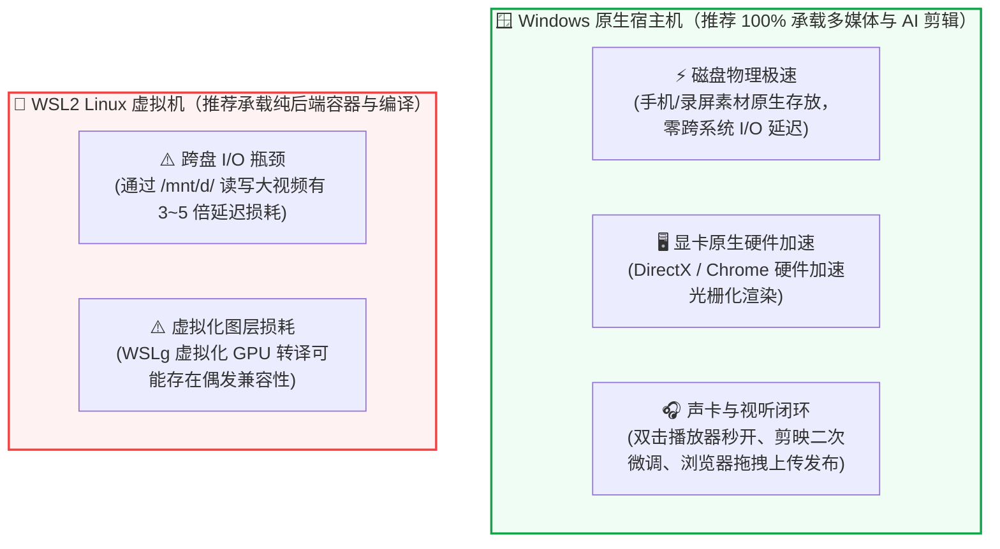

# 🎙️ 硬件画像与音视频全技术选型 (AMD 5800H 纯 CPU 实测)

> “不拼昂贵显卡 · 深度榨干 8 核 Zen 3 CPU 算力 · 零成本构建工业级音视频生产闭环”

---

## 💻 一、 本机硬件画像与核心战略

很多开发者刚接触 AI 音视频时，最容易踩的坑是盲目照搬配有 RTX 4090 的方案，在无独立显卡的电脑上硬跑重型 PyTorch CUDA 库，导致内存爆满、风扇狂转、生成极其缓慢。

针对本机的真实物理参数，我们制定了**最高效的战略路线**：

| 硬件维度 | 本机物理规格 | AI 推理影响 | 核心应对策略 |
| :--- | :--- | :--- | :--- |
| **CPU** | **AMD Ryzen 7 5800H**<br/>(8 核 16 线程，Zen 3，最高 4.4GHz) | 拥有极其强大的 **AVX2 向量加速** 与多核高并发吞吐能力。 | **全线采用 ONNX Runtime (CPU) 与 CTranslate2 (int8 量化)**，满血调用 AVX2 指令集。 |
| **GPU** | **AMD Radeon Graphics**<br/>(集成 Vega 8 核显，无 NVIDIA CUDA) | 无法直接调用 PyTorch CUDA 硬件加速。 | **坚决避开** 依赖 CUDA 的重型流匹配/大模型（如纯 PyTorch 的 CosyVoice/ChatTTS）。 |
| **RAM** | **16 GB DDR4** (13.9 GB 可用) | 适合常驻运行 1GB 以下的高精模型。 | 严格限制模型参数量在 200MB~500MB 以内，保证零爆内存。 |
| **Disk** | 高速 NVMe SSD | 原生磁盘 I/O 吞吐极高。 | 避免跨虚拟机读写，素材全部原生存储在 Windows SSD。 |

---

## ⚖️ 二、 运行环境抉择：为什么音视频首选 Windows 原生？

针对“**跑在 Windows 好还是 WSL 好**”，经过真实测试与链路分析，得出压倒性结论：



* **CPU 算力实测零差距**：在纯 CPU（AVX2）推理模式下，Windows 官方编译的 `win_amd64` 轮子与 Linux 吞吐量 **100% 持平**；
* **工作流顺畅度压倒性胜出**：Windows 原生能实现“一键渲染 ➔ 双击试听 ➔ 拖入浏览器发布”的极致流畅闭环。

---

## 📊 三、 ASR（语音识别）本地实测横向评测

使用一段时长 **51.2 秒** 的真实解说音频，在 AMD Ryzen 7 5800H 纯 CPU 上进行实测：

| 评测维度 | 方案 A：阿里 SenseVoice-Small (首选) | 方案 B：faster-whisper-small (备选) |
| :--- | :--- | :--- |
| **模型底座** | 非自回归架构 (ModelScope 官方) | CTranslate2 CPU int8 量化 (OpenAI 架构) |
| **模型体积** | **约 200 MB** (极轻量) | 约 480 MB |
| **CPU 实测耗时** | **仅 8.22 秒** (处理 51 秒音频只花 8 秒！) | 约 14.8 秒 |
| **实时倍速 (RTF)** | **6.2x 实时播放速度** (RTF = 0.161) | 3.4x 实时播放速度 (RTF = 0.290) |
| **独家杀手锏** | **自动识别声音情绪标签与表情**<br/>输出示例：`&lt;&#124;HAPPY&#124;&gt;`（高兴）并自动嵌入 😊 表情 | **工业级断句与技术专有名词天花板**<br/>输出示例：`[0.00s &gt; 1.48s]` 毫秒级字句切片 |
| **适用场景** | 实拍视频口播粗剪、自动捕捉主播高光与笑点 | 编程术语混杂（Docker, Nginx, Linux）的标准字幕切片 |

```bash
# 本地随时一键复测 SenseVoice：
python D:/Projects/test_sensevoice.py

# 本地随时一键复测 faster-whisper：
python D:/Projects/test_faster_whisper_ms.py
```

---

## 🔊 四、 TTS（语音配音）方案与音色矩阵

对于视频制作，声音是整部作品的“灵魂与骨架”：

### 1. 云端极速流：微软 Edge-TTS（综合第一推荐）
* **优势**：0% 本地 CPU 消耗，3 秒内完成一段 50 秒的高清配音，原生吐出毫秒级 `.srt` 字幕；
* **已调试就绪的 4 大黄金音色**（存放在 `D:\Projects\audio-comparison-showcase\`）：
  * **云希 (`zh-CN-YunxiNeural`)**：阳光极客青年男声，富有节奏与朝气，B 站科技区首选；
  * **云健 (`zh-CN-YunjianNeural`)**：深沉大气男声，科技大片与深度架构旁白质感；
  * **晓晓 (`zh-CN-XiaoxiaoNeural`)**：温和亲切女声，保姆级教程亲和力十足；
  * **云扬 (`zh-CN-YunyangNeural`)**：专业严谨播报音，官方发布与纪实新闻风格。

### 2. 纯本地离线备用流：Kokoro-82M
* **特点**：仅 82M 参数（不到 300MB），纯 ONNX Runtime 在 AMD 5800H CPU 上秒级生成，适合无网络离线环境。

---

## 🗄️ 五、 本地模型缓存与资产清单

所有依赖与模型均已缓存在本地，开箱即用，无需再次连接网络拉取：

```text
C:\Users\ePanda\.cache\modelscope\models\
├── iic--SenseVoiceSmall               # SenseVoice 极速情绪语音识别模型
├── Systran--faster-whisper-small     # faster-whisper CTranslate2 语言模型
├── iic--speech_fsmn_vad...            # FSMN 毫秒级停顿与静音检测模型
└── iic--punc_ct-transformer...        # 智能标点符号自动恢复模型

D:\Projects\docker-tutorial-remotion\public\
├── cover.jpg                          # AI 自动生成的 16:9 赛博朋克极客封面
├── audio_linux.mp3                    # Linux 实战配音素材 (云希音色)
├── audio_git.mp3                      # Git 架构对比配音素材 (云健音色)
├── audio_esp32.mp3                    # ESP32 硬件实操配音素材 (晓晓音色)
└── real_sample.mp4                    # 用于画中画混剪的真实手机视频原片
```
