# 🚀 三大核心视频生成技术方案与实战对比

> “三大截然不同的技术流水线 · 4 种衍生实战组件 · 彻底打通代码、实拍与 AI 生图”

---

## 🌟 一、 三大核心技术路线全景对比

为了探索 AI 时代自媒体视频生产的最优路径，我们在本地搭建并实测渲染了 **三种截然不同的底层技术流水线**：

```mermaid
flowchart TD
    subgraph S1["方案一：纯代码程序化渲染流 (Pure Code)"]
        A1["📝 纯文字脚本"] --> B1["⚛️ 100% React + SVG 代码逐帧计算"]
        B1 --> C1["🎬 最终 MP4 (docker_tutorial.mp4)"]
    end

    subgraph S2["方案二：实拍素材 + Remotion 智能画中画混剪流 (Real Video Hybrid)"]
        A2["📱 手机拍摄/录屏原片"] --> B2["🔍 SenseVoice 提取情绪与卖点"]
        B2 --> C2["⚛️ Remotion &lt;Video /&gt; 动态嵌入手机边框 + 激光扫描"]
        C2 --> D2["🎬 最终 MP4 (02_solution_real_video_hybrid.mp4)"]
    end

    subgraph S3["方案三：AI 概念生图 + 电影级运镜推拉视差流 (AI Generative Art)"]
        A3["🎨 AI 大模型生成 8K 概念图"] --> B3["📐 Remotion 物理推拉运镜 (Ken Burns) + 科幻 HUD"]
        B3 --> C3["🎬 最终 MP4 (03_solution_ai_image_cinematic.mp4)"]
    end

    style S1 fill:#eff6ff,stroke:#3b82f6,stroke-width:2px
    style S2 fill:#f0fdf4,stroke:#16a34a,stroke-width:2px
    style S3 fill:#faf5ff,stroke:#a855f7,stroke-width:2px
```



---

## 🎥 二、 三大技术方案实战深度拆解

---

### 方案一：【纯代码程序化渲染流 (Pure Code Remotion)】
* **核心输入**：零外部素材、零拍摄，仅需文案脚本；
* **技术实现**：全部由 React 虚拟 DOM、CSS 动画与 SVG 矢量图元在无头 Chrome 浏览器中逐帧光栅化绘制；
* **代表成果**：`docker_tutorial.mp4` (51.3 秒 / 1080p 30fps)；
* **分镜全景**：涵盖“生产环境报错痛点 ➔ 传统虚拟机与 Docker 架构对比 ➔ 核心三要素（镜像/容器/仓库）➔ 终端极速启动 Nginx ➔ 价值总结”全套 5 大镜头；
* **视觉呈现**：


---

### 方案二：【实拍素材 + Remotion 智能画中画包装流 (Real Video Hybrid)】
* **核心输入**：手机实拍原片、OBS 录屏素材（支持 4K/竖屏/横屏）；
* **技术实现**：
  1. 通过 Remotion 原生 <code>&lt;Video /&gt;</code> 组件无缝接入外部视频原片；
  2. 自动构建圆角金属质感手机外壳与上下呼吸动态光晕；
  3. 叠加贯穿画面的高科技蓝色激光扫描线；
  4. 画面右侧与 SenseVoice ASR 联动，实时弹出主播情绪标签（<code>&lt;|HAPPY|&gt;</code> 兴奋爆点）与核心卖点高亮卡片；
* **代表成果**：`02_solution_real_video_hybrid.mp4` (9.3 秒 / 1080p 30fps)；
* **视觉呈现**：


---

### 方案三：【AI 概念生图 + 电影级运镜推拉视差流 (AI Generative Art Cinematic)】
* **核心输入**：AI 大模型自动生成的专属于 **ePanda** 的 8K 赛博朋克极客大图；
* **技术实现**：
  1. 彻底颠覆了“静态图片只能干巴巴展示”的传统认知；
  2. 使用 Remotion 的 `interpolate(frame, [0, 315], [1.0, 1.18])` 模拟昂贵斯坦尼康稳定器的缓慢镜头推近（Ken Burns 运镜法）；
  3. 前景悬浮发光的科幻 HUD 瞄准准心、暗角渐变呼吸层与科技面板；
* **代表成果**：`03_solution_ai_image_cinematic.mp4` (10.5 秒 / 1080p 30fps)；
* **视觉呈现**：


---

## 🧩 三、 衍生实战组件库：满足多品类视频创作

除了三大基础流水线，我们还在工程中预制了针对不同教学场景的专用组件：

### 1. 终端打字风组件 (`01_linux_memory_debug.mp4`)
* **适用场景**：Linux 运维技巧、终端快捷键、一行命令排查事故；
* **特点**：实时逐字输入打字机动效、光标闪烁、彩色进程监控输出流与高亮红色警示条。


---

### 2. 双卡片架构对比组件 (`02_git_merge_vs_rebase.mp4`)
* **适用场景**：技术概念选型、数据库对比（MySQL vs MongoDB）、工作流架构解析；
* **特点**：左蓝右紫高科技卡片、物理弹簧阻尼 (`spring`) 入场动效、单线与交叉时间线对比。


---

### 3. 单片机硬件电路组件 (`03_esp32_hardware_intro.mp4`)
* **适用场景**：ESP32、树莓派、泰山派、嵌入式硬件改造避坑；
* **特点**：芯片模组视觉、115200 波特率正弦波呼吸灯、TX/RX 交叉动态连线。


---

## 🎨 四、 AI 自动化封面图生成

高完播率离不开极具辨识度的视频封面。我们通过 AI 生成专属的 16:9 3D 赛博朋克风封面图，存放在工程的 `public/cover.jpg`：


---

## 🕹️ 五、 本地实时交互与渲染命令指南

### 1. 本地网页端时间轴预览 (Remotion Studio)
在工程目录下启动本地 Web 预览器，即可在浏览器里像专业剪辑师一样拖拽时间轴、逐帧检查动画细节：

```powershell
cd D:\Projects\docker-tutorial-remotion
npm run dev
```
👉 浏览器访问 `http://localhost:3000` 即可自由切换查看各个视频组合。

### 2. 命令行极速渲染导出
```powershell
# 导出方案一：纯代码 Docker 动画
npx remotion render src/index.ts Solution1-PureCode out/docker_tutorial.mp4 --concurrency=6

# 导出方案二：实拍画中画混剪
npx remotion render src/index.ts Solution2-RealVideoHybrid out/02_solution_real_video_hybrid.mp4 --concurrency=6

# 导出方案三：AI 生图推拉运镜
npx remotion render src/index.ts Solution3-AiImageCinematic out/03_solution_ai_image_cinematic.mp4 --concurrency=6
```
