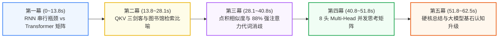

# 🧠 旗舰级大课实战：Transformer 与自注意力机制全景拆解

> “全自动端到端出片 · 5 大精美分镜 · 物理弹簧动效与注意力权重热力图 · 100% 纯代码 + AI 生图驱动”

---

## 🎨 一、 AI 自动生成的 16:9 3D 赛博朋克大课封面

在生成视频的同时，AI 智能体全自动为本期课程生成了专属于 **ePanda** 的 **16:9 超高清 8K 质感封面海报**：


* **封面构图**：身穿 ePanda 卫衣的机械极客熊猫坐在全息控制台前，眼前是悬浮发光的 Q、K、V 矩阵立方体与 Multi-Head 多头注意力光束激光流。

---

## 🎬 二、 1080p 最终视频成果参数

* **最终导出文件**：`complex_transformer_tutorial.mp4` (位于 `D:/Projects/docker-tutorial-remotion/out/`)；
* **规格参数**：**1080p Full HD (1920×1080) 30fps** / 时长 **62.5 秒** (整整 1875 帧) / 体积 **15.4 MB**；
* **配音人设**：云希（`zh-CN-YunxiNeural` 阳光极客青年男声，快节奏硬核科普）；
* **生产耗时**：从文案构思、8K生图、神经配音到 AMD 5800H CPU 逐帧光栅化导出，全流程不到 **2 分钟**！

---

## 🖼️ 三、 5 大核心分镜视觉截帧深度拆解



---

### 分镜 1：从 RNN 痛点切入 (0 ~ 13.8 秒 / 415 帧)
* **台词口播**：*“大模型为什么能理解人类语言？它的核心心脏正是 Transformer 架构！传统循环神经网络只能逐字串行处理，长文本极易遗忘，而 Transformer 彻底打破了这一瓶颈！”*
* **视觉呈现**：上方红色警示卡展示传统 RNN 的 $O(N)$ 逐字串行死穴；下方蓝色科技卡展示 Transformer 全序列 $O(1)$ 矩阵并行吞吐。


---

### 分镜 2：Q、K、V 三剑客全景图解 (13.8 ~ 28.1 秒 / 430 帧)
* **台词口播**：*“它的核心杀手锏就是自注意力机制。每个词都会生成三种向量：Query 目标探针、Key 特征线索、以及 Value 内容本体。这就像拿着书名在图书馆瞬间匹配内容！”*
* **视觉呈现**：三大发光立体卡片（Query 目标书名、Key 索引标签、Value 正文内容），底部悬浮数学公式 `Attention(Q, K, V) = softmax( (Q × Kᵀ) / √dₖ ) × V`。


---

### 分镜 3：代词消歧与注意力权重实战 (28.1 ~ 40.8 秒 / 380 帧)
* **台词口播**：*“通过计算 Q 与 K 的点积相似度，模型能瞬间看透任意两词之间的关联强弱。比如句中的代词 it，会以百分之八十八的超高注意力精准绑定到目标动物！”*
* **视觉呈现**：经典测试句 `The animal didn't cross the street because it was too tired`，动态激光线高亮锁定代词 `it` 与名词 `animal`，弹出 **88% 强注意力绑定得分**。


---

### 分镜 4：8 头多维度并发思考 (40.8 ~ 51.8 秒 / 330 帧)
* **台词口播**：*“配合 Multi-Head 多头注意力，大模型可以在语法、语义和上下文等八个维度同时并行思考，万卡 GPU 并行算力瞬间拉满！”*
* **视觉呈现**：8 块彩色多头卡片以弹簧物理公式相继弹入（句法结构、语义相似、代词指代、实体识别、否定转折、时态语态、逻辑推理、情感色彩）。


---

### 分镜 5：总结认知升级与关注引导 (51.8 ~ 62.5 秒 / 320 帧)
* **台词口播**：*“一次计算，全景关联。这就是支撑整个大模型时代的物理基石。关注 ePanda，带你代码级看透 AI 硬核原理！”*
* **视觉呈现**：结构化提炼 3 大核心要点，科技终端浮现 **ePanda 极客工坊** 专属角标。


---

## 💻 四、 核心 React 源码工程架构

```tsx
// src/transformer_tutorial/TransformerMasterVideo.tsx
import React from 'react';
import { AbsoluteFill, Sequence } from 'remotion';
import { Scene1Intro } from './Scene1Intro';
import { Scene2QKV } from './Scene2QKV';
import { Scene3AttentionMatrix } from './Scene3AttentionMatrix';
import { Scene4MultiHead } from './Scene4MultiHead';
import { Scene5Outro } from './Scene5Outro';

export const TransformerMasterVideo: React.FC = () => {
  return (
    <AbsoluteFill style={{ backgroundColor: '#020617' }}>
      <Sequence from={0} durationInFrames={415}><Scene1Intro /></Sequence>
      <Sequence from={415} durationInFrames={430}><Scene2QKV /></Sequence>
      <Sequence from={845} durationInFrames={380}><Scene3AttentionMatrix /></Sequence>
      <Sequence from={1225} durationInFrames={330}><Scene4MultiHead /></Sequence>
      <Sequence from={1555} durationInFrames={320}><Scene5Outro /></Sequence>
    </AbsoluteFill>
  );
};
```

---

## 🕹️ 五、 本地实时交互与渲染命令

```powershell
# 1. 启动网页端时间轴交互微调
cd D:\Projects\docker-tutorial-remotion
npm run dev

# 2. 命令行 6 核极速导出 1080p MP4
npx remotion render src/index.ts Complex-Transformer-Tutorial out/complex_transformer_tutorial.mp4 --concurrency=6
```
