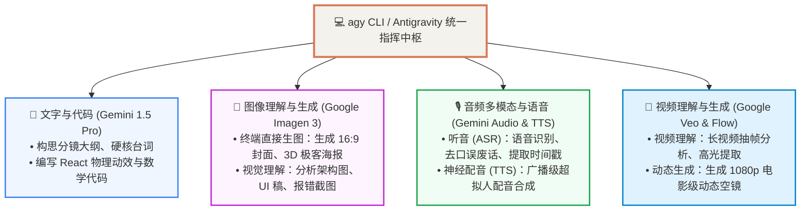

# 🌐 AGY 全模态调度与 Google 视频大模型 (Veo / Flow) 选型指南

> “打通文字、代码、Imagen 3 生图、多模态音频与 Google Veo 视频大模型”

---

## 🚀 一、 AGY CLI 全模态统一指挥中枢

在 Antigravity (AGY) 终端体系下，开发者可以直接调用谷歌云端的全模态超级算力，实现跨模态端到端协同：



---

## 🎬 二、 谷歌视频“模型” vs “工具”选型深度对比

| 层次 | 名称 | 访问地址 | 核心定位与特点 | 推荐使用场景 |
| :--- | :--- | :--- | :--- | :--- |
| **底层大模型** | **Google Veo (Veo 3.1)** | 云端 TPU 算力底座 | 谷歌最先进的 1080p 物理动力学视频生成引擎 | 提供底座视频扩散推理能力 |
| **极速抽卡工具** | **VideoFX / Whisk** | [labs.google](https://labs.google) | **单镜头 5 秒极速生成**：输入一句提示词，30秒吐出一段高清短片 | **需要 5 秒超炫动态背景时首选** |
| **影视级工作台** | **Google Flow** | [flow.google](https://flow.google) | **多镜头叙事工作台**：支持摄影机运镜控制（Pan/Zoom）、角色外貌连续性 | 制作有剧情连贯性的 30 秒故事短片 |
| **原生对话入口** | **Gemini 网页端** | [gemini.google.com](https://gemini.google.com) | **对话流一键图生视频**：直接在聊天框输入提示词或让图片动起来 | 快速验证画面概念与单图动效 |

---

### 🎨 三、 终端原生生图 vs 网页端视频生成的真相

1. **生图（Images）：100% 可以在 AGY 终端直接直出！**
   * 内置 **Google Imagen 3** 引擎，直接在终端输入自然语言需求，秒级在本地保存 16:9 高清大图，**零网页依赖**。
2. **生视频（Videos）的双轨分工**：
   * **程序化技术视频 (Remotion)**：100% 在终端依靠本地 CPU 渲染输出，文字 100% 矢量清晰，音画绝对同步；
   * **好莱坞级电影空镜 (Veo / VideoFX)**：在网页端点一下生成并下载，作为素材提供给本地组装。

---

## 🏆 四、 为什么技术科普首选“大模型代码化 + Remotion 渲染”？

| 对比维度 | 纯黑盒文生视频 (如 Veo / Sora) | 大模型编程 + Remotion 渲染 (当前主力方案) |
| :--- | :--- | :--- |
| **代码与文字** | ❌ 极易乱码扭曲、不可控 | ✅ **100% 矢量级锐利，代码高亮与数学公式分毫不差** |
| **音画同步** | ❌ 难以精确到毫秒级高亮 | ✅ **讲到哪个词，哪个按钮/色块/激光线就精准亮起** |
| **视频长度** | ❌ 通常单次只能生 5~10 秒 | ✅ **可连续生成 1 分钟、5 分钟甚至体系大课** |
| **修改成本** | ❌ 稍微改一个字要重新排队抽卡 | ✅ **改一行代码，本地 1 秒刷新重新导出** |

---

## 🎯 五、 自媒体制作最佳 SOP：9:1 黄金法则

```text
┌─────────────────────────────────────────────────────────────┐
│ 🚀 90% 的日常视频（代码技巧、架构对比、Linux命令、实操教学） │
│  👉 全程在【本地终端】搞定！                                  │
│     在终端对 AGY 说一句话 ➔ 自动写分镜 ➔ 自动配音 ➔ 本地导出 MP4  │
│     (耗时：2 分钟出片 / 成本：0 元 / 效果：绝对高清可控)       │
└─────────────────────────────────────────────────────────────┘
                             ▲
                             │ （需要好莱坞级炸裂片头时）
┌────────────────────────────┴────────────────────────────────┐
│ 🌌 10% 的重大概念大片（需要 5 秒好莱坞级电影空镜）           │
│  👉 打开【Google Flow / VideoFX 网页】抽卡生成一段 5 秒短片  │
│     下载 MP4 丢进本地 public 目录 ➔ 终端一键组装为动态大片！   │
└─────────────────────────────────────────────────────────────┘
```

---

## 🚦 六、 真实 Pro 订阅额度与频次限制全景

| 模块 | 真实上限与频次限制 | 触发限制后的表现 |
| :--- | :--- | :--- |
| **1. 核心大模型 (Gemini 1.5 Pro)** | **• 上下文容量**：最高 **200 万 Token**<br/>**• 频次限制**：滑动时间窗口（高频对话约 **50~100 次 / 3 小时**） | 自动平滑降级到响应更快的 Gemini 1.5 Flash，或提示冷却几分钟后恢复。 |
| **2. AI 生图 (Imagen 3)** | **• 频次限制**：约 **2~5 张 / 分钟**<br/>**• 单日软上限**：日常约 **50~100 张 / 天** | 连续快速生成会被限速拦截（`429 Too Many Requests`），需排队等待。 |
| **3. 视频渲染 (Remotion)** | **💥 0 限制！真正的无限次！** | **100% 跑在本地 8 核 CPU 上**，不消耗云端配额，一天渲染 1000 条也一分钱不扣。 |
| **4. 神经配音 (Edge-TTS)** | **💥 0 限制！** | 走免费神经通道，**完全不消耗 Google Pro 订阅额度**。 |
