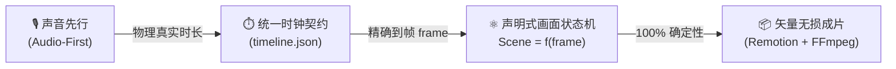
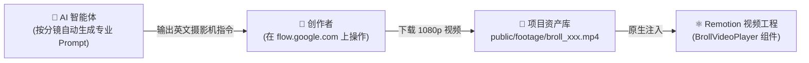

# 🎬 AI Video Studio 工业级全链路视频自动化工作流

> **开源工程**：[https://github.com/Xepanda/ai-video-studio](https://github.com/Xepanda/ai-video-studio)  
> **核心定位**：基于**“代码即视频”**理念打造的高保真视频自动化流水线，全面覆盖**科普视频**、**自媒体短片**、**项目实战**与**实拍/AI生成视频混剪**。

---

## 一、 为什么抛弃“纯盲盒抽卡”而选择程序化渲染？

传统纯文生视频模型（如 Sora、可灵、Runway）本质上是“根据概率预测像素”，在专业技术领域存在无法逾越的缺陷：文字乱码、架构图胡乱连线、无法精准指代引脚与代码。

`AI Video Studio` 采用工业级**确定性程序化渲染**：



* **画面即纯函数**：`Scene = f(frame)`。任何动画都是当前帧号 `frame` 经过数学公式（`interpolate`、Spring 弹簧物理、贝塞尔曲线）计算出的绝对样式，零抽卡成本。
* **声音先行绝对真理**：声音的物理时长决定画面的寿命，`durationInFrames = Math.ceil(秒数 * 30 FPS)`。台词修改后重新打点，画面关键帧自动收缩或延伸，无需手动对齐。

---

## 二、 核心硬件基准与极速选型策略

根据工作站物理参数（AMD Ryzen 7 5800H 8C/16T, 16GB RAM, AMD Radeon 集显），确立了最高能效比的软硬件架构路线：

| 维度 | 物理配置 | 架构约束 | 应对策略 |
| :--- | :--- | :--- | :--- |
| **CPU 计算** | **AMD Ryzen 7 5800H**<br/>(8核16线程, 最高 4.4GHz) | 具备极强的 **AVX2 向量加速**。 | 视频渲染走 Headless Chrome 6核并发光栅化；ASR 采用 **FunASR CPU 原生推理**。 |
| **GPU 约束** | **AMD Radeon Graphics** (核显) | **无 NVIDIA CUDA** 支持。 | **坚决规避** 依赖 CUDA 的重型未量化 PyTorch 模型；微调走云端，推理走轻量 CPU。 |
| **存储 I/O** | Windows 11 原生 + WSL2 双环境 | 跨虚拟盘 (`/mnt/d/`) 读写大视频有 3~5 倍延迟。 | **工程完全落盘在 Windows 原生物理盘 (`D:\Projects\ai-video-studio`)**。 |
| **ASR 裁判** | 阿里 **SenseVoice-Small** | 51.2 秒音频仅耗时 **8.22 秒** (RTF = 0.161)。 | 提取词级起止毫秒时间戳与情绪标签（如 HAPPY 情绪）。 |

---

## 三、 Google Flow (`https://flow.google.com/`) Web 协同闭环

对于代码动画难以表达的“电影级微距特写”、“芯片发光流光”、“故障艺术概念”等镜头，系统将 **Google 视频大模型 (Veo / Flow)** 纳入标准化工程闭环：



### 1. 摄影学五段式提示词规范
`Prompt = [主体材质] + [光影色彩] + [运镜景深] + [环境氛围] + [画质风格]`

* **芯片特写范例**：
  > `Extreme cinematic macro shot of a glowing microchip processor with pulsating blue circuit traces, holographic data floating above, anamorphic lens flare, shallow depth of field, 4k 60fps, smooth slow camera drift.`

### 2. Remotion BrollVideoPlayer 组件消费
工程内置了自适应 B-Roll 组件，支持电影级微缩放（Ken Burns 慢推）与画幅自适应毛玻璃边框：

```tsx
import { BrollVideoPlayer } from './components/BrollVideoPlayer';

export const MyScene = () => (
  <BrollVideoPlayer
    src="footage/broll_scene_01.mp4"
    durationInFrames={150}
    kenBurns={true}
    blurBackground={true}
  />
);
```

---

## 四、 五重质量审查门禁 (Quality Gate)

为了保障批量化工业生产的稳定性，建立了严格的五重拦截机制：

```text
┌─────────────────────────────────────────────────────────────┐
│ 阶段 1：文案与分镜合规审查 (字数/语速比 4.5字/s, 多音字注音)│
├─────────────────────────────────────────────────────────────┤
│ 阶段 2：声音与毫秒打点审查 (SenseVoice 连续性, 情绪匹配)   │
├─────────────────────────────────────────────────────────────┤
│ 阶段 3：视觉动效与安全区审查 (平台 Safe Zone, 物理弹簧阻尼) │
├─────────────────────────────────────────────────────────────┤
│ 阶段 4：自动化静态资产门禁 (执行 python scripts/validator.py)│
├─────────────────────────────────────────────────────────────┤
│ 阶段 5：最终成片交付门禁 (CFR 30.00 fps, yuv420p 色彩空间)   │
└─────────────────────────────────────────────────────────────┘
```

其中 **阶段 4** 可由终端脚本全自动执行：
```bash
python scripts/validator.py
```
若出现任何音频 404、视频缺失、分镜帧数计算断层，脚本将直接退出并报出详细上下文，严禁带病渲染。

---

## 五、 创作者极简操作 SOP

创作者日常生产视频只需 3 个标准化动作：

1. **填写需求表**：
   复制 `templates/PROJECT_SPEC_TEMPLATE.md` 为 `my_project.md`，填入分镜文案、画面类型和 Google Flow 提示词需求。
2. **运行打点流水线**：
   ```bash
   python scripts/pipeline.py --project my_project
   ```
   自动完成配音生成、SenseVoice 毫秒打点与数据契约自动审查。
3. **网页预览与并发导出**：
   ```bash
   # 启动本地实时交互剪辑台 (浏览器访问 localhost:3000)
   npm run dev

   # 榨干 5800H 8核算力，导出 1080p MP4
   npx remotion render src/index.ts MasterVideo out/final.mp4 --concurrency=6
   ```

---

## 六、 仓库索引与快速导航

* 💻 **GitHub 源码仓库**：[Xepanda/ai-video-studio](https://github.com/Xepanda/ai-video-studio)
* 📜 **操作总规程**：[`WORKFLOW.md`](https://github.com/Xepanda/ai-video-studio/blob/master/WORKFLOW.md)
* 🔍 **质检验收清单**：[`AUDIT_CHECKLIST.md`](https://github.com/Xepanda/ai-video-studio/blob/master/AUDIT_CHECKLIST.md)
* 📋 **分镜制作模板**：[`PROJECT_SPEC_TEMPLATE.md`](https://github.com/Xepanda/ai-video-studio/blob/master/templates/PROJECT_SPEC_TEMPLATE.md)
