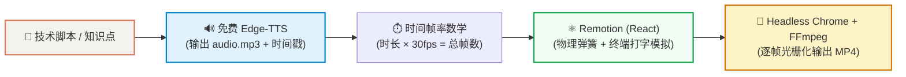
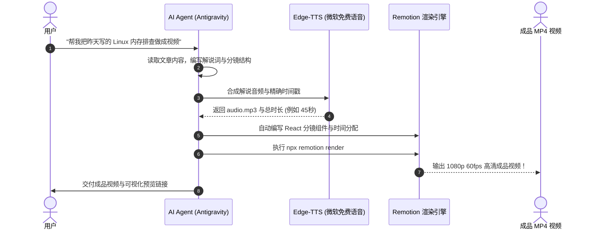

# 🎬 Remotion + 免费神经 TTS 自动化视频流水线

> “代码即视频 (Code as Video) · 彻底告别剪映与 PR 的手工拖拽拉时间轴时代。”

本指南记录了如何使用 **Remotion (React)** 配合 **微软 Edge-TTS 免费神经语音**，在本地端到端构建一套全自动、工业级的编程教学动画视频生成引擎。

---

## 🌟 一、 为什么选择“代码即视频”？

传统视频剪辑（剪映、Premiere、After Effects）在制作编程教学或技术架构解说时存在三大痛点：
1. **耗时费力**：对齐台词、拉字幕、调关键帧需要大量手工重复操作；
2. **难以修改**：一旦脚本台词有微调，整条时间轴上的剪辑块全部错位，重做成本极高；
3. **无法程序化**：工程文件庞大、格式私有，无法被 Git 追踪，更无法被 AI Agent 自动化驱动。

**Remotion 的革命性**：把**每一个视频画面变成一个 React 组件**，通过帧率数学与物理公式驱动动画。整部视频就是几百行纯 TypeScript 代码，可版本控制、可模板复用、可由 AI 自动生成！



---

## 🚀 二、 核心实现步骤全景拆解

### 步骤 1：声音先行 —— 神经语音合成与锁定时间基准
在程序化视频中，**“声音的长度决定了画面的寿命”**。我们绝不能先盲目画画面，而是必须先由配音确立严格的时间轴骨架。

* **选型**：使用微软官方的 `edge-tts`（100% 免费、免 API Key、零 GPU 开销）。
* **音色**：技术教程推荐 `zh-CN-YunxiNeural`（阳光自然的极客男声）或 `zh-CN-YunjianNeural`（沉稳旁白解说）。
* **核心脚本** (`generate_audio.py`)：
  ```python
  import asyncio, edge_tts

  VOICE = "zh-CN-YunxiNeural"
  TEXT = "在你的电脑上能跑，但在服务器上就报错？这是每个开发者都经历过的环境噩梦..."

  async def generate():
      communicate = edge_tts.Communicate(TEXT, VOICE, rate="+8%")
      submaker = edge_tts.SubMaker()
      with open("public/audio.mp3", "wb") as f:
          async for chunk in communicate.stream():
              if chunk["type"] == "audio":
                  f.write(chunk["data"])
              elif chunk["type"] == "WordBoundary":
                  submaker.feed(chunk)
      with open("public/subtitles.srt", "w", encoding="utf-8") as f:
          f.write(submaker.get_srt())

  asyncio.run(generate())
  ```
  > `总帧数 (durationInFrames) = 51.2 秒 × 30 FPS ≈ 1540 帧`

---

### 步骤 2：分镜编排 —— 用 React 组件声明式定义时间轴
在 Remotion 中，`<Sequence>` 标签就等价于剪辑软件里的轨道素材块。

```tsx
// src/Video.tsx
import { AbsoluteFill, Audio, Sequence, staticFile } from 'remotion';

export const DockerTutorialVideo: React.FC = () => {
  return (
    <AbsoluteFill>
      {/* 1. 注入神经语音音轨 */}
      <Audio src={staticFile('audio.mp3')} />

      {/* 2. 第一幕：痛点引入 (0~12秒 / 0~360帧) */}
      <Sequence from={0} durationInFrames={360}>
        <IntroScene />
      </Sequence>

      {/* 3. 第二幕：虚拟机 vs 容器架构对比 (12~23秒 / 360~690帧) */}
      <Sequence from={360} durationInFrames={330}>
        <ComparisonScene />
      </Sequence>

      {/* 4. 第三幕：核心三要素 (23~38秒 / 690~1180帧) */}
      <Sequence from={690} durationInFrames={490}>
        <CoreElementsScene />
      </Sequence>

      {/* 5. 第四幕：终端打字实战模拟 (38~46秒 / 1180~1380帧) */}
      <Sequence from={1180} durationInFrames={200}>
        <TerminalScene />
      </Sequence>

      {/* 6. 第五幕：核心价值总结与 Slogan (46~51秒 / 1380~1540帧) */}
      <Sequence from={1380} durationInFrames={160}>
        <OutroScene />
      </Sequence>

      {/* 7. 全局动态同步字幕条 */}
      <SubtitleBar />
    </AbsoluteFill>
  );
};
```

---

### 步骤 3：动效实现 —— 物理弹簧阻尼与动态打字算法

抛弃传统 CSS Transition，所有动画严格绑定当前帧 `useCurrentFrame()`。

#### 1. 物理弹簧算法 (`spring`)
使卡片弹出时具备真实物理世界的微回弹质感（避免机械生硬）：
```tsx
const cardSpring = spring({
  frame: frame - 15, // 延后 15 帧入场
  fps: 30,
  config: { damping: 12, mass: 0.8 }, // 阻尼系数与质量
});

// 在 JSX 中直接绑定 scale
<div style={{ transform: `scale(${cardSpring})` }} />
```

#### 2. 黑客终端动态敲入算法
通过当前帧在总命令长度中的比例，实时对文本进行字符串切片（`slice`），并实现光标按秒闪烁：
```tsx
const command = 'docker run -d -p 80:80 --name my-web nginx';
// 随着 frame 推进，逐字吐出字符
const charsCount = Math.min(command.length, Math.floor(frame * 0.8));
const typedCommand = command.slice(0, charsCount);
const showCursor = Math.floor(frame / 10) % 2 === 0;

return (
  <div className="terminal-prompt">
    <span className="user">ePanda@workstation:~$</span>
    <span className="cmd">{typedCommand}</span>
    {charsCount < command.length && showCursor && <span className="cursor" />}
  </div>
);
```

---

### 步骤 4：光栅化渲染 —— Headless Chrome + FFmpeg 管道
当你执行 `npm run render` 时，Remotion 内部启动了极高并行的光栅化流程：
1. **打包 React 代码**：通过 Webpack/Vite 把代码打包为独立的 Web 运行时；
2. **启动无头 Chrome**：在后台启动 Chrome Headless Shell，在内存中渲染每一帧网页（1920×1080）；
3. **管道推送 FFmpeg**：无头浏览器每截获一帧图像，直接通过标准管道（stdin）推入 FFmpeg，最后混流 `audio.mp3`，以硬件并发压制成标准 H.264 / AAC MP4 文件。

---

## 🖼️ 三、 实战渲染效果走查 (Docker 入门教程)

在本次构建的 [`D:\Projects\docker-tutorial-remotion\`](file:///D:/Projects/docker-tutorial-remotion/) 项目中，5 个场景实测截帧效果如下：

### 1. 痛点引言场景 (IntroScene)

*暗黑科技网格背景 + 红色呼吸警示标 + 抛出灵魂拷问。*

### 2. 架构对比场景 (ComparisonScene)

*左侧红框（虚拟机笨重体系）与右侧蓝绿框（Docker 共享内核极速架构）直观对比。*

### 3. 核心三要素场景 (CoreElementsScene)

*镜像（只读模板）➔ 容器（运行实例）➔ 仓库（应用集市），连贯动态排布。*

### 4. 终端实战场景 (TerminalScene)

*逼真的 Ubuntu WSL2 终端模拟、键盘敲击动效、镜像拉取日志与毫秒级服务就绪提示。*

---

## 🤖 四、 与 AI Agent 结合的未来生产力玩法

这套方案真正的威力在于：**它完全是文本代码，因此可以由 AI Agent 100% 全自动调度**！

我们已经将这套工作流固化为专有技能 **[`remotion-video-maker`](file:///C:/Users/ePanda/.agents/skills/remotion-video-maker/SKILL.md)**：



---

## 🛠️ 五、 常用命令与操作指南

### 1. 本地项目路径
```text
D:\Projects\docker-tutorial-remotion\
├── generate_audio.py      # 配音合成与字幕提取
├── public/                # 音频与静态资源 (audio.mp3)
├── src/
│   ├── Video.tsx          # 视频总控时间轴
│   ├── Root.tsx           # Remotion 根配置
│   ├── components/        # 背景、字幕条公共组件
│   └── scenes/            # 各分镜组件 (Intro, Comparison, Elements, Terminal)
└── out/
    └── docker_tutorial.mp4 # 渲染成品
```

### 2. 交互式调试与导出
```bash
# 启动网页端可视化逐帧微调 Studio
npm run dev

# 导出最终 1080p 视频
npm run render
```
