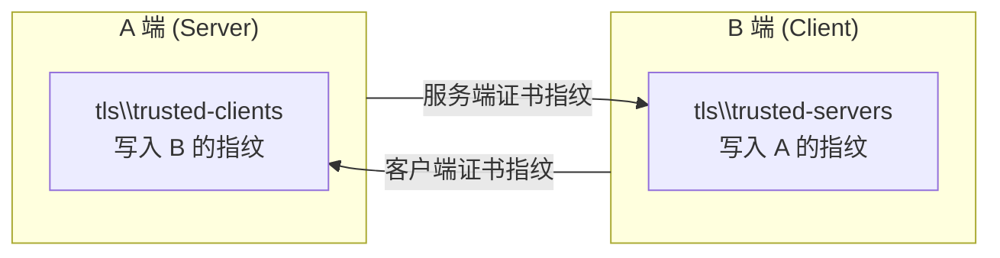

# Deskflow 跨屏键鼠共享部署

[Deskflow](https://github.com/deskflow/deskflow)（Synergy 的开源续作）提供软件级 KVM：一台服务端共享键鼠给多台客户端，鼠标在屏幕边缘无缝穿越，剪贴板同步。本方案中 **A 为服务端、B 为客户端**。

---

## 1. 安装（两台都要装）

winget 安装在本机实测报错 `exit 1603`，直接下载 MSI 静默安装最稳：

```bash
# 下载 https://github.com/deskflow/deskflow/releases 的 deskflow-1.26.0-win-x64.msi
msiexec /i deskflow-1.26.0-win-x64.msi /qn
# 安装位置: C:\Program Files\Deskflow\
```

> **注意**：MSI 装完后 GUI 不会自动启动服务。后续我们**完全不用 GUI**，直接命令行启动核心进程，更可控。

---

## 2. A 端：服务端配置

### 2.1 服务端配置文件

`C:\ProgramData\Deskflow\deskflow-server.conf`：

```ini
section: screens
    LAPTOP-8KJBDOP9:
    LAPTOP-MSHUJLQO:
end

section: links
    LAPTOP-8KJBDOP9:
        right = LAPTOP-MSHUJLQO
    LAPTOP-MSHUJLQO:
        left = LAPTOP-8KJBDOP9
end

section: options
    keystroke(alt+control+right) = switchInDirection(right)
    keystroke(alt+control+left) = switchInDirection(left)
end
```

关键点：

* `screens` 中的名字是两台机器的 **Windows 计算机名**（`hostname`），一字不能错；
* `links` 定义几何布局：A 的右边是 B，B 的左边是 A——鼠标滑过 A 右边缘即进入 B；
* 修饰键**必须写全称 `control`**，写 `ctrl` 会报 `unable to parse key`；
* 注释和内容建议纯 ASCII，中文注释在某些版本会干扰解析。

### 2.2 无窗口启动服务端

不要用 GUI（点不点 Start 状态不透明），直接后台启动核心进程：

```bash
"C:\Program Files\Deskflow\deskflow-core.exe" server -c C:/ProgramData/Deskflow/deskflow-server.conf
```

监听端口 `24800`。验证：

```bash
netstat -ano | findstr 24800
```

### 2.3 开机自启

放一个 VBS 到 `shell:startup`（`Win+R` 输入 `shell:startup`），带已运行检测避免重复拉起：

```vb
' start-deskflow-server.vbs
Set objWMI = GetObject("winmgmts:\\.\root\cimv2")
Set cols = objWMI.ExecQuery("SELECT * FROM Win32_Process WHERE Name='deskflow-core.exe'")
If cols.Count = 0 Then
    CreateObject("WScript.Shell").Run """C:\Program Files\Deskflow\deskflow-core.exe"" server -c C:/ProgramData/Deskflow/deskflow-server.conf", 0, False
End If
```

---

## 3. TLS 指纹互信（最容易卡住的一步）

Deskflow 1.26.0 默认启用 TLS，两端互不信任会拒绝连接。GUI 启动时会弹信任对话框，但**命令行启动的服务端不弹框**（GitHub issue #9688），必须手动写指纹文件。

### 3.1 信任原理



* **A 端**：`C:\ProgramData\Deskflow\tls\trusted-clients` ← 写入 **B 的指纹**
* **B 端**：`C:\ProgramData\Deskflow\tls\trusted-servers` ← 写入 **A 的指纹**

### 3.2 指纹格式（踩过坑）

```
v2:sha256:<64位小写hex，无冒号>
```

* 整行 `wc -c` 应为 **75 字符**（含换行）；
* 实测手写漏了 1 个 hex 字符（63 位）→ 指纹永远 `not trusted`，且日志没有明确提示长度错误；
* 指纹来源：对端首次连接尝试时，本端 Deskflow 日志会打印对方指纹（`F2:36:1E:...` 冒号格式需去掉冒号转小写）。

### 3.3 B 端信任 A（一行命令，管理员 PowerShell）

```powershell
Set-Content -Path "C:\ProgramData\Deskflow\tls\trusted-servers" -Value "v2:sha256:f2361e0fe7ade606c485b7fca3643e9c9d5ff21032caa9af58cdda1a7874b148"
```

写入后 B 的客户端每 3 秒自动重连，无需手动重启。

### 3.4 A 端信任 B

同理，把 B 连接时日志中打印的指纹写入 A 的 `trusted-clients`。

---

## 4. B 端：客户端启动

```bash
"C:\Program Files\Deskflow\deskflow-core.exe" client --name LAPTOP-MSHUJLQO 192.168.31.152:24800
```

连接成功的标志（A 端日志）：

```
TLSv1.3, accepted client connection
client "LAPTOP-MSHUJLQO" has connected
```

同时 `netstat` 能看到一条稳定的 `ESTABLISHED` 连接（而非每 3 秒重连的短连接）。

---

## 5. 排错速查

| 症状 | 根因与解法 |
|------|-----------|
| B 连不上，24800 不通 | 服务端根本没启动（GUI 开着 ≠ 服务在跑）。用 netstat 确认监听后再查防火墙 |
| TLS 握手成功但 `new client is unresponsive` 循环 | B 卡在验证 A 的指纹 → 跑 3.3 的信任命令 |
| 屏幕名对不上、B 反复重连 | 检查计算机名拼写。**实测踩坑：`MSHUJLQO` 结尾是字母 O，不是数字 0**，一字之差连接永不成功 |
| `unable to parse key` | 修饰符写成 `ctrl` 了，改 `control` 全称 |
| B ping A 100% 丢包 | B 防火墙拦 ICMP 而已，不代表链路断，别被误导 |
| 日志时间戳比真实时间慢 2.5 小时 | Deskflow 日志时区显示问题，判断新鲜度以内容为准 |

> **屏幕布局自定义**：`links` 段可以随意组合方向（`right/left/above/below`），比如把 B 放 A 上方，鼠标滑 A 顶边缘进 B。
