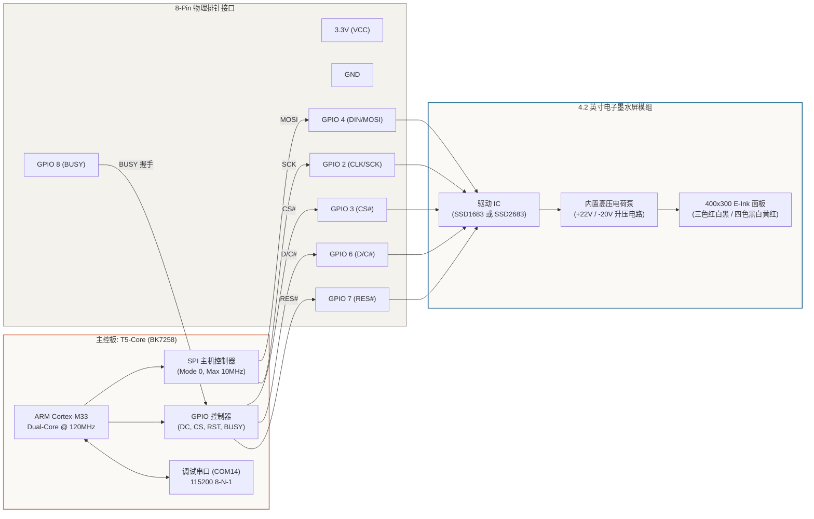
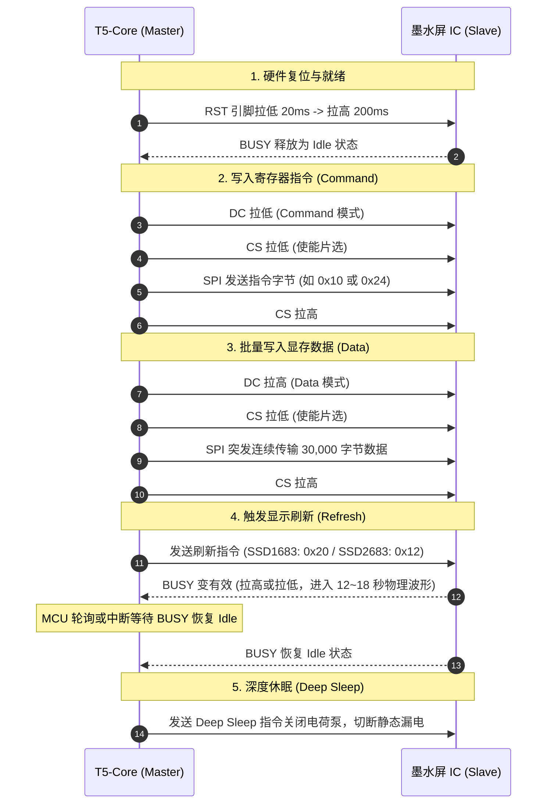

# 01. 硬件架构、引脚映射与双控制器规范

在低功耗物联网（IoT）设备与极客桌面终端设计中，**微胶囊电泳显示技术（Micro-encapsulated Electrophoretic Display, EPD）** 具备双稳态维持（显示静态图像零耗电）、全反射式高环境光可读性以及接近纸质印刷品的舒适观感。

本项目基于 **涂鸦 TuyaOpen 开源物联网框架** 与 **T5-Core（博通集成 BK7258 双核 ARM Cortex-M33，内置 Wi-Fi 6 + BLE 5.4）** 核心板，构建了一套软硬件深度协同的通用驱动系统，支持在同一套固件中无缝驱动 **4.2 英寸黑白红三色屏** 与 **4.2 英寸黑白黄红四色屏**。

---

## 一、 系统整体架构与硬件拓扑

系统的整体硬件连接与数据流转拓扑如下所示：

---

## 二、 三色屏与四色屏核心参数深度对比

虽然两款屏幕模组在外观尺寸（约 91.0 x 77.0 mm）、有效显示区（84.8 x 63.6 mm，对角线 4.2 英寸）以及 8 针接口引脚定义上完全一致，但在内部显示原理、显存编码结构及刷新波形上有本质区别：

| 参数项 | 4.2" 黑白红三色屏 (Tri-Color) | 4.2" 黑白黄红四色屏 (Spectra 4-Color) |
| :--- | :--- | :--- |
| **典型面板型号** | **DEPG0420** / **GDEW042Z15** | **GDEM042F86** (Good Display) |
| **主控芯片 (Driver IC)** | **Solomon SSD1683** / **UltraChip UC8176** | **Solomon SSD2683** |
| **物理分辨率** | **400(水平) x 300(垂直)** 像素 | **400(水平) x 300(垂直)** 像素 |
| **像素点间距 (Pitch)** | 0.212 x 0.212 mm (约 120 DPI) | 0.212 x 0.212 mm (约 120 DPI) |
| **支持显示色彩** | 纯黑、纯白、赤红 (3 种物理原色) | 纯黑、纯白、金黄、赤红 (4 种物理原色) |
| **显存组织架构 (VRAM)** | **双平面 1-bit**： • 黑白平面：400x300/8 = 15,000 字节 • 红色平面：400x300/8 = 15,000 字节 **单帧显存总计：30,000 字节 (30 KB)** | **单平面 2-bit (Packed)**： • 每个像素占用 2 bits (4 像素/字节) • 400x300 x 2 / 8 = 30,000 字节 **单帧显存总计：30,000 字节 (30 KB)** |
| **显存颜色编码** | **黑白平面 (RAM 0x24)**：`0`=黑, `1`=白 **红色平面 (RAM 0x26)**：`1`=红, `0`=非红 | **单平面 (RAM 0x10)**： • `00b` = 纯黑 (Black) • `01b` = 纯白 (White) • `10b` = 金黄 (Yellow) • `11b` = 赤红 (Red) |
| **BUSY 引脚极性** | **高电平 (1) = 正在刷新 (Busy)** 低电平 (0) = 刷新结束 (Idle) | **低电平 (0) = 正在刷新 (Busy)** 高电平 (1) = 刷新结束 (Idle) |
| **全屏刷新波形耗时** | 约 **18 ~ 20 秒** (高压粒子翻转波形) | **标准模式 ~18s / 极速模式 ~12s** |
| **工作电压与电流** | 逻辑电压 3.3V (2.3~3.6V)，刷新峰值约 15mA，休眠电流 `< 5uA` | 逻辑电压 3.3V (2.3~3.6V)，刷新峰值约 18mA，休眠电流 `< 5uA` |

---

## 三、 T5-Core 开发板引脚物理接线表

开发板与墨水屏通过 8 根杜邦线相连。本工程选择的 GPIO 避开了 BK7258 的系统烧录 UART（UART1）及主调试口，确保烧录与串口 CLI 交互完全独立不受干扰：

| 墨水屏引脚 | 标称引脚名 | T5-Core GPIO | 内部复用功能 | 方向 | 硬件电气特性与设计说明 |
| :---: | :---: | :---: | :---: | :---: | :--- |
| **1** | **VCC** | **3.3V** | Power (3V3) | 输入 | 模组主电源（2.3V ~ 3.6V），请并联 10uF 钽电容与 0.1uF 陶瓷滤波电容 |
| **2** | **GND** | **GND** | Ground (0V) | 输入 | 系统共地 |
| **3** | **DIN** | **GPIO 4** | SPI MOSI / DO | 输出 | 主机数据输出。在时钟上升沿将指令或显存字节移入驱动 IC |
| **4** | **CLK** | **GPIO 2** | SPI SCK / SCLK | 输出 | 串行时钟线。最高支持 10MHz 时钟频率（SPI Mode 0） |
| **5** | **CS** | **GPIO 3** | SPI CS# / NSS | 输出 | 芯片片选引脚，低电平使能通信，高电平复位串行接口 |
| **6** | **DC** | **GPIO 6** | Data / Command | 输出 | 命令/数据选择：**低电平 = 写入寄存器指令；高电平 = 写入显示数据** |
| **7** | **RST** | **GPIO 7** | Reset (RES#) | 输出 | 硬件复位引脚，低电平复位，初始化时需保持低电平至少 20ms |
| **8** | **BUSY** | **GPIO 8** | Busy Status | 输入 | **波形状态握手引脚**，驱动 IC 内部高压电荷泵工作时会拉低/拉高该引脚 |

---

## 四、 4-Wire SPI 协议与时序规格

电子墨水屏控制器采用标准的 **4 线 SPI (Mode 0)** 通信协议。

### 1. SPI 时序关键时间参数 (Timing Requirements)
- **时钟周期 (`t_CYCLE`)**：最小 `100 ns`（即最大支持 `10 MHz`）；
- **时钟高/低电平宽度 (`t_HIGH / t_LOW`)**：最小 `40 ns`；
- **CS 片选建立时间 (`t_CSS`)**：在 SCK 第一个脉冲前 CS 至少提前 `60 ns` 拉低；
- **CS 片选保持时间 (`t_CSH`)**：在 SCK 最后一个脉冲后 CS 至少保持 `65 ns` 再拉高；
- **数据建立/保持时间 (`t_DS / t_DH`)**：`t_DS >= 30 ns`, `t_DH >= 30 ns`。

---

## 五、 墨水屏内部电荷泵与高压电泳机理

电子墨水屏之所以能够在断电后数月依然保持画面不褪色，是因为其微胶囊内部悬浮着带不同电荷的微米级颜料颗粒：
- **白色微粒**：带正电荷（二氧化钛 TiO2）；
- **黑色微粒**：带负电荷（碳黑 Carbon Black）；
- **红色微粒**：带轻微负电荷（需要更高驱动电压与更长施加脉冲）；
- **黄色微粒**：带中等负电荷。

为了驱动这些微胶囊在粘性流体中泳动，驱动 IC 内部集成了基于开关电容的 **升压电荷泵（Charge Pump Booster）**：
1. **升压过程**：将输入的 3.3V 升压至 **Gate High (VGH 约 +22V)** 与 **Gate Low (VGL 约 -20V)**；
2. **波形施加（LUT Modulation）**：通过内置的查找表（Look-Up Table, LUT）产生正负交替的高压交流波形，振荡唤醒颗粒并促使其精准分层泳动到显示表面；
3. **休眠保护（Power Down）**：刷新完成后，必须执行 Power Off 与 Deep Sleep 序列，将高压电容中的残余电荷泄放到地。**若未正常断电休眠，残余直流偏置电压会导致墨水颗粒永久极化甚至物理损坏！**

---

## 六、 硬件自检与引脚排障诊断

在工程调试中，杜邦线松动、虚焊、接触不良是墨水屏不刷新的首要元凶。本固件在应用层内置了完整的引脚电平与通信诊断 CLI 工具：

### 1. SPI 读写与吞吐量诊断 (`epd_test`)
在串口控制台输入 `epd_test`，固件将自动执行：
1. 打印各引脚的 GPIO 编号与当前逻辑电平；
2. 触发 RST 硬件复位脉冲测试；
3. 发送 1,000 个测试时钟脉冲验证 SCK/MOSI 信号完整性；
4. 模拟全屏 30,000 字节突发数据写入，测试 SPI 实际吞吐率。

### 2. 1Hz 引脚电平翻转测试 (`epd_pins [次数]`)
在控制台输入 `epd_pins 5`，开发板将在 `CLK`、`DIN`、`CS`、`DC`、`RST` 引脚上以 1Hz 频率交替输出 3.3V 和 0V。此时开发者可以用万用表直流电压档测量墨水屏转接板上的焊盘，快速定位哪一根跳线存在虚接。
