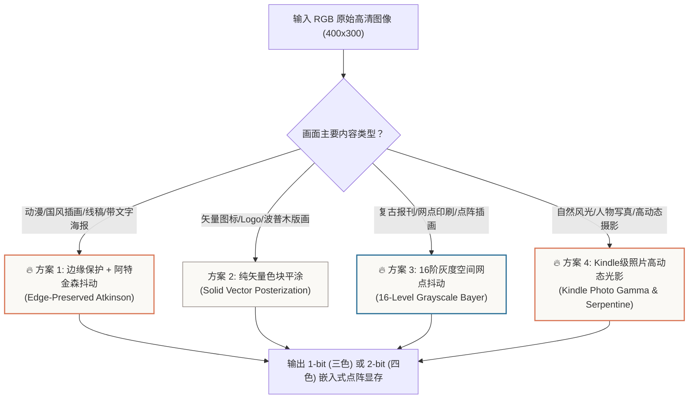
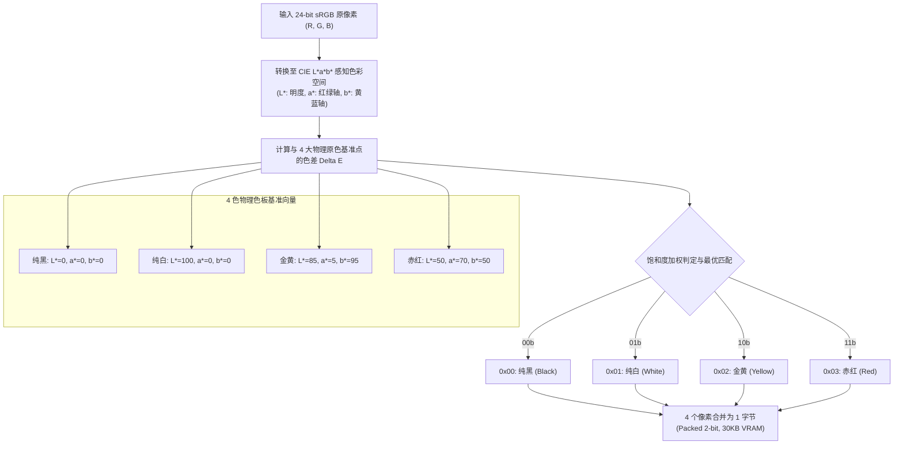

# 02. 电子墨水屏图像算法：边缘保护、16阶灰度与Kindle级光影

电子墨水屏（E-Paper）在微观物理层面上是由充满透明流体的微胶囊构成的。与手机/显示器 LCD 或 OLED 面板具备 256 级（8-bit）甚至 1024 级（10-bit）连续模拟调光能力不同，三色（黑/白/红）与四色（黑/白/黄/红）电子墨水屏的每个微胶囊**只有几种极端的全开/全关物理状态**。

如果使用常规图像处理软件中的最近邻颜色量化（Nearest Neighbor Quantization），输出的画面会出现大面积死黑、高光苍白以及严重的色阶断层（Color Banding）。为了在极其受限的 1-bit 和 2-bit 色深下呈现照片级的细腻光影和插画级的锐利线条，本项目开发了 **4 套专为电子墨水屏定制的高阶算法管线**。

---

## 一、 算法管线选型与视觉特征矩阵



| 渲染方案 | 核心技术与处理流水线 | 噪点与伪影控制 | 适用场景与代表作 |
| :--- | :--- | :--- | :--- |
| **🔥 方案 1：边缘保护 + 阿特金森<br/>(`Edge-Preserved Atkinson`)** | Sobel 空间梯度提取 + 边缘骨架硬锁定 + 75% 误差衰减扩散 | **极低**：彻底消除轮廓两侧的扩散噪点，大色块纯净无杂斑 | 国风插画（如武士熊猫）、动漫线稿、UI 文字卡片 |
| **方案 2：纯矢量色块平涂<br/>(`Solid Vector Posterization`)** | 双边边缘保持平滑 + CIE Lab 空间多阈值色彩硬聚类 | **0 噪点**：完全不进行误差扩散，仅保留纯色面 | 扁平化 Logo、天气图标、浮世绘木版画 |
| **🔥 方案 3：16 阶灰度空间网点<br/>(`16-Level Grayscale Bayer`)** | 16 等距色阶量化 + $4\times4$ 拜耳有序空间点阵调制 | **微观有序**：呈现均匀几何点阵，无随机颗粒漂移 | 复古报纸、报刊插图、点阵写真 |
| **🔥 方案 4：Kindle 级照片光影<br/>(`Kindle Photo Gamma & Serpentine`)** | Gamma 1.45 暗部反射率校正 + USM 反遮罩锐化 + 蛇形双向扩散 | **极佳连续性**：消除单向扩散斜纹伪影，毛发与高光过渡自然 | 自然摄影、动物特写（如熊猫毛发）、高清壁纸 |

---

## 二、 核心算法原理解析与数学推导

### 1. 方案 1：边缘保护 + 阿特金森抖动 (Edge-Preserved Atkinson)

#### 痛点分析
标准 Floyd-Steinberg 算法在处理包含黑色锐利轮廓的插画时，会将轮廓边缘的高量化误差无节制地扩散到周围的白色背景或纯红大日中，导致线条两侧出现一圈极其脏乱的“污迹散点”（Smear Artifacts）。

#### 算法管线实现
1. **Sobel 梯度边缘提取**：
   输入灰度图 `I`，使用 3x3 Sobel 算子计算像素 `(x, y)` 处的空间梯度：
   ```text
   Gx = [[-1, 0, +1], [-2, 0, +2], [-1, 0, +1]] * I
   Gy = [[-1, -2, -1], [ 0,  0,  0], [+1, +2, +1]] * I
   Gradient(x, y) = sqrt(Gx^2 + Gy^2)
   ```
2. **边缘掩膜与骨架锁定（Edge Masking & Locking）**：
   设定梯度阈值 `T_edge = 45`。当 `Gradient(x, y) > T_edge` 且原始像素灰度处于中暗区时，直接将该像素标记为**绝对黑色骨架**：
   ```text
   if Gradient(x, y) > T_edge:
       Pixel(x, y) = BLACK
       Mask_edge(x, y) = True
   ```
   **被锁定的边缘像素完全不产生量化误差，也不接收邻域传来的任何误差**，从而切断了轮廓两侧的噪点扩散链。
3. **阿特金森 75% 衰减扩散核（Atkinson Diffusion）**：
   对于非边缘像素，采用经典的阿特金森扩散核：
   ```text
   Kernel = 1/8 * [
       [  *, 1, 1 ],
       [ 1, 1, 1, 0 ],
       [ 0, 1, 0, 0 ]
   ]
   ```
   阿特金森核仅将误差的 `6/8 = 75%` 扩散到周围 6 个邻近像素，**剩余 25% 的误差被主动丢弃**。这种衰减机制使得微小误差在平坦区域迅速归零，保证了红白纯色背景的极度纯净。

---

### 2. 方案 3：16 阶灰度空间网点抖动 (16-Level Bayer Halftoning)

#### 视觉心理学原理
基于人眼视网膜在一定观察距离下的空间低通滤波特性，当黑白微观网点以特定几何规律密集排列时，视觉皮层会自动将其积分融合为连续的宏观灰度感知。

#### 算法实现步骤
1. **4x4 拜耳阈值矩阵（Bayer Matrix）**：
   标准化的 16 阶拜耳矩阵定义如下：
   ```text
   M[4][4] = 1/16 * [
       [  0,  8,  2, 10 ],
       [ 12,  4, 14,  6 ],
       [  3, 11,  1,  9 ],
       [ 15,  7, 13,  5 ]
   ]
   ```
2. **像素级阈值比较**：
   对图像中任意坐标 `(x, y)` 的像素灰度 `V(x, y) in [0, 255]`：
   - 提取局部调制基准值：`Threshold = M[y % 4][x % 4] * 255`；
   - 若 `V(x, y) > Threshold`，该点输出白色 (`1`)；否则输出黑色 (`0`)。
3. **视觉效果**：
   微观上呈现极其严谨、规则的 4x4 网点，宏观上呈现 16 级连续灰度过渡，极具复古《纽约时报》报纸版画印刷风格。

---

### 3. 方案 4：Kindle 级照片高动态光影 (Kindle Photo Gamma & Serpentine)

#### 痛点分析
电子墨水屏的物理反射率仅约 35% ~ 40%（即墨水屏的“白色”相当于浅灰色新闻纸），如果直接对普通摄影照片进行线性量化，暗部（如动物毛发、阴影细节）会发生大面积死黑坍塌；同时，单向从左向右的扫描线误差扩散会形成明显的“对角线虫状斜纹”（Worm Artifacts）。

#### 算法管线实现
1. **Gamma 1.45 暗部反射率补偿曲线**：
   根据反射式显示器的非线性感知模型，对输入图像进行幂律变换：
   ```text
   I_out = 255 * ((I_in / 255.0) ^ (1.0 / 1.45))
   ```
   该非线性曲线重点拉伸了灰度 `[0, 100]` 的暗部区间，使得阴影中的细节被充分提亮唤醒。
2. **反遮罩高频锐化（Unsharp Masking, USM）**：
   ```text
   I_blurred = GaussianBlur(I_out, radius=1.0, sigma=1.0)
   I_sharp   = Clip(I_out + 1.2 * (I_out - I_blurred), 0, 255)
   ```
   提升动物眼球高光、胡须边缘微小细节的反差与微观质感。
3. **蛇形双向扫描遍历（Serpentine Traversal）**：
   - **偶数行（Row 0, 2, 4...）**：从左至右扫描（`x: 0 -> W-1`），将误差向右、右下、正下、左下扩散；
   - **奇数行（Row 1, 3, 5...）**：从右至左反向扫描（`x: W-1 -> 0`），将误差向左、左下、正下、右下扩散。
   **双向交替扩散彻底抵消了单向误差累积，完全消除了条纹伪影**。

---

## 三、 四色墨水屏专属：CIE Lab 3D 色彩空间聚类与 2-Bit 显存编码

四色墨水屏（黑、白、黄、红）的难点在于：**金黄色（Yellow）在人眼感知中具有极高的明度（接近白）和饱和度，而红色（Red）明度中等偏低**。在传统 RGB 欧氏距离下，金黄色极易被误判为白色或被红色噪点污染。



### 1. CIE L*a*b* 色差度量公式
```text
Delta_E = sqrt((L1 - L2)^2 + Wa * (a1 - a2)^2 + Wb * (b1 - b2)^2)
```
- **`Wa = 1.2`**：提升红绿轴权重，增强落日与战甲红色的纯正度；
- **`Wb = 1.5`**：大幅提升黄蓝轴权重，确保武士刀金黄光芒不被误判为白。

### 2. 2-Bit 显存位打包算法（Python 实现示例）
```python
def pack_2bit_vram(img_quantized_4color):
    """
    将 400x300 的四色量化图像（点取值 0,1,2,3）
    打包压缩为 30,000 字节的单平面显存
    """
    h, w = img_quantized_4color.shape
    vram = bytearray()
    
    for y in range(h):
        for x in range(0, w, 4):
            # 取出相邻 4 个像素
            c0 = img_quantized_4color[y, x]     & 0x03 # 像素 0
            c1 = img_quantized_4color[y, x + 1] & 0x03 # 像素 1
            c2 = img_quantized_4color[y, x + 2] & 0x03 # 像素 2
            c3 = img_quantized_4color[y, x + 3] & 0x03 # 像素 3
            
            # 高位在前 (MSB first) 打包进单字节
            byte_val = (c0 << 6) | (c1 << 4) | (c2 << 2) | c3
            vram.append(byte_val)
            
    return vram
```
通过这种高度紧凑的排布，400×300 的四色彩色画面仅需 **30,000 字节（30KB）** 显存，极大地降低了微控制器（MCU）的 RAM 占用。
