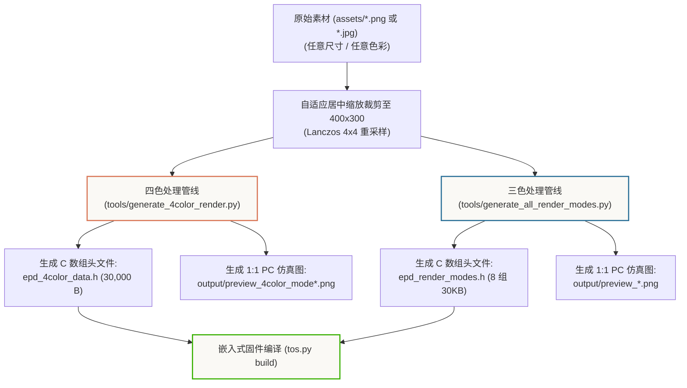

# 04. 本地 Python 图像处理管线与嵌入式点阵生成工具

在电子墨水屏嵌入式开发中，微控制器（MCU）的计算能力与 Flash 存储极其有限，通常不适合在设备端运行高耗能的双边滤波、CIE Lab 浮点色彩空间转换以及非线性优化算法。

为此，本项目在工程的 `tools/` 目录下构建了一套**基于 PC 端 Python 的专业级图像前置量化与点阵生成工具链**。开发者可以在 PC 端完成毫秒级算法调优，生成精准匹配单片机显存布局的 C 语言点阵头文件，并在上板前通过 1:1 像素级仿真图预览墨水屏真实显示效果。

---

## 一、 Python 工具集结构与功能矩阵



| 脚本文件 | 输入源 | 核心处理逻辑 | 输出产物 |
| :--- | :--- | :--- | :--- |
| **`tools/generate_4color_render.py`** | `assets/` 下的四色武士熊猫原图 | CIE Lab 3D 色差聚类 + 边缘提取 + 75% 阿特金森扩散 + 2-bit 打包 | `source/embedded/include/epd_4color_data.h`<br/>`output/epaper_4color_mode*.png` (3 张) |
| **`tools/generate_all_render_modes.py`** | 照片 (`img1.png`) 与插画 (`img2.png`) | 批量生成 4 种算法（边缘保护、矢量平涂、16阶灰度、Kindle光影） | `source/embedded/include/epd_render_modes.h`<br/>`output/` 各模式 1:1 预览图 |
| **`tools/benchmark_all_algorithms.py`** | `output/` 下的各模式产物 | 将 4 种算法结果在同一画布上自动排版并生成标注对比图 | `output/benchmark_*.png` 综合排版图 |

---

## 二、 核心位运算打包与 C 数组生成

### 1. 2-Bit 四色点阵压缩打包（4 像素 / 字节）
四色墨水屏显存中每个像素占用 2 bits：
- `00b (0)`：纯黑色 (Black)
- `01b (1)`：纯白色 (White)
- `10b (2)`：金黄色 (Yellow)
- `11b (3)`：赤红色 (Red)

Python 打包核心代码实现：
```python
def export_c_header_4color(image_array_2bit, output_header_path, var_name):
    """
    将 400x300 的 2-bit 图像数组转换为标准的 C 语言 const uint8_t 数组
    """
    h, w = image_array_2bit.shape
    packed_bytes = bytearray()

    for y in range(h):
        for x in range(0, w, 4):
            p0 = int(image_array_2bit[y, x])     & 0x03
            p1 = int(image_array_2bit[y, x + 1]) & 0x03
            p2 = int(image_array_2bit[y, x + 2]) & 0x03
            p3 = int(image_array_2bit[y, x + 3]) & 0x03
            
            # MSB First 移位打包
            byte_val = (p0 << 6) | (p1 << 4) | (p2 << 2) | p3
            packed_bytes.append(byte_val)

    # 验证显存体积必须严格等于 30,000 字节
    assert len(packed_bytes) == 30000, f"Error: buffer size {len(packed_bytes)} != 30000"

    with open(output_header_path, 'w', encoding='utf-8') as f:
        f.write("#ifndef __EPD_4COLOR_DATA_H__\n#define __EPD_4COLOR_DATA_H__\n\n")
        f.write("#include <stdint.h>\n\n")
        f.write(f"/* 400x300 Quad-Color Bitmap (30,000 Bytes) */\n")
        f.write(f"const uint8_t {var_name}[30000] = {{\n")
        
        for i, b in enumerate(packed_bytes):
            f.write(f"0x{b:02X}, ")
            if (i + 1) % 16 == 0:
                f.write("\n    ")
                
        f.write("\n};\n\n#endif\n")
```

---

### 2. 1-Bit 三色双平面打包（1 像素 / bit）
三色墨水屏显存分为独立的黑白平面与红色平面：
- **黑白平面（Black/White Plane）**：`0` 代表黑色像素，`1` 代表白色像素；
- **红色平面（Red Plane）**：`1` 代表红色像素，`0` 代表非红。

```python
def pack_3color_dual_planes(bw_mask, red_mask):
    """
    输入: bw_mask (400x300 bool, True=黑), red_mask (400x300 bool, True=红)
    输出: 15,000 字节 bw_buf + 15,000 字节 red_buf
    """
    h, w = bw_mask.shape
    bw_buf = bytearray(15000)
    red_buf = bytearray(15000)

    for y in range(h):
        for x in range(w):
            idx = (y * w + x) // 8
            bit = 7 - ((y * w + x) % 8)

            # 黑白平面：默认为白(1)，若为黑则将对应 bit 清 0
            if not bw_mask[y, x]:
                bw_buf[idx] |= (1 << bit) # 白
            else:
                bw_buf[idx] &= ~(1 << bit) # 黑

            # 红色平面：默认为非红(0)，若为红则将对应 bit 置 1
            if red_mask[y, x]:
                red_buf[idx] |= (1 << bit)

    return bw_buf, red_buf
```

---

## 三、 从一张自定义图片到墨水屏显示的完整实战

想要将您自己拍摄的照片或网上下载的壁纸显示到墨水屏上，只需遵循以下 4 步工作流：

### 步骤 1：放置素材
将您的原始高清图片（如 `my_panda.jpg`）复制到 `assets/` 目录下。

### 步骤 2：运行 Python 脚本生成点阵与 1:1 预览
```bash
# 1. 转换四色墨水屏画作
python tools/generate_4color_render.py

# 2. 批量转换三色墨水屏图片
python tools/generate_all_render_modes.py
```

### 步骤 3：在 PC 上即时预览效果
打开 `output/` 文件夹，查看脚本生成的 1:1 仿真 PNG 图片。如果发现对比度不够或暗部偏暗，可以在脚本中微调 `gamma`（如将 1.45 调整为 1.6）或调整 `edge_threshold`，再次运行脚本。

### 步骤 4：编译并烧录固件
```bash
cd source/embedded
tos.py build

# 烧录到 T5-Core
tyutool_cli.exe write -d t5 -f source/embedded/.build/bin/ePaper-DEPG042-demo_QIO_1.0.0.bin -p COM14
```

烧录完成后，在串口输入 `epd_4c_edge` 或 `img1_kindle`，即可在墨水屏上欣赏细腻逼真的画面！
