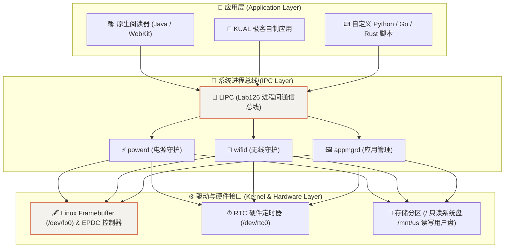
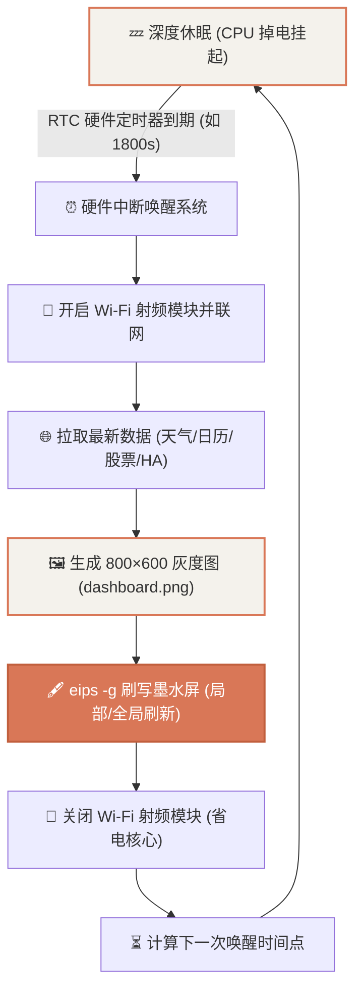

import KindleScreenSimulator from '@site/src/components/KindleScreenSimulator';
import LipcCommandGenerator from '@site/src/components/LipcCommandGenerator';

# Kindle 8 硬件架构与底层控制手册

本篇总结了 Kindle 8 (KT3) 的硬件规格与 Linux 底层核心控制接口（LIPC、EIPS、Framebuffer 与电源管理）。

---

## 1. 硬件规格与系统架构栈

Kindle 并非封闭的单片机，它本质上是一台运行精简版 **Embedded Linux（内核 3.0.x / 4.1.x + glibc）的单板计算机**：



### 硬件规格参数

| 硬件项 | 参数规格 | 开发说明 |
| :--- | :--- | :--- |
| **设备型号** | Kindle 8th Gen (KT3 / Model SY69JL) | 2016 年发布入门版（无内置背光灯） |
| **CPU 架构** | NXP/Freescale i.MX6 SoloLite (ARMv7l, Cortex-A9 @ 1.0 GHz) | 支持 32 位 ARM Linux 二进制程序与静态交叉编译 |
| **系统内存** | 512 MB LPDDR2 | 足够运行 Python3、Node.js、SQLite、Go 守护进程 |
| **存储分区** | 4GB eMMC（`/mnt/us` 可用空间约 2.8GB） | 用户空间挂载为 VFAT，程序与脚本必须放此处 |
| **屏幕参数** | 6.0 英寸 E-Ink 珍珠屏（800 × 600 分辨率，167 ppi） | 16 级灰度，支持局部刷新与全局反转清除残影 |
| **触控芯片** | 电容式多点触控 | Linux event 设备节点位于 `/dev/input/event0` |

---

## 2. 墨水屏核心绘制命令 (`eips`)

Kindle 自带的 `eips` (Electronic Ink Print String) 是操作屏幕最轻量、最高效的原生工具。

### 交互体验：Kindle 墨水屏在线模拟器
下面的交互组件模拟了 Kindle 8 墨水屏在终端运行 `eips` 的实时渲染效果：

<KindleScreenSimulator />

### 常用 `eips` 终端命令速查
```bash
# 1. 清空屏幕（清除全部残影并全局刷新）
eips -c

# 2. 在指定行、列输出文字（坐标原点为左上角 0 0）
eips 5 2 "Hello E-Ink Display!"

# 3. 渲染全屏或局部 PNG 图片（必须为 800x600 灰度图）
eips -g /mnt/us/dashboard.png

# 4. 指定坐标渲染小图标
eips -g /mnt/us/icon.png 100 200
```

---

## 3. 系统进程间通信 (`LIPC`) 实用指令

Kindle 系统的所有核心服务（电源、框架、网络）都通过 Lab126 IPC 总线通信：

### 交互工具：LIPC 指令一键生成器
点击下方预设按钮，可直接获取对应的 LIPC Shell 指令并一键复制：

<LipcCommandGenerator />

### 电源与电量查询
```bash
# 获取当前电池电量百分比 (0-100)
lipc-get-prop com.lab126.powerd battLevel

# 查询当前是否正在充电
lipc-get-prop com.lab126.powerd isCharging
```

### 常亮与休眠控制
```bash
# 阻止自动锁屏休眠（进入开发常亮模式）
lipc-set-prop com.lab126.powerd preventScreenSaver 1

# 恢复系统正常自动休眠
lipc-set-prop com.lab126.powerd preventScreenSaver 0

# 强制进入睡眠挂起状态
lipc-set-prop com.lab126.powerd -i poweroff 0
```

### 关闭原生阅读器 UI（释放内存与 CPU）
```bash
# 停止亚马逊官方界面（进入纯控制台/纯应用模式）
stop framework

# 重新启动亚马逊官方界面
start framework
```

---

## 4. RTC 深度定时唤醒与超长续航架构

墨水屏看板的核心优势在于“无背光、静态显示零耗电”。通过 RTC 硬件闹钟定时唤醒，可以实现单次充电运行 3~6 个月的超低功耗循环：



### 定时唤醒命令实战
```bash
# 睡眠 1800 秒（30分钟）后硬件自动唤醒并继续执行脚本
rtcwake -d /dev/rtc0 -m mem -s 1800
```
