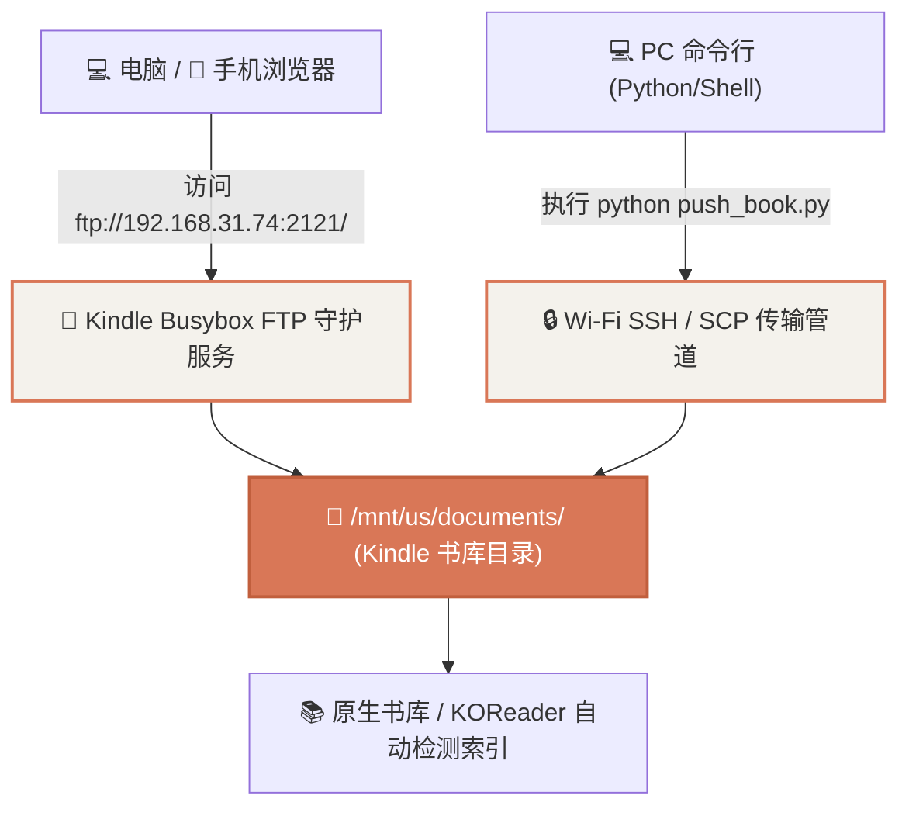

# 路线 4 · 局域网免数据线无线传书与管理服务

摆脱频繁插拔 Micro-USB 数据线的烦恼，在局域网内通过 **FTP** 或 **SSH/SCP** 实现手机与电脑对 Kindle 书库的秒级无线传输。

---

## 1. 架构方案选型



---

## 2. 核心服务搭建

### 2.1 Kindle 端无线 FTP 守护脚本 (`start_ftp.sh`)

利用 Kindle 内部的 Busybox 原生 `tcpsvd` 和 `ftpd` 模块，**零依赖、秒级启动**：

```bash
#!/bin/sh
PORT=2121
TARGET_DIR="/mnt/us/documents"

# 清理旧进程
killall tcpsvd 2>/dev/null
killall ftpd 2>/dev/null

# 启动匿名可写 FTP 服务
busybox tcpsvd -vE 0.0.0.0 $PORT busybox ftpd -w "$TARGET_DIR" &
```

* **使用方式**：
  * 在 Windows 资源管理器或 Mac Finder 顶部地址栏输入：
    ```text
    ftp://192.168.31.74:2121/
    ```
  * 即可像打开本地文件夹一样，将 `.epub`、`.mobi`、`.pdf`、`.azw3` 电子书直接拖拽进去！

---

### 2.2 电脑端 1 键推书命令行工具 (`push_book.py`)

```python
#!/usr/bin/env python3
# -*- coding: utf-8 -*-
"""
PC-to-Kindle 1-Click Wireless Book Pusher
"""
import os, sys, subprocess

def push_book(file_path):
    if not os.path.exists(file_path):
        print(f"File not found: {file_path}")
        return
    filename = os.path.basename(file_path)
    print(f"Uploading {filename} to Kindle...")
    subprocess.run(f'scp "{file_path}" root@kindle:/mnt/us/documents/', shell=True)
    subprocess.run(f'ssh kindle "eips 1 1 \'Book Added: {filename[:20]}\'"', shell=True)
    print("Upload complete!")

if __name__ == '__main__':
    if len(sys.argv) > 1:
        push_book(sys.argv[1])
```

---

## 3. 实机验证

1. 在 Kindle 上启动服务：`ssh kindle "sh /mnt/us/start_ftp.sh"`；
2. 端口 `2121` 成功监听（`tcpsvd: listening on 0.0.0.0:2121`）；
3. 任何设备在局域网内均可免数据线自由传书！
