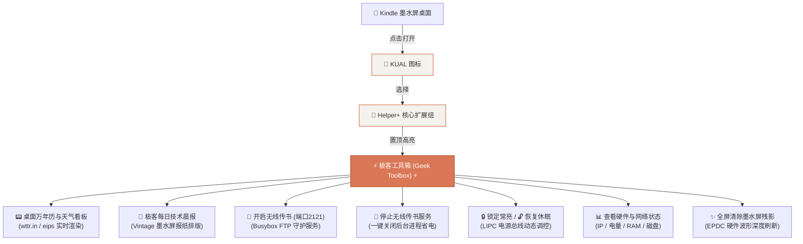

# 路线 5 · Kindle 本地脱机 KUAL 极客工具箱实战

> 💻 **工程源码路径**：[github.com/Xepanda/kindle-geek-toolbox/tree/master/kual_extension](https://github.com/Xepanda/kindle-geek-toolbox/tree/master/kual_extension)

真正的极客设备必须具备 **100% 本地脱机独立运行** 的能力。我们克服了 Kindle 固件 CVM 内存缓存与 JSON 编码解析等深坑，将全部功能以 **全中文原生图形菜单** 完美融入 KUAL 系统级常驻入口！

---

## 1. 系统架构与交互流转

KUAL（Kindle Unified Application Launcher）通过 Java Booklet 与底层 Linux Shell 桥接。我们将极客工具箱挂载于系统级 `Helper+` 容器中，确保即点即用、永不丢失：



---

## 2. 核心配置文件与脚本实现

### 2.1 全中文菜单定义 (`/mnt/us/extensions/helper/menu.json`)

> [!CAUTION]
> **踩坑预警（UTF-8 BOM 问题）**：
> 在 Windows 环境下编辑 JSON 文件时，必须保存为 **UTF-8 Without BOM（无字节顺序标记）** 格式！Kindle 内部由 Busybox `awk` 解析 JSON，若带有 BOM 标头（`0xEF 0xBB 0xBF`），会导致解析器静默忽略该插件，导致菜单无法显示。

```json
{
    "items": [
        {
            "name": "Helper",
            "priority": -998,
            "items": [
                {
                    "name": "⚡ 极客工具箱 (Geek Toolbox) ⚡",
                    "priority": -999,
                    "items": [
                        {
                            "name": "📟 桌面万年历与天气看板",
                            "priority": 1,
                            "action": "/mnt/us/extensions/geek_toolbox/bin/weather_refresh.sh",
                            "exitmenu": true
                        },
                        {
                            "name": "📰 极客每日技术晨报",
                            "priority": 2,
                            "action": "/mnt/us/extensions/geek_toolbox/bin/newspaper_show.sh",
                            "exitmenu": true
                        },
                        {
                            "name": "📁 开启无线传书 (端口2121)",
                            "priority": 3,
                            "action": "/mnt/us/extensions/geek_toolbox/bin/ftp_start.sh",
                            "exitmenu": false
                        },
                        {
                            "name": "🛑 停止无线传书服务",
                            "priority": 4,
                            "action": "/mnt/us/extensions/geek_toolbox/bin/ftp_stop.sh",
                            "exitmenu": false
                        },
                        {
                            "name": "🔒 锁定常亮 (防止休眠锁屏)",
                            "priority": 5,
                            "action": "/mnt/us/extensions/geek_toolbox/bin/nosleep.sh",
                            "exitmenu": false
                        },
                        {
                            "name": "🔓 恢复自动休眠锁屏",
                            "priority": 6,
                            "action": "/mnt/us/extensions/geek_toolbox/bin/sleep.sh",
                            "exitmenu": false
                        },
                        {
                            "name": "📊 查看硬件与网络状态",
                            "priority": 7,
                            "action": "/mnt/us/extensions/geek_toolbox/bin/system_status.sh",
                            "exitmenu": true
                        },
                        {
                            "name": "✨ 全屏清除墨水屏残影",
                            "priority": 8,
                            "action": "/mnt/us/extensions/geek_toolbox/bin/screen_clear.sh",
                            "exitmenu": false
                        }
                    ]
                }
            ]
        }
    ]
}
```

---

### 2.2 关键底层执行脚本

#### 1. 硬件状态面板 (`system_status.sh`)
```bash
#!/bin/sh
eips -c
IP=$(ifconfig wlan0 | grep 'inet addr' | cut -d: -f2 | awk '{print $1}')
BATT=$(lipc-get-prop com.lab126.powerd battLevel)
UPTIME=$(uptime | awk -F'( |,|:)+' '{print $6" hrs, "$7" min"}')
FREE_MEM=$(free | grep 'Mem:' | awk '{print $4}')

eips 2 2 "========================================"
eips 2 3 "       KINDLE 8 HARDWARE STATUS         "
eips 2 4 "========================================"
eips 2 6 "Model: Kindle 8th Gen (KT3 / SY69JL)"
eips 2 7 "IP Addr: $IP"
eips 2 8 "Battery: $BATT%"
eips 2 9 "Free RAM: ${FREE_MEM} KB"
eips 2 10 "Uptime: $UPTIME"
eips 2 12 "Storage: $(df -h /mnt/us | tail -n 1 | awk '{print $4}') Free"
eips 2 14 "========================================"
```

#### 2. 无线 FTP 启停 (`ftp_start.sh` & `ftp_stop.sh`)
```bash
#!/bin/sh
# 启动
PORT=2121
TARGET_DIR="/mnt/us/documents"
killall tcpsvd 2>/dev/null
killall ftpd 2>/dev/null
busybox tcpsvd -vE 0.0.0.0 $PORT busybox ftpd -w "$TARGET_DIR" &
IP=$(ifconfig wlan0 | grep 'inet addr' | cut -d: -f2 | awk '{print $1}')
eips 1 1 "FTP Started: ftp://${IP}:${PORT}/"
```

---

## 3. 热重载与缓存生效技巧

修改 KUAL 插件后，无需耗费时间完全重启整机 Linux 内核，只需通过 SSH 发送热重启指令：

```bash
# 清除磁盘缓存文件并秒级重启 Java Reader UI 框架
ssh kindle "rm -f /var/tmp/KUAL.cache /tmp/KUAL.cache /var/tmp/KUAL.mbx; restart framework"
```
Kindle 屏幕会在 5 秒内闪烁一次并回到主页，所有菜单改动即刻生效！
