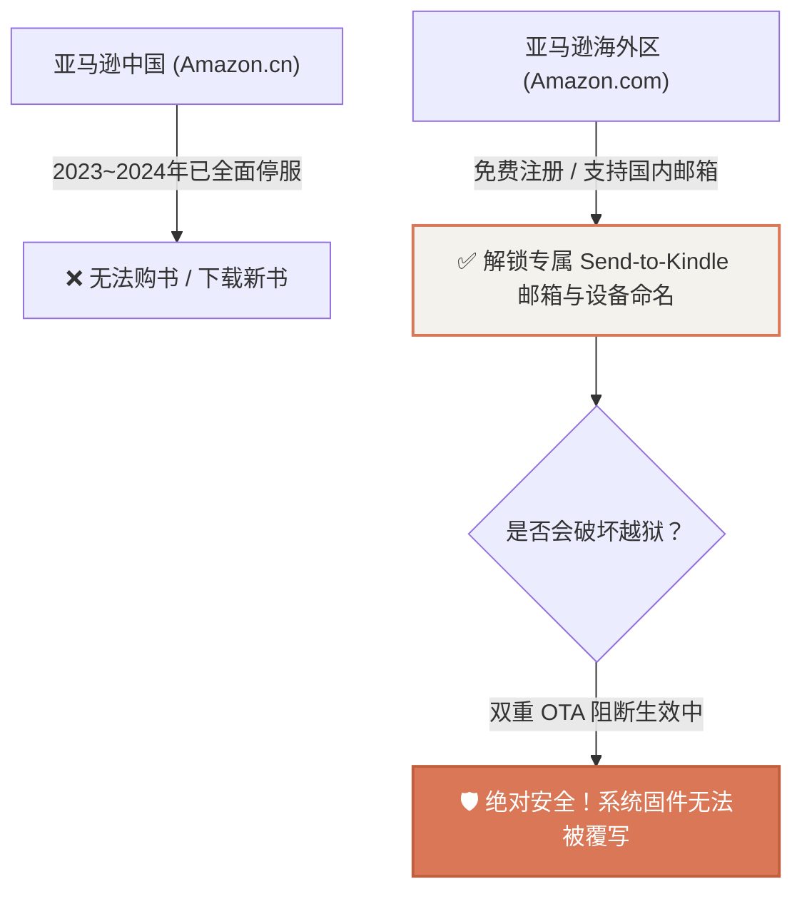

# 专题 · 极客开发常见问题与避坑指南 (FAQ)

在 Kindle 8 (KT3) 的全栈改造与实际开发过程中，我们遇到了若干平台特有的底层深坑。本篇将这些典型问题与解决对策系统化梳理，作为长期技术备忘。

---

## 1. 书架出现 `KPPMainApp...` 崩溃日志文件

### ❓ 现象说明
越狱完成后，书架中可能会出现类似以下名称的文件：
* `KPPMainAppV2_3000_002-juno_..._crash.tgz`
* `KPPMainAppV2_3000_..._crash.txt`
* `KPPMainAppV2_...sdr`

### 💡 原因分析
`KPP` 是 Kindle 阅读引擎核心服务（Kindle Publishing Platform）。越狱漏洞（如 LanguageBreak / Popcorn）在执行提权时，会故意利用边界溢出触发该进程崩溃以劫持执行流。这些文件是系统自动生成的 **崩溃转储日志（Crash Dump）**。

### ✅ 解决方案
**对系统没有任何影响，可放心安全删除！**  
通过 SSH 执行一键清理指令即可：
```bash
ssh kindle "rm -rf /mnt/us/documents/KPPMainApp* /mnt/us/documents/*.tgz 2>/dev/null"
```

---

## 2. KUAL 菜单修改后不更新 / 找不到新插件

### ❓ 现象说明
在 `/mnt/us/extensions/` 中添加了新插件目录并编写了 `menu.json`，但在 Kindle 屏幕打开 KUAL 后，依然只显示旧菜单。

### 💡 原因分析（两大深坑）

#### 深坑 A：Windows 编码带来的 UTF-8 BOM 标头
* 在 Windows 上使用某些编辑器或 PowerShell 保存 JSON 时，可能会在文件开头插入 `0xEF 0xBB 0xBF`（BOM 标头）；
* Kindle Linux 内部的 KUAL 由 Busybox `awk` 解析，遇到 BOM 时会无法识别 JSON 格式并**静默跳过该插件**。
* **对策**：必须确保文件是 **UTF-8 Without BOM** 格式，或者在 Python 中生成：
  ```python
  with open('menu.json', 'w', encoding='utf-8', newline='\n') as f:
      json.dump(menu_data, f, indent=4, ensure_ascii=False)
  ```

#### 深坑 B：Java 虚拟机（CVM）与磁盘缓存
* KUAL 在 `/var/tmp/KUAL.cache` 和 `/tmp/KUAL.cache` 中保存了生成好的菜单缓存；
* 并且 Kindle Reader 系统的 Java 虚拟机（CVM）在后台常驻时不会主动重新扫描磁盘。
* **对策（秒级热重载）**：
  ```bash
  ssh kindle "rm -f /var/tmp/KUAL.cache /tmp/KUAL.cache /var/tmp/KUAL.mbx; restart framework"
  ```

---

## 3. 亚马逊海外账号注册与登录安全指南

### ❓ 现象说明
想在已越狱的 Kindle 上登录账号以使用设备命名或推送功能，但担心被官方封禁或强制 OTA 升级导致越狱丢失。

### 💡 安全准则与现状



### 📋 注册与登录要点
1. **无需海外手机号与信用卡**：进入 `https://www.amazon.com/`，使用国内 QQ/163 邮箱直接免费注册；
2. **两步验证（2FA）登录技巧**：
   * 若登录时 Kindle 提示密码错误，亚马逊会向你的邮箱发送 6 位临时验证码（OTP）；
   * 在 Kindle 密码输入框中连续输入 **`[你的密码][6位验证码]`**（中间无空格），即可直接登录成功！
3. **固件安全**：由于我们已经配置了 **`update.bin.tmp.partial` 目录锁** 与 `otad` 升级进程隔离，联网登录账号**绝无升级丢失越狱的风险**。
