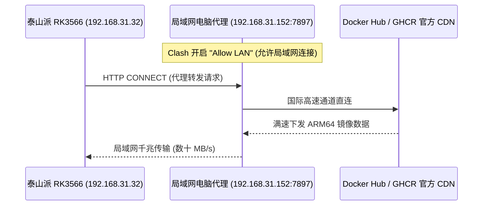

# Docker 容器底座部署、eMMC 寿命保护与局域网代理加速拉取

在嵌入式 ARM 开发板（如泰山派 RK3566 2+16G）上运行 Docker 时，面临两个致命痛点：
1. **存储寿命与容量隐患**：16GB eMMC 空间有限，容器高频输出 stdout 日志若不加限制，几周内就会撑爆根目录导致系统只读卡死；
2. **镜像拉取困难**：国内直连 Docker Hub 经常遭遇握手超时或限速，而国内公用加速镜像站频繁失效。

本篇记录了标准化的 Docker Engine 部署、全局日志轮转硬限制、以及**局域网共享代理极速拉取海外官方镜像**的完整工程实战。

---

## 1. 安装 Docker Engine 与 Docker Compose

在 Debian 13 (Trixie) 环境下安装最新稳定的 Docker 运行时与命令行工具：

```bash
DEBIAN_FRONTEND=noninteractive apt-get install -y \
  docker.io \
  docker-compose \
  docker-buildx \
  containerd \
  bridge-utils \
  iptables

# 安装官方最新版 Docker CLI 静态二进制文件
curl -sSL https://mirrors.aliyun.com/docker-ce/linux/static/stable/aarch64/docker-27.0.3.tgz -o /tmp/docker.tgz
tar -xzf /tmp/docker.tgz -C /tmp/
cp /tmp/docker/docker /usr/bin/docker
chmod +x /usr/bin/docker
rm -rf /tmp/docker /tmp/docker.tgz
```

---

## 2. 配置 `/etc/docker/daemon.json`（日志限制与 eMMC 保护）

创建 Docker 守护进程配置文件，限制每个容器单个日志文件最大 **10MB**，最多保留 **3 个** 归档，并指定 `overlay2` 存储驱动：

```json
{
  "log-driver": "json-file",
  "log-opts": {
    "max-size": "10m",
    "max-file": "3"
  },
  "storage-driver": "overlay2",
  "registry-mirrors": [
    "https://dockerpull.org",
    "https://docker.1panel.live",
    "https://hub.rat.dev"
  ]
}
```

应用并启动 Docker：
```bash
systemctl daemon-reload
systemctl restart docker
systemctl enable docker
```

---

## 3. 局域网共享代理极速拉取方案（秒破镜像限速）

无需在泰山派上复杂安装 VPN 客户端，直接利用局域网内现成 PC/手机（如 Windows 电脑运行 Clash / v2rayN）共享代理通道：



### 3.1 配置 Docker 守护进程走局域网代理
创建 Systemd 代理配置文件 `/etc/systemd/system/docker.service.d/http-proxy.conf`：

```ini
[Service]
Environment="HTTP_PROXY=http://192.168.31.152:7897"
Environment="HTTPS_PROXY=http://192.168.31.152:7897"
Environment="NO_PROXY=localhost,127.0.0.1,192.168.31.0/24"
```

重载并重启 Docker 服务：
```bash
systemctl daemon-reload
systemctl restart docker
```

### 3.2 验证代理与拉取速度
```bash
# 测试代理连通性
curl -x http://192.168.31.152:7897 -s -I https://registry-1.docker.io/v2/
# 输出: HTTP/1.1 200 Connection established

# 满速拉取 OpenWrt 官方镜像（耗时仅数秒）
docker pull unifreq/openwrt-aarch64:latest
```

---

## 4. 运行环境验证

```bash
docker --version
# 输出: Docker version 27.0.3, build 7d4bcd8

docker-compose --version
# 输出: Docker Compose version 2.26.1-4

docker info | grep -E "Server Version|Storage Driver|Logging Driver"
# 确认 Server Version 为 26.1.5, Storage Driver 为 overlay2, Logging Driver 为 json-file
```
