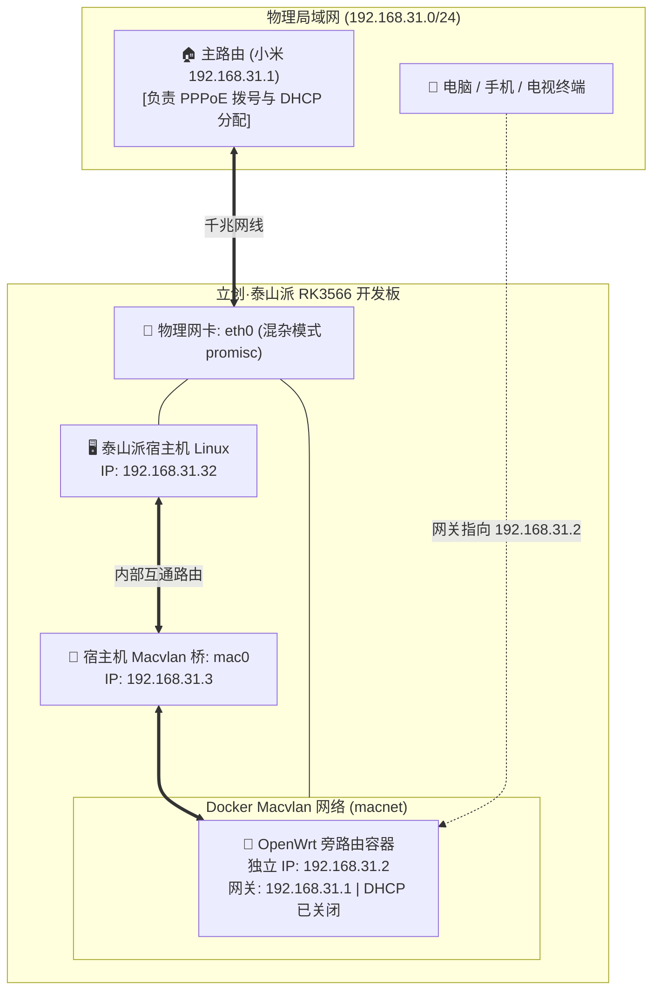

# Docker Macvlan 模式 OpenWrt 旁路由搭建与宿主机互通实战

泰山派板载仅有 **1 个千兆 RJ45 网口（`eth0`）**。作为**旁路由（旁网关 Bypass Gateway）**运行时，最佳方案是使用 Docker `macvlan` 网络驱动，赋予 OpenWrt 一个与家里路由器完全同网段的独立局域网 IP（如 `192.168.31.2`）。

本篇记录从物理网卡混杂模式开启、Macvlan 虚拟网络构建、OpenWrt 容器编排、到宿主机互通网桥 `mac0` 持久化固化的全套实操。

---

## 1. 网络架构与拓扑原理



---

## 2. 详细部署步骤

### 2.1 开启网卡混杂模式并创建 Macvlan 网络
```bash
# 1. 开启物理网卡混杂模式
ip link set eth0 promisc on

# 2. 创建 Docker Macvlan 网络 (绑定 eth0)
docker network create -d macvlan \
  --subnet=192.168.31.0/24 \
  --gateway=192.168.31.1 \
  -o parent=eth0 macnet
```

### 2.2 启动 OpenWrt 容器
```bash
docker run -d \
  --name openwrt \
  --restart always \
  --network macnet \
  --ip 192.168.31.2 \
  --privileged \
  unifreq/openwrt-aarch64:latest /sbin/init
```

### 2.3 配置 OpenWrt 内部网络与防火墙
由于 OpenWrt 容器默认可能桥接在 `192.168.1.1`，必须通过脚本重置为家庭网段并关闭冲突的 DHCP 服务：

```bash
# 1. 重写 /etc/config/network 配置文件
docker exec openwrt sh -c "cat << 'EOF' > /etc/config/network
config interface 'loopback'
	option ifname 'lo'
	option proto 'static'
	option ipaddr '127.0.0.1'
	option netmask '255.0.0.0'

config globals 'globals'
	option ula_prefix 'fd5b:15f2:0745::/48'

config interface 'lan'
	option type 'bridge'
	option ifname 'eth0'
	option proto 'static'
	option ipaddr '192.168.31.2'
	option netmask '255.255.255.0'
	option gateway '192.168.31.1'
	list dns '192.168.31.1'
	list dns '223.5.5.5'
EOF
"

# 2. 关闭 OpenWrt 的 DHCP 服务（避免与主路由抢发 IP）
docker exec openwrt sh -c "
uci set dhcp.lan.ignore='1'
uci commit dhcp
"

# 3. 注入 NAT 防火墙伪装规则
docker exec openwrt sh -c "
echo 'iptables -t nat -A POSTROUTING -j MASQUERADE' >> /etc/firewall.user
"

# 4. 重启网络与防火墙服务
docker exec openwrt /etc/init.d/network restart
docker exec openwrt /etc/init.d/firewall restart
docker exec openwrt /etc/init.d/dnsmasq restart
```

---

## 3. 解决 Linux 内核限制：宿主机与 Macvlan 容器互通

Linux 内核为了安全，默认禁止宿主机直接与挂载在同父网卡的 Macvlan 子容器通信。

为了让泰山派宿主机（`192.168.31.32`）自身也能正常访问 OpenWrt（`192.168.31.2`），建立一条专用通信虚拟桥：

```bash
ip link add mac0 link eth0 type macvlan mode bridge
ip addr add 192.168.31.3/32 dev mac0
ip link set mac0 up
ip route add 192.168.31.2 dev mac0
```

### 3.1 固化到 `/etc/rc.local`（开机自动执行）
```bash
cat << 'EOF' > /etc/rc.local
#!/bin/bash
# 保证网卡混杂模式与 Macvlan 宿主机互通
ip link set eth0 promisc on
ip link add mac0 link eth0 type macvlan mode bridge 2>/dev/null || true
ip addr add 192.168.31.3/32 dev mac0 2>/dev/null || true
ip link set mac0 up 2>/dev/null || true
ip route add 192.168.31.2 dev mac0 2>/dev/null || true
exit 0
EOF
chmod +x /etc/rc.local
systemctl enable rc-local
```

---

## 4. 连通性测试

在同一局域网下的电脑终端中测试连通性：

```powershell
# 测试 Ping 延迟
Test-Connection -ComputerName 192.168.31.2 -Count 2
# 输出: Latency 1ms ~ 2ms, 0% 丢包

# 测试 Web 管理后台端口
Test-NetConnection -ComputerName 192.168.31.2 -Port 80
# 输出: TcpTestSucceeded : True
```

浏览器访问 **`http://192.168.31.2`** 即可秒级进入 LuCI 登录管理界面。
