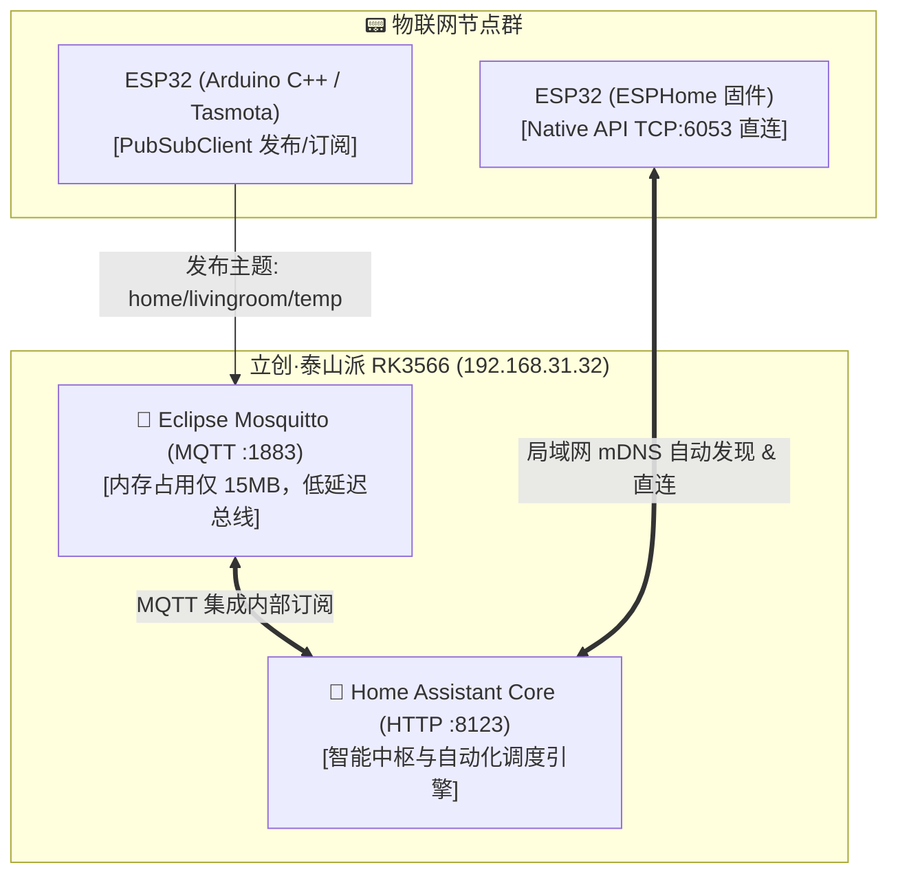

# MQTT 物联网服务部署、Home Assistant 联动与 ESP32 极速接入实战

在泰山派 All-in-One 系统中，**Eclipse Mosquitto (MQTT Broker)** 作为轻量级高并发消息总线，与 **Home Assistant (智能中枢)** 和 **ESP32 物联网终端节点** 共同构成了一套极其健壮的私有化智能家居系统。

本篇记录 Mosquitto 容器化部署、HA 联动、以及 ESP32 基于 Arduino C++ 与 ESPHome 的完整接入代码实操。

---

## 1. 消息流向与通信拓扑



---

## 2. Eclipse Mosquitto 容器化部署

### 2.1 目录规划与极简配置
在泰山派 `/opt/all-in-one/mosquitto` 创建配置文件：

```ini
# /opt/all-in-one/mosquitto/config/mosquitto.conf
listener 1883
allow_anonymous true
persistence true
persistence_location /mosquitto/data/
log_dest file /mosquitto/log/mosquitto.log
```

### 2.2 启动 Mosquitto 容器
```bash
docker run -d \
  --name test-mqtt \
  --restart always \
  -p 1883:1883 \
  -p 9001:9001 \
  -v /opt/all-in-one/mosquitto/config:/mosquitto/config \
  -v /opt/all-in-one/mosquitto/data:/mosquitto/data \
  -v /opt/all-in-one/mosquitto/log:/mosquitto/log \
  eclipse-mosquitto:latest
```

---

## 3. ESP32 客户端接入代码实操

### 方案 1：Arduino C++ (基于 PubSubClient 库)
适合自己编写固件、需要高度定制硬件交互逻辑的极客场景：

```cpp
#include <WiFi.h>
#include <PubSubClient.h>

const char* ssid = "YOUR_WIFI_SSID";
const char* password = "YOUR_WIFI_PASSWORD";
const char* mqtt_server = "192.168.31.32"; // 泰山派 IP

WiFiClient espClient;
PubSubClient client(espClient);

void callback(char* topic, byte* message, unsigned int length) {
  String msg;
  for (int i = 0; i < length; i++) msg += (char)message[i];
  Serial.print("收到主题 ["); Serial.print(topic); Serial.print("] 消息: "); Serial.println(msg);

  // 接收 Home Assistant 下发的继电器开关指令
  if (String(topic) == "home/livingroom/switch/set") {
    if (msg == "ON") {
      digitalWrite(2, HIGH);
      client.publish("home/livingroom/switch/state", "ON");
    } else {
      digitalWrite(2, LOW);
      client.publish("home/livingroom/switch/state", "OFF");
    }
  }
}

void setup() {
  pinMode(2, OUTPUT);
  Serial.begin(115200);
  WiFi.begin(ssid, password);
  while (WiFi.status() != WL_CONNECTED) delay(500);

  client.setServer(mqtt_server, 1883);
  client.setCallback(callback);
}

void loop() {
  if (!client.connected()) {
    while (!client.connected()) {
      if (client.connect("ESP32_LivingRoom_Node")) {
        client.subscribe("home/livingroom/switch/set");
      } else {
        delay(3000);
      }
    }
  }
  client.loop();

  // 每 10 秒向 MQTT 发布模拟温湿度数据
  static unsigned long lastTime = 0;
  if (millis() - lastTime > 10000) {
    lastTime = millis();
    float temp = 26.8;
    client.publish("home/livingroom/temperature", String(temp, 1).c_str());
  }
}
```

---

### 方案 2：ESPHome 原生直连（免写代码，HA 自动发现）

适合传感器接入（温湿度、人体存在雷达、按键开关、RGB灯带）：

```yaml
esphome:
  name: esp32-livingroom-sensor

esp32:
  board: esp32dev
  framework:
    type: arduino

wifi:
  ssid: "YOUR_WIFI_SSID"
  password: "YOUR_WIFI_PASSWORD"

api: # 启用 Native API，Home Assistant 自动在“集成”页面弹出发现提示

logger:

sensor:
  # DHT11 温湿度传感器
  - platform: dht
    pin: GPIO23
    temperature:
      name: "客厅温度"
    humidity:
      name: "客厅湿度"
    model: DHT11
    update_interval: 10s

switch:
  # 板载继电器 / LED 控制
  - platform: gpio
    pin: GPIO2
    name: "客厅氛围灯"
    id: relay_light
```

---

## 4. 负载表现总结

在实测中，即使同时接入 **50 个 ESP32 节点** 并保持 1 秒/次的高频上报：
* Mosquitto 内存占用始终保持在 **15MB ~ 25MB**；
* RK3566 四核待机 CPU 负载小于 **1%**；
* 消息延迟低于 **5 毫秒**，完全满足严苛的低延迟全屋智能联动需求。
