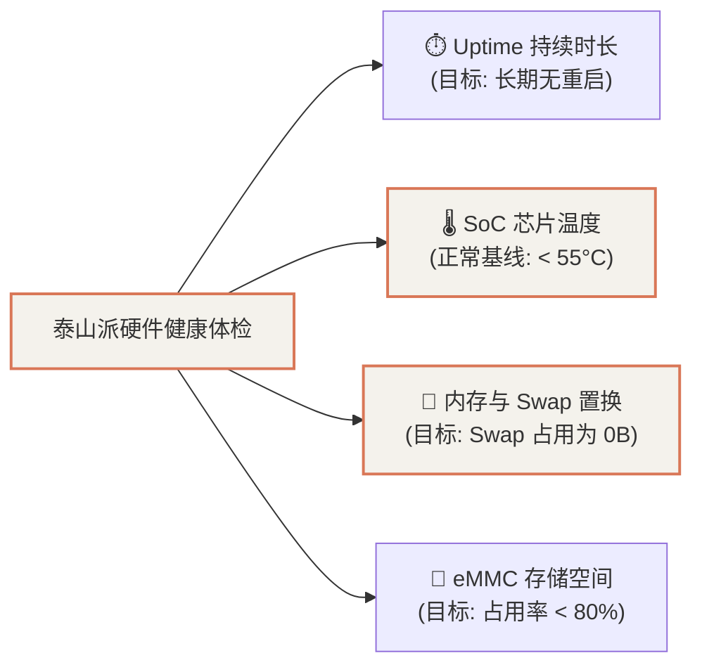

# Home Assistant 状态巡检、SQLite 底层诊断与智能家居设备排障指南

在泰山派（RK3566 2+16G）All-in-One 架构中，**Home Assistant (HA)** 承担着全屋传感器聚合、场景自动化与语音联动的智能中枢角色。

随着接入的 Zigbee / Wi-Fi 设备与自动化规则不断增多，建立一套标准化的**系统资源体检、Docker 服务探针、以及 SQLite 底层实体状态核对机制**，对于保障全屋智能长期 7x24 小时不掉线至关重要。

---

## 1. 泰山派系统与硬件基线指标巡检

通过 SSH 连入泰山派，首要检查四个核心维度的硬件与系统健康度：



### 1.1 关键监控命令汇总
```bash
# 1. 查看持续运行时间与平均负载 (三核/四核空闲指标)
uptime
# 正常状态示例: up 7 days, 1:03, load average: 0.21, 0.17, 0.08

# 2. 读取芯片物理热敏探针温度 (单位: 千分之一摄氏度)
paste <(cat /sys/class/thermal/thermal_zone*/type) <(cat /sys/class/thermal/thermal_zone*/temp)
# soc-thermal: 47222 (约 47.2°C，散热极佳)
# gpu-thermal: 46666 (约 46.7°C)

# 3. 内存健康检查 (重点关注 Available 与 Swap 是否被频繁置换)
free -h
# 正常状态示例: Total 1.9G, Used 1.0G, Available ~900M, Swap: 0B Used

# 4. 存储磁盘空间监控 (防止 SQLite 数据库写满 eMMC)
df -h /
# 正常状态示例: 14G 总量, 6.7G 已用, 7.1G 剩余 (49% 占用)
```

---

## 2. Docker 服务健康探测与资源占用

检查 Home Assistant 核心容器及周边微服务容器的运行状态：

```bash
# 1. 检查各容器的存活时长与退出码
docker ps -a --format "table {{.Names}}\t{{.Status}}\t{{.Ports}}"

# 2. 实时资源开销快照 (无持续刷屏模式)
docker stats --no-stream
```

### 关键组件健康基线：
* **`homeassistant` 容器**：
  * CPU 占用率日常维持在 **1% ~ 3%** 之间；
  * 内存占用通常在 **500MB ~ 700MB** 左右；
* **HTTP 探针自检**：
  ```bash
  curl -s -o /dev/null -w "HTTP Status: %{http_code}\n" --connect-timeout 3 http://127.0.0.1:8123
  # 输出: HTTP Status: 200 (服务正常对外响应)
  ```
* **关联支撑微服务**：
  * `matter-server`：负责 Matter 协议设备网关桥接（常驻内存约 140MB）；
  * `alist`：负责本地多媒体与网盘文件聚合管理（常驻内存约 70MB）。

---

## 3. SQLite 底层数据库实体状态直读

当移动端 App 显示设备状态异常或离线时，直接穿透 Web 前端，通过查询内部 SQLite 数据库 (`home-assistant_v2.db`) 获取实体的底层真实状态：

```bash
# 进入 HA 容器，执行 SQL 读取当前所有实体的最终更新状态
docker exec homeassistant python3 -c '
import sqlite3
con = sqlite3.connect("/config/home-assistant_v2.db")
cur = con.cursor()
sql = """
SELECT sm.entity_id, s.state 
FROM states s 
JOIN states_meta sm ON s.metadata_id = sm.metadata_id 
WHERE s.state_id IN (SELECT MAX(state_id) FROM states GROUP BY metadata_id)
ORDER BY sm.entity_id;
"""
for entity_id, state in cur.execute(sql).fetchall():
    if any(k in entity_id for k in ["switch.", "light.", "sensor.", "automation."]):
        print(f"{entity_id:<50} -> {state}")
'
```

### 实体状态判定准则：
1. **正常开关 / 灯光**：返回 `on` 或 `off`；
2. **传感器 / 电量指标**：返回数字（如 `235.0` V、`0.0` A）；
3. **`unavailable` 或 `unknown`**：代表对应硬件断电、网络失联、或集成插件通讯失败，需重点排查。

---

## 4. 常见故障排查：小米设备 (Xiaomi Miot) 离线诊断

### 4.1 典型报错特征
在 Home Assistant 日志中频繁出现如下报错：
```text
ERROR [custom_components.xiaomi_miot.core.device...] Unable to discover the device 192.168.31.xxx
WARNING [custom_components.xiaomi_miot.core.device...] Got miio chunked properties failed: None
TypeError: 'NoneType' object is not subscriptable
```

### 4.2 根因与排查链路
```mermaid
flowchart TD
    Err["HA 报 Unable to discover the device"] --> Step1["1. 测试泰山派能否 Ping 通该 IP"]
    Step1 -->|Ping 不通 (100% 丢包)| CauseA["🔌 设备断电 / Wi-Fi 信号极弱 / 路由器重启"]
    Step1 -->|Ping 正常通畅| Step2["2. 检查路由器 DHCP 分配表"]
    Step2 --> CauseB["⚠️ 设备 IP 发生漂移 (DHCP 重新分配新 IP)"]
    CauseB --> Fix["🛠️ 解决方案: 在小米路由器后台绑定静态 MAC-IP 租约"]

    style Err fill:#f4f2ec,stroke:#d97757,stroke-width:2px
    style Fix fill:#d97757,stroke:#c15f3d,stroke-width:2px,color:#fff
```

### 4.3 解决方案实操：
1. **DHCP 静态绑定**：
   登录家里的小米主路由器后台（`http://192.168.31.1`）➔ 【高级设置】 ➔ 【DHCP 静态 IP 分配】，将智能插座、空调伴侣、小爱音箱等关键设备的 MAC 地址与内网 IP 强制绑定，防止设备重启后 IP 漂移导致 HA 配置失效。
2. **Wi-Fi 节能模式检查**：
   部分低功耗 Wi-Fi 插座会在空闲时进入 Deep Sleep，若路由器开启了 AP 隔离或合频漫游（802.11r / WPA3），容易引起握手超时，建议让智能家居设备单独连接 2.4GHz 专网。

---

## 5. 典型故障排查：小爱音箱语音联动幽灵触发（空调突然自动打开）

### 5.1 故障现象
小爱音箱在无人交互或夜间静默状态下，偶尔会突然“自言自语”播报 *“好的，已为你打开空调”*，并通过涂鸦红外万能遥控器自动向海尔空调发射开机红外码；检查数据库发现短时间内被连续触发 10 余次。

### 5.2 根因定位与排查链路
通过对泰山派 Home Assistant SQLite 数据库（`home-assistant_v2.db`）中对话传感器 `sensor.xiaomi_l05b_b558_conversation` 的状态与属性流转分析：

```text
[22:53:38] state='打开空调' | content='打开空调' | timestamp='2026-09-16T22:53:38' (真实语音指令)
... 沉寂数十分钟后 ...
[23:40:08] state='打开空调' | content='None'    | timestamp=None
[23:40:13] state='打开空调' | content='打开空调' | timestamp='2026-09-16T22:53:38' (幽灵触发 1)
[23:41:04] state='打开空调' | content='None'    | timestamp=None
[23:41:09] state='打开空调' | content='打开空调' | timestamp='2026-09-16T22:53:38' (幽灵触发 2)
```

**根本原因**：
1. **HA 的 `platform: state` 触发机制**：若未指定目标状态 `to:`，**实体只要发生任何 attribute（属性）更新，HA 均会无条件触发自动化**；
2. **状态残留**：用户说过的语音指令会一直停留在传感器的 `state` 中，不会自动清空重置；
3. **Miot 轮询属性翻转**：小米 Miot 集成在与云端心跳轮询时，传感器的内部属性周期性在 `null` 与上一次的缓存值之间翻转；
4. **无时效性校验**：自动化模板 `trigger.to_state.state` 每次均读到残留的历史指令 `"打开空调"`，误判为刚刚开口说的指令，从而反复触发。

### 5.3 彻底修复方案
在 `automations.yaml` 的所有小爱语音联动自动化条件中，建立**时效性截断防线（Time Window Filter）**：

```yaml
condition:
  - condition: template
    value_template: >-
      
      
      
        
        
      
        
          
          
          {# 核心防护 1：语音指令发生时间戳必须在当前系统时间 60 秒以内，彻底截断一切历史重放与轮询缓存 #}
          
            {# 核心防护 2：排除属性翻转，确保状态值或时间戳确实发生了更新 #}
            
            
            
              
              
            
          
        
      
      {{ is_valid and ('空调' in text) and ('开' in text) and ('关' not in text) }}
```

**效果验证**：
* 过滤后实测：云端轮询与重启期间的所有旧属性刷新均被拦截（`is_valid: False`）；
* 真实语音指令发起时，指令时间戳与当前时间差 $< 2$ 秒（`is_valid: True`），正常触发，误开现象彻底消失。

---

## 6. 自动化一键巡检脚本

可将以下脚本保存为 `/root/ha_check.sh`，随时在泰山派执行以获取系统与 HA 的全景报告：

```bash
#!/bin/bash
echo "================ 1. 硬件与系统资源 ================"
uptime
free -h
df -h /
echo "SoC 温度: $(cat /sys/class/thermal/thermal_zone0/temp 2>/dev/null | awk '{print $1/1000}') °C"

echo -e "\n================ 2. 容器与服务状态 ================"
docker ps --format "table {{.Names}}\t{{.Status}}\t{{.Ports}}"
curl -s -o /dev/null -w "HA HTTP 状态码: %{http_code}\n" --connect-timeout 3 http://127.0.0.1:8123

echo -e "\n================ 3. HA 最近异常日志 ================"
docker logs --tail 50 homeassistant 2>&1 | grep -E "ERROR|WARNING" | tail -n 10 || echo "无异常日志"
```
