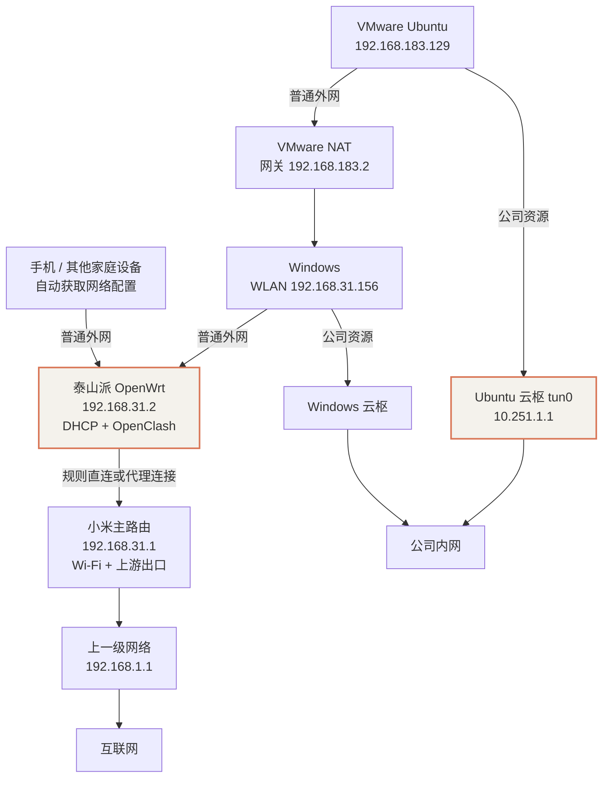
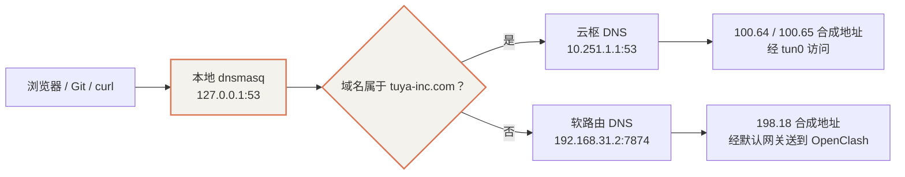
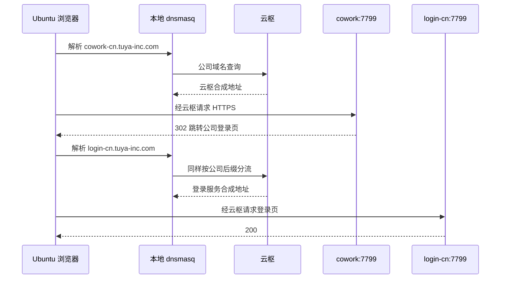

# 家庭 Wi-Fi 自动代理与云枢、Tailscale 共存实战

本次调整解决两个实际需求：家庭设备连接 Wi-Fi 后自动经过软路由分流；工作电脑开启云枢（YunShu）后仍能同时访问公司内网与普通外网。Linux 虚拟机还运行 Tailscale，需要处理它与云枢之间的地址范围和防火墙冲突。

本文记录 **2026-10-02 的实际环境与最终生效配置**。前置部署见 [OpenWrt 旁路由搭建](./04-openwrt-bypass-gateway-setup.mdx)，代理内核与节点管理见 [透明代理与终端接入](./05-transparent-proxy-and-clients.mdx)。

:::info 适用范围与资料处理
本文以 IPv4、家庭网络 `192.168.31.0/24` 和 VMware NAT 为基线。示例地址、接口名与公司域名均需按自己的环境核对。公开文档不包含 SSH 密码、路由器登录会话、云枢令牌、代理订阅凭据或设备完整 MAC 清单。
:::

## 1. 最终状态与设备分工

### 1.1 网络地址和服务

| 设备 / 服务 | 本次实测配置 | 职责 |
| --- | --- | --- |
| 小米主路由 | R4AC，固件 2.18.51；LAN `192.168.31.1` | 提供家庭 Wi-Fi，连接上一级网络 |
| 小米 WAN | DHCP 地址 `192.168.1.2/24`，上游网关 `192.168.1.1` | 家庭网络的互联网出口；本次未修改 |
| 泰山派宿主机 | Armbian；有线 `192.168.31.32`，无线 `192.168.31.206` | 运行 Docker、NAS 和其他服务 |
| 宿主机互通接口 | `mac0`，`192.168.31.3/32` | 宿主机访问 macvlan 中的 OpenWrt |
| OpenWrt 容器 | `192.168.31.2/24`，上游网关 `192.168.31.1` | DHCP、DNS、透明代理分流 |
| OpenClash / Mihomo | Rule 模式；fake-IP `198.18.0.1/16` | 根据规则选择直连或代理 |
| Windows WLAN | DHCP，保留地址 `192.168.31.156` | 运行 Windows 云枢与 VMware |
| VMware VMnet8 | Windows 侧 `192.168.183.1`；NAT 网关 `192.168.183.2` | 为 Ubuntu 虚拟机提供 NAT 网络 |
| Ubuntu 虚拟机 | Ubuntu 26.04.1；`ens33 = 192.168.183.129/24` | 开发环境、本地 DNS 转发、Linux 云枢 |
| Ubuntu 云枢 | `tun0 = 10.251.1.1/32`，本机 DNS `10.251.1.1:53` | 公司内网接入 |
| Ubuntu Tailscale | `tailscale0 = 100.107.71.46` | 独立的 Tailscale 网络接入 |

泰山派硬件通过设备树核对为 `lckfb,tspi-v10`、`rockchip,rk3566`，模型为 `TaishanPi V10 Board`。内核名中的 `rk35xx` 是内核适配系列，不能据此判断为 RK3588。

### 1.2 日常使用方式

| 使用场景 | 当前行为 |
| --- | --- |
| 普通手机、电脑连接家庭 Wi-Fi | 自动获取 OpenWrt 下发的网关和 DNS，不需要逐台设置代理 |
| 国内网站与规则中的直连服务 | 经过软路由后按规则直连 |
| Google、GitHub 等需要代理的服务 | 经过软路由后按规则选择代理节点 |
| Windows 开启云枢 | 已验证公司内网与 Google 可以同时访问 |
| Ubuntu 开启云枢 | 公司域名交给云枢 DNS；普通外网继续交给软路由 |
| 新增公司域名 | `tuya-inc.com` 及其子域名已被 DNS 分流规则覆盖 |
| 其他公司域名后缀 | 需要另行核对与配置，例如本次未自动添加 `tuya-inc.top` |
| 外出连接其他 Wi-Fi | Windows 的 DHCP 可随网络变化；Ubuntu 的软路由 DNS 配置仍绑定家庭环境，需要另外设计网络切换 |

家庭代理与公司内网访问是两种不同能力。普通家庭设备不会因为连接了这台软路由就获得公司的云枢访问权限。

## 2. 当前流量与 DNS 路径

### 2.1 网络拓扑



图中的云枢路径是逻辑隧道。隧道自身的外层连接仍使用底层网络出站；Ubuntu 的外层连接需要经过 VMware NAT 与 Windows。Windows 云枢也可能介入经过宿主机的流量，不能把虚拟机理解为完全绕开宿主机网络控制。

### 2.2 Ubuntu 的 DNS 分流



`100.64.x.x` 和 `198.18.x.x` 在本例中都是合成地址。它们不是目标服务器的真实公网地址，也不一定固定。判断是否可用需要看后续路由、隧道和回包，不能只凭地址范围认定是“死地址”。

## 3. 小米 DHCP 迁移到 OpenWrt

### 3.1 为什么需要迁移

原来小米提供 Wi-Fi 与 DHCP，OpenWrt 只是同一个局域网中的旁路由。连接 Wi-Fi 不会自动让数据经过 OpenWrt；设备必须把网关指向 `192.168.31.2`，OpenClash 才能处理它的普通出站流量。

本次检查了小米的“局域网设置”及该页面实际调用的接口。R4AC 这版固件提供 DHCP 开关、开始地址、结束地址和租约设置，页面没有独立下发网关与 DNS 的入口。这个结论只针对本次型号和固件，不代表所有小米路由器都相同。

因此保留小米的 Wi-Fi 和 WAN 配置，由 OpenWrt 接管 DHCP。不要把 WAN 页面上的 DNS 设置与客户端 DHCP 下发的 DNS 混为一谈，也不需要为了本方案修改小米的工作模式。

### 3.2 切换前后的 DHCP 配置

| 项目 | 切换前 | 切换后 |
| --- | --- | --- |
| 小米 DHCP | 开启；`.31.5–.31.254`，12 小时租约 | 关闭 |
| OpenWrt DHCP | `ignore=1`，`dhcpv4=disabled` | `ignore=0`，`dhcpv4=server` |
| OpenWrt 动态地址池 | 未对外分配 | `.31.100–.31.249`，12 小时租约 |
| 客户端网关 | 由原 DHCP 下发，工作电脑另有手动设置 | DHCP option 3：`192.168.31.2` |
| 客户端 DNS | 原 DHCP 或手动设置 | DHCP option 6：`192.168.31.2` |
| 地址保留 | 原有设备地址 | 为当时发现的 14 台设备准备保留项 |
| OpenWrt 自身默认网关 | `192.168.31.1` | 保持 `192.168.31.1` |

NAS 有线与无线地址原本通过 DHCP 获取，需要按网卡 MAC 保留 `.31.32` 与 `.31.206`。Windows 的保留地址是 `.31.156`。`.31.1`、`.31.2`、`.31.3` 属于基础设施地址，不能分给普通客户端。

设备清单不是完整 DHCP 租约数据库。切换前还应核对离线设备、手动固定地址与已有保留项。本次保留的是现场发现的设备映射，不应把公开文档里的示例当成自己的完整地址清单。手机随机 MAC 改变后，原 MAC 的保留项不会再匹配，但它仍可获得新的动态地址。

### 3.3 备份与草案准备

以下命令在泰山派宿主机执行，默认已经通过 SSH 获得管理权限。密码只在登录时输入，不写入脚本或 Git。

```bash
TASK_BACKUP="/root/network-backup-$(date +%Y%m%d-%H%M%S)"
mkdir -m 700 "$TASK_BACKUP"

docker exec openwrt tar -czf - \
  /etc/config /etc/hosts /etc/openclash/kele_cloud.yaml \
  > "$TASK_BACKUP/openwrt-config.tar.gz"

docker inspect openwrt > "$TASK_BACKUP/openwrt-container.json"
docker network inspect macnet > "$TASK_BACKUP/macnet.json"

# 备份内容可能包含订阅凭据，保留在私有管理目录。
chmod 600 "$TASK_BACKUP"/*
tar -tzf "$TASK_BACKUP/openwrt-config.tar.gz"
```

先修改临时目录中的 UCI 草案，避免在小米 DHCP 仍开启时让 OpenWrt 同时分配地址：

```bash
docker exec openwrt sh -c '
set -e
mkdir -p /tmp/dhcp-stage
cp /etc/config/dhcp /tmp/dhcp-stage/dhcp

uci -c /tmp/dhcp-stage set dhcp.lan.ignore="0"
uci -c /tmp/dhcp-stage set dhcp.lan.dhcpv4="server"
uci -c /tmp/dhcp-stage set dhcp.lan.start="100"
uci -c /tmp/dhcp-stage set dhcp.lan.limit="150"
uci -c /tmp/dhcp-stage set dhcp.lan.leasetime="12h"

# 本例原配置没有其他客户端 DHCP options。
# 如果自己的环境有 PXE 等选项，应保留它们并只替换网关、DNS。
uci -c /tmp/dhcp-stage -q delete dhcp.lan.dhcp_option || true
uci -c /tmp/dhcp-stage add_list dhcp.lan.dhcp_option="3,192.168.31.2"
uci -c /tmp/dhcp-stage add_list dhcp.lan.dhcp_option="6,192.168.31.2"
uci -c /tmp/dhcp-stage commit dhcp
uci -c /tmp/dhcp-stage export dhcp
'
```

静态保留项通过 `config host` 配置。以下示例从 NAS 的有线接口读取 MAC，不公开实际 MAC；已经有对应保留项时不要重复创建：

```bash
NAS_ETH_MAC="$(cat /sys/class/net/eth0/address)"

docker exec openwrt uci -c /tmp/dhcp-stage set dhcp.nas_eth=host
docker exec openwrt uci -c /tmp/dhcp-stage set dhcp.nas_eth.mac="$NAS_ETH_MAC"
docker exec openwrt uci -c /tmp/dhcp-stage set dhcp.nas_eth.ip="192.168.31.32"
docker exec openwrt uci -c /tmp/dhcp-stage commit dhcp
```

NAS 无线接口、其他固定设备按同样方式核对。不要把 `docker cp` 成功作为配置已生效的证据，最终需要检查 UCI、生成的 dnsmasq 配置与实际客户端租约。

### 3.4 执行切换

切换顺序：

1. 保持一台已配置好地址的管理电脑在线，准备好备份与恢复方式。
2. 在小米“常用设置 → 局域网设置”关闭 DHCP 并保存。
3. 将审核后的 OpenWrt 草案应用到运行配置。
4. 重启 OpenWrt 的 dnsmasq，并检查 DHCP option 3 / 6 和 UDP 67 监听。
5. 用手机自动获取地址验证，成功后再调整 Windows。

```bash
docker exec openwrt sh -c '
set -e
cp /tmp/dhcp-stage/dhcp /etc/config/dhcp
/etc/init.d/dnsmasq restart

uci get dhcp.lan.ignore
uci get dhcp.lan.dhcpv4
uci get dhcp.lan.dhcp_option
netstat -lnup | grep ":67 "
'
```

本次切换设置了 **10 分钟未确认则恢复的临时回滚保护**。手机确认网关、DNS 均为 `.31.2` 且 Google 可访问后，已取消该回滚。它不是长期定时任务。

小米登录会话在当前管理电脑上有效，但同一会话从 NAS 发起请求被拒绝；没有把带登录凭据的管理接口搬到 NAS 调用。本文使用管理页面描述恢复步骤，不提供会话令牌。

:::warning DHCP 与 DNS 服务要区分
关闭的是小米的客户端 DHCP 地址分配。OpenWrt 的 dnsmasq 同时负责 DNS 与 DHCP；回滚时应关闭 `dhcp.lan` 地址分配并重启 dnsmasq，不能直接停掉整个 dnsmasq，否则会连 DNS 一起停掉。
:::

## 4. Windows 改为自动获取

在 Windows 的管理员 PowerShell 执行，接口名以实际名称为准：

```powershell
netsh interface ipv4 set address name="WLAN" source=dhcp
netsh interface ipv4 set dnsservers name="WLAN" source=dhcp
ipconfig /renew "WLAN"

netsh interface ipv4 show config name="WLAN"
```

本次输出确认：

```text
DHCP 已启用: 是
IP 地址: 192.168.31.156
默认网关: 192.168.31.2
通过 DHCP 配置的 DNS 服务器: 192.168.31.2
```

IP 没有变化是地址保留的结果，并不代表 DHCP 未生效。手机、平板、其他电脑也应使用自动获取；旧租约未更新时，需要重新连接或更新租约，再核对网关。手动固定 IP 的设备不会自动采用新网关。

本次没有修改 Windows 云枢配置、VMware NAT 模式、VMnet8 地址或 WSL 虚拟网络。Windows 用户实测云枢开启时 Google、cowork、ocean-code 可以同时访问。

## 5. Ubuntu 本地 DNS 与公司域名分流

### 5.1 保留的原有基础配置

Ubuntu 已有 `dnsmasq-softrouter.service`，监听 `127.0.0.1:53`，转发到 OpenWrt `192.168.31.2:7874`。`/etc/resolv.conf` 已指向本地地址且设置了 immutable；这些都不是本次新增。

```text
nameserver 127.0.0.1
options edns0
```

本次观察到：从虚拟机查询 `192.168.31.2:53` 会得到 `100.64.x.x`，同一地址的 `7874` 会得到 OpenClash 的 `198.18.x.x`；OpenWrt 本机查询自己的 53 端口也返回 `198.18.x.x`。这说明 DNS 请求路径之间存在改写差异，但仅凭这些结果不能独立确定拦截发生在哪一层。当前继续使用 7874，避免经过产生差异的 53 端口请求路径。

### 5.2 最终 DNS 配置

文件：`/etc/dnsmasq-softrouter.conf`。

```ini
listen-address=127.0.0.1
bind-interfaces
port=53

# 普通域名交给家庭软路由。
server=192.168.31.2#7874

# 公司主域名及所有子域名交给本机云枢。
server=/tuya-inc.com/10.251.1.1

no-resolv
no-hosts
cache-size=1000
user=root
```

本次最终新增的是 `server=/tuya-inc.com/10.251.1.1`。范围包括 cowork、公司登录页、ocean-code 以及相同后缀的其他子域名；它也会把该后缀下的公开服务交给云枢解析。

现有服务运行命令为：

```text
/usr/sbin/dnsmasq --keep-in-foreground --conf-file=/etc/dnsmasq-softrouter.conf
```

修改后先检查语法，再重启服务：

```bash
sudo dnsmasq --test --conf-file=/etc/dnsmasq-softrouter.conf
sudo systemctl restart dnsmasq-softrouter
```

`Type=simple` 服务显示已启动时，进程可能还没完成绑定端口。不要重启后立刻用一次查询失败判定配置不可用；使用有限重试确认解析就绪：

```bash
DNS_READY=0

for ATTEMPT in $(seq 1 30); do
  if READY_ANSWER=$(dig @127.0.0.1 login-cn.tuya-inc.com A \
       +short +time=1 +tries=1 2>/dev/null) \
     && printf '%s\n' "$READY_ANSWER" \
       | grep -Eq '^100\.(64|65)\.[0-9]+\.[0-9]+$'; then
    DNS_READY=1
    printf '公司 DNS 已就绪：%s\n' "$READY_ANSWER"
    break
  fi
  sleep 0.2
done

test "$DNS_READY" = 1
sudo resolvectl flush-caches
```

这个地址范围检查针对本例的云枢配置；其他部署需要改成对应的预期结果。刷新 systemd-resolved 缓存不会保证清除浏览器自己的 DNS / 连接缓存，浏览器验证时应完整退出并重新打开。

:::note 家庭网络之外的使用
本地 dnsmasq 的默认上游仍固定为 `192.168.31.2:7874`，`resolv.conf` 仍被锁定。Windows 自动获取已实现，Ubuntu 尚未实现根据不同 Wi-Fi 自动选择 DNS；离开家庭网络后，普通域名解析可能不可用。云枢未连接时，公司域名分流也没有可用的隧道服务。
:::

## 6. 云枢与 Tailscale 的回包冲突

### 6.1 证据：回包已经返回，应用仍然超时

Ubuntu 云枢使用 `100.64.0.0/15` 合成地址，Tailscale 使用更大的 CGNAT 范围 `100.64.0.0/10`。Tailscale 默认的防伪规则包含：

```text
-A ts-input -s 100.64.0.0/10 ! -i tailscale0 -j DROP
```

本次抓包观察到：

```text
tun0 Out 10.251.1.1:临时端口 > 100.64.0.44:目标端口  SYN
tun0 In  100.64.0.44:目标端口 > 10.251.1.1:临时端口  SYN,ACK
```

SYN 与 SYN,ACK 重复出现，但应用不能完成 TCP 握手。防火墙中这条 DROP 规则也有累计命中。云枢回包从 `tun0` 进入，符合“源地址属于 CGNAT、接口不是 tailscale0”的丢弃条件。

因此这里的 `100.64.x.x` 不是无效地址。问题在本机防火墙，不是“云枢完全不转发”，也不是缺少公司网段路由。

### 6.2 定向放行已建立连接的回包

把以下规则放在 INPUT 链首位，早于进入 `ts-input`：

```bash
sudo iptables -w 5 -I INPUT 1 \
  -i tun0 \
  -s 100.64.0.0/15 \
  -d 10.251.1.1/32 \
  -m conntrack --ctstate ESTABLISHED,RELATED \
  -m comment --comment yunshu-tailscale-compat \
  -j ACCEPT
```

规则限定了云枢接口、合成地址范围、本机隧道地址和连接状态。它没有放行任意来源的新连接，也没有关闭 Tailscale 的全部防火墙管理。

### 6.3 启动时恢复规则

本次创建了 `/usr/local/sbin/yunshu-tailscale-compat`：

```bash
#!/bin/sh
set -eu

if /usr/sbin/iptables -w 5 -C INPUT \
  -i tun0 -s 100.64.0.0/15 -d 10.251.1.1/32 \
  -m conntrack --ctstate ESTABLISHED,RELATED \
  -m comment --comment yunshu-tailscale-compat \
  -j ACCEPT 2>/dev/null; then

  /usr/sbin/iptables -w 5 -D INPUT \
    -i tun0 -s 100.64.0.0/15 -d 10.251.1.1/32 \
    -m conntrack --ctstate ESTABLISHED,RELATED \
    -m comment --comment yunshu-tailscale-compat \
    -j ACCEPT
fi

/usr/sbin/iptables -w 5 -I INPUT 1 \
  -i tun0 -s 100.64.0.0/15 -d 10.251.1.1/32 \
  -m conntrack --ctstate ESTABLISHED,RELATED \
  -m comment --comment yunshu-tailscale-compat \
  -j ACCEPT
```

脚本会把已有规则重新放到链首，而不只是确认它存在。否则 Tailscale 启动时把自己的跳转规则放在前面，原来的例外可能失去作用。

对应 drop-in：`/etc/systemd/system/tailscaled.service.d/50-yunshu-compat.conf`。

```ini
[Service]
ExecStartPost=-/usr/local/sbin/yunshu-tailscale-compat
```

`ExecStartPost` 前的 `-` 表示兼容脚本失败不会让 Tailscale 服务整体启动失败，因此还需要检查日志和规则顺序，不能只看服务 active。

```bash
sudo chmod 755 /usr/local/sbin/yunshu-tailscale-compat
sudo systemctl daemon-reload
sudo /usr/local/sbin/yunshu-tailscale-compat

systemctl show tailscaled --property=ExecStartPost
sudo iptables -S INPUT
sudo journalctl -u tailscaled -b --no-pager
```

本次安装后检查了生效规则、helper 执行结果与 systemd 读取到的启动命令，但没有通过重启 Tailscale 或整机来完成生命周期验证。若云枢接口、隧道 IP 或合成地址范围变化，需要同步修改规则。

## 7. 公司网页必须验证完整跳转链路

### 7.1 非标准端口是实际资源的一部分

Windows 能正常打开的 cowork 地址为：

```text
https://cowork-cn.tuya-inc.com:7799/#/gateway
```

此前按默认 HTTPS 443 测试会遇到 TLS 连接关闭，不能据此判断实际 7799 服务不可用。URL 的 `#/gateway` 是浏览器片段，不会作为 HTTP 路径发送给服务器。

ocean-code 的实际访问协议和端口没有在这次命令行验证中独立记录。它的公司 DNS 已被后缀分流覆盖，Windows 用户确认可用；不要把一个域名默认拼成 HTTPS 443 后当作完整资源验收。

### 7.2 302 并不是网页已经可用

cowork 的入口返回：

```text
HTTP 302
Location: https://login-cn.tuya-inc.com:7799/login
```

只配置 cowork 的单域名 DNS 后，入口可以访问，但登录域名仍得到软路由 fake IP，浏览器在跳转阶段超时。最终把 `tuya-inc.com` 及其子域名统一交给云枢后，登录页和完整跳转都返回 200。



这次排障说明：需要验证入口、跳转、登录页和浏览器表现，不能把入口 302 当成完整成功。网络能打开登录页也不等于已完成账号登录或拥有所有应用权限。

## 8. 验证命令与本次结果

### 8.1 分层检查

Ubuntu 普通用户执行：

```bash
# 系统实际使用的域名结果。
getent ahostsv4 cowork-cn.tuya-inc.com
getent ahostsv4 login-cn.tuya-inc.com

# 公司解析应走云枢，普通外网解析应走软路由。
dig @127.0.0.1 cowork-cn.tuya-inc.com A +short
dig @127.0.0.1 login-cn.tuya-inc.com A +short
dig @127.0.0.1 www.google.com A +short

# 查看云枢合成地址是否选中 tun0；地址以实际查询为准。
ip route get 100.64.0.44

# 关闭显式代理变量的影响，并跟随完整跳转。
curl --noproxy '*' -sS -L --max-redirs 8 \
  --connect-timeout 5 --max-time 25 -o /dev/null \
  -w 'HTTP=%{http_code} TLS=%{ssl_verify_result} redirects=%{num_redirects}\n' \
  https://cowork-cn.tuya-inc.com:7799/

curl --noproxy '*' -sS -o /dev/null \
  -w 'HTTP=%{http_code} TLS=%{ssl_verify_result}\n' \
  https://www.google.com/
```

未使用 `curl -k` 跳过证书验证。正常的命令行网络结果还应与浏览器页面相互核对。

### 8.2 本次实测记录

| 检查项 | 结果 | 说明 |
| --- | --- | --- |
| 手机自动连接家庭 Wi-Fi | 网关、DNS 均为 `192.168.31.2`；Google 可用 | 验证 OpenWrt DHCP 发放 |
| Windows 自动获取 | DHCP 开启；IP `.31.156`，网关、DNS `.31.2` | 地址保留正常 |
| Windows 云枢开启 | Google、cowork、ocean-code 可打开 | 用户浏览器验证 |
| Ubuntu cowork 入口 | 302，TLS 校验成功 | 只代表入口可达 |
| Ubuntu 公司登录页 | 200，TLS 校验成功 | 登录域名也需要分流 |
| Ubuntu cowork 完整跳转 | 200，1 次跳转，TLS 校验成功 | 最终到达登录页 |
| Ubuntu Google / GitHub | 200 | 普通外网透明代理可用 |
| OpenAI API 无认证请求 | 401，TLS 校验成功 | 网络可达，缺少 API 认证 |
| ChatGPT 网页早期探测 | 403 | 不能据此声称 ChatGPT 网页完全可用 |
| 最终浏览器表现 | 用户反馈“当前没有问题了” | 浏览器现场确认 |
| 整机 / 服务重启后验证 | 尚未执行 | 启动恢复逻辑已配置，但未完成重启实测 |

## 9. 维护、备份与回滚

### 9.1 配置文件清单

| 位置 | 本次处理 |
| --- | --- |
| 小米 DHCP 设置 | 关闭地址分配；保留原 WAN 与 LAN 地址 |
| OpenWrt `/etc/config/dhcp` | 启用 LAN DHCP，设置网关、DNS、地址池和保留项 |
| OpenWrt `/etc/config/network` | 本次未修改 |
| OpenClash `/etc/openclash/kele_cloud.yaml` | 本次未修改代理节点与内核配置 |
| Ubuntu `/etc/dnsmasq-softrouter.conf` | 新增公司域名后缀分流 |
| Ubuntu `/etc/resolv.conf` | 保留已有本地 DNS 与 immutable 设置 |
| Ubuntu `dnsmasq-softrouter.service` | 保留原服务定义，修改配置后重启 |
| Ubuntu `/usr/local/sbin/yunshu-tailscale-compat` | 新增定向回包放行脚本 |
| Ubuntu `tailscaled.service.d/50-yunshu-compat.conf` | 新增启动恢复 hook |

备份留在各自设备的私有目录，不提交原始包：

- 泰山派：`/root/network-preflight-20261002-121109/`，包括 OpenWrt 配置归档、Docker 网络信息、小米设置快照、地址保留草案与 SHA256 校验。
- Ubuntu：`/root/yunshu-network-backup-20261002-141017/`，保存公司分流与回包修复前的 DNS 配置和防火墙快照。
- Ubuntu：`/root/company-dns-backup-20261002-141857/`，保存从 cowork 单域名扩展到整个公司后缀之前的 DNS 配置。

OpenWrt 本次检查没有 Docker bind mount / volume；配置保存在容器可写层。普通容器重启与删除后重新创建不是一回事，重建容器前需要导出配置，并用对应备份恢复。

### 9.2 家庭 DHCP 回滚

1. 关闭 OpenWrt 的 LAN DHCP，保留其 DNS 服务。
2. 在小米管理页面重新开启 DHCP，恢复原地址池 `.31.5–.31.254` 和 12 小时租约。
3. 客户端重新获取租约，再检查实际网关与 DNS。
4. 原来依赖手动网关的设备若仍要使用旁路由，需要恢复对应手动设置。

```bash
# 泰山派宿主机执行。
docker exec openwrt sh -c '
uci set dhcp.lan.ignore="1"
uci set dhcp.lan.dhcpv4="disabled"
uci commit dhcp
/etc/init.d/dnsmasq restart
'
```

恢复完成前，已有租约可能还能通信，但新设备可能无法取得地址。不要长时间留下小米和 OpenWrt 同时提供不同网关的 DHCP。

### 9.3 撤销本次 Ubuntu 修复

以下恢复到修复前的本地 DNS 转发配置，仍保留原有 dnsmasq 服务和锁定的 `resolv.conf`；公司内网也会回到修复前的行为。

```bash
# 选择实际存在的“修复前”备份，不要误选只撤销后缀扩展的备份。
UBUNTU_BACKUP=/root/yunshu-network-backup-20261002-141017

sudo cp -a "$UBUNTU_BACKUP/dnsmasq-softrouter.conf" \
  /etc/dnsmasq-softrouter.conf
sudo dnsmasq --test --conf-file=/etc/dnsmasq-softrouter.conf
sudo systemctl restart dnsmasq-softrouter

sudo rm -f /etc/systemd/system/tailscaled.service.d/50-yunshu-compat.conf
sudo systemctl daemon-reload

# 只撤销本次带固定 comment 的例外，不恢复整套旧防火墙快照。
sudo iptables -w 5 -D INPUT \
  -i tun0 -s 100.64.0.0/15 -d 10.251.1.1/32 \
  -m conntrack --ctstate ESTABLISHED,RELATED \
  -m comment --comment yunshu-tailscale-compat \
  -j ACCEPT

sudo rm -f /usr/local/sbin/yunshu-tailscale-compat
```

不要直接把历史 `iptables-save` 全量快照覆盖到现在，否则可能覆盖 Tailscale 或其他服务后来更新的规则。

### 9.4 诊断抓包与日志收尾

本次诊断出现了抓包进程未被 `timeout` 回收、退出信号返回权限拒绝的现象。进程处于 `tcpdump (enforce)`，但没有进一步确认具体拒绝来源，也没有解除 AppArmor 或云枢保护。

后续诊断应限制接口、目标、输出与包数，例如使用 `-c` 自动结束；同时确认进程实际退出，不能仅凭超时命令返回就认为所有子进程已清理。公开截图与日志只保留必要的包头和状态，删除登录令牌、Cookie、个人身份和认证参数。

## 10. 常见问题与验收边界

### 10.1 为什么连 Wi-Fi 后仍没走代理？

先看客户端网关，而不是只看连接了哪个 SSID。旧租约、手动网关或独立的访客网络可能仍使用小米或另一套网络；只有确认普通出站流量经过 `.31.2`，OpenClash 规则才会生效。本次只验证了实际连接的家庭 Wi-Fi，没有验证访客网络。

### 10.2 为什么不能只给公司域名加 DIRECT？

软路由的 DIRECT 是从家庭网络直接访问目标，不会自动进入 Windows 或 Ubuntu 上的云枢隧道。公司域名需要由本机云枢解析、选中本机隧道路由，同时保证回包不被其他 VPN 的规则丢弃。

### 10.3 开着其他 VPN 时，普通流量还走软路由吗？

要看客户端实际安装的路由与策略。分流 VPN 只接管指定目标；全隧道 VPN 可能先封装普通外网流量，此时软路由主要看到 VPN 外层连接，不能按其中每个网站独立分流。云枢和 Tailscale 同时运行也不能只看各自“已连接”就判断所有路径正常。

### 10.4 重连云枢或 Tailscale 后应该检查什么？

- DNS 是否仍走 `127.0.0.1`，公司域名是否得到预期的云枢地址。
- 相关合成地址是否经 `tun0`，隧道 IP 是否仍为 `10.251.1.1`。
- `yunshu-tailscale-compat` 是否早于 `ts-input`。
- cowork 的 7799 入口及登录跳转能否完整完成。
- Google 与其他外网服务是否仍正常。

运行了 Tailscale 启动 hook 不等于覆盖所有其他软件的防火墙改写。发生异常时需要重新读取当前规则和日志。

### 10.5 本次没有做哪些改变？

没有改成 VMware 桥接，没有修改 Windows 云枢策略，没有关闭 Tailscale，没有新增系统代理环境变量，也没有重新安装或替换 OpenClash。软路由仍采用既有 fake-IP 透明代理；全屋自动接入来自 DHCP 接管。

## 11. 参考资料

- [OpenWrt：DHCP 与 DNS 配置示例](https://openwrt.org/docs/guide-user/base-system/dhcp_configuration)：DHCP option 3 为客户端网关，option 6 为 DNS。
- [dnsmasq 官方手册](https://thekelleys.org.uk/dnsmasq/docs/dnsmasq-man.html)：`server=/域名/上游`、域名后缀分流与 DHCP 保留项。
- [Tailscale：Netfilter modes](https://tailscale.com/docs/reference/netfilter-modes)：默认 CGNAT 防伪丢弃规则。
- [Tailscale：与其他 VPN 共存](https://tailscale.com/docs/reference/faq/other-vpns)：CGNAT 地址范围冲突。
- [Microsoft：netsh interface](https://learn.microsoft.com/zh-cn/windows-server/administration/windows-commands/netsh-interface)：Windows DHCP 与 DNS 配置命令。
