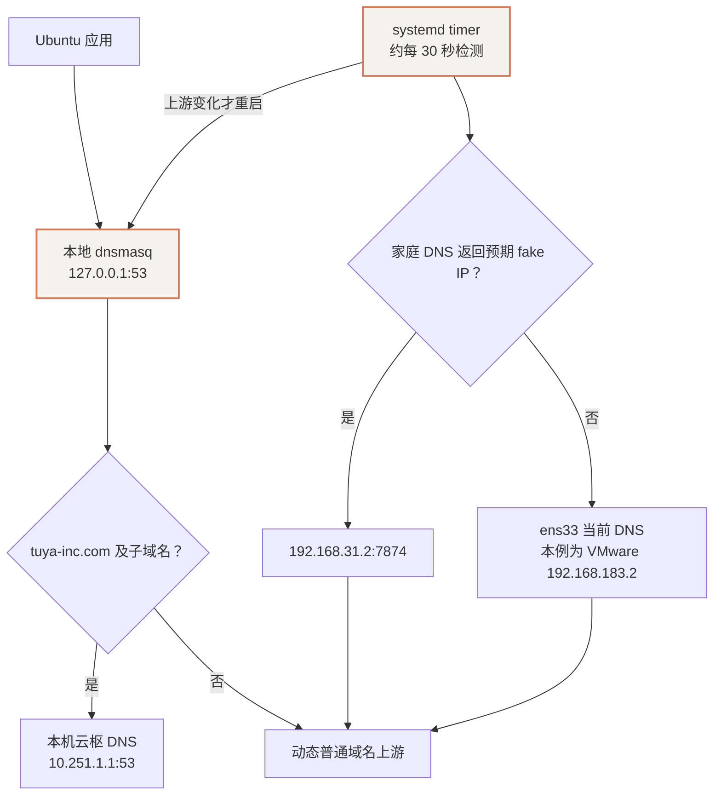

# Ubuntu 虚拟机 DNS 随 Wi-Fi 自动切换

[家庭 Wi-Fi 自动代理与云枢、Tailscale 共存实战](./10-dhcp-yunshu-tailscale-coexistence.mdx)解决了家里的代理与公司内网共存，但 Ubuntu 普通域名的上游仍固定为家中的软路由。Windows 换 Wi-Fi 后，VMware NAT 网卡可能保持在线；虚拟机虽然有默认路由，域名解析却仍请求已经无法到达的家庭 DNS。

本次为既有 dnsmasq 增加一个定期检查器：家里的 DNS 可用时继续使用它；不可用时改用虚拟机网卡当前获取的 DNS。公司域名仍独立交给本机云枢。

:::info 适用环境
本方案针对现有 Ubuntu、NetworkManager、接口 ens33 和 VMware NAT，处理 IPv4 DNS。它没有修改 Windows Wi-Fi、VMware 网络模式、云枢策略或 Tailscale 回包规则，也不负责在外出时提供代理节点。
:::

## 1. 切换前后的区别

| 项目 | 原配置 | 新配置 |
| --- | --- | --- |
| 应用查询入口 | 本地 127.0.0.1:53 | 保持不变 |
| 普通域名 | 始终使用 192.168.31.2:7874 | 家庭 DNS 可用时使用它，否则采用 ens33 当前 DNS |
| 公司域名 | tuya-inc.com 交给 10.251.1.1 | 保持不变 |
| resolv.conf | nameserver 127.0.0.1，已有 immutable | 保持不变 |
| 网络变化检测 | 无 | 启动后检查，并约每 30 秒再次检查 |
| 配置相同 | 无需处理 | 不写文件、不重启 DNS |
| 切换失败 | 普通解析可能持续不可用 | 配置或服务验证失败则恢复上一个上游 |

当前 ens33 的 DHCP DNS 是 192.168.183.2，即 VMware NAT 的 DNS 转发入口。Windows 换 Wi-Fi 后，虚拟机网段与这个地址通常不会变化，因此不能仅靠“DNS 地址变了”或“网卡重连”触发切换。

## 2. DNS 路径与检测方式



检查器直接向 192.168.31.2:7874 查询 www.google.com 的 A 记录。本次家庭配置应返回 198.18.0.0/16 内的 fake IP；查询失败或返回其他地址时，读取 NetworkManager 中 ens33 的 IPv4 DNS。

这是 DNS 能力检测，不是读取 Windows 的 Wi-Fi 名称，也不是验证 Google 网页一定能打开。若更改家庭 fake-IP 范围、接口名或网关地址，应同步修改检查器。另一网络如果恰好存在相同地址、端口和响应特征的服务，也可能被识别为 home 分支。

无可用上游时保留上一份配置，不写入空 DNS。读取到的 DHCP DNS 会去重，并排除本地回环、无效地址和本例已经无法使用的家庭 DNS 地址。

## 3. 最终配置与文件

### 3.1 主 DNS 配置

文件：/etc/dnsmasq-softrouter.conf。

```ini
listen-address=127.0.0.1
bind-interfaces
port=53
no-resolv
no-hosts
cache-size=1000
user=root
server=/tuya-inc.com/10.251.1.1
conf-file=/etc/dnsmasq-softrouter-upstream.conf
```

固定的普通域名 server 行移到独立文件，由检查器维护。公司后缀行继续留在主配置，不参与普通上游切换。dnsmasq 的独立配置文件与域名上游机制见 [官方手册](https://thekelleys.org.uk/dnsmasq/docs/dnsmasq-man.html)。

### 3.2 动态普通上游

文件：/etc/dnsmasq-softrouter-upstream.conf。

在家时：

```ini
server=192.168.31.2#7874
```

家庭 DNS 不可用时，本机当前 NAT 环境下会生成：

```ini
server=192.168.183.2
```

不要手动编辑这个文件后期待它长期保留；下一轮检查会按实际检测结果更新。NetworkManager DNS 通过 nmcli 的 IP4.DNS 字段读取，参见 [nmcli 官方文档](https://networkmanager.dev/docs/api/latest/nmcli.html)。

### 3.3 检查器与定时器

| 文件 | 用途 |
| --- | --- |
| /usr/local/sbin/network-dns-switch | 探测、选择上游、原子写入与失败恢复 |
| /etc/systemd/system/network-dns-switch.service | 一次性执行检查 |
| /etc/systemd/system/network-dns-switch.timer | 启动后约 5 秒检查，此后按上一轮结束时间每 30 秒检查 |
| /etc/dnsmasq-softrouter-upstream.conf.lock | 串行化手动和定时执行，避免同时修改配置 |

定时器设置：

```ini
[Timer]
OnBootSec=5s
OnUnitInactiveSec=30s
AccuracySec=1s
Unit=network-dns-switch.service
```

上游发生变化时，先原子替换文件，再检查完整 dnsmasq 配置并重启服务，使进程读到新配置并清掉旧缓存。失败时恢复旧文件并尝试重新启动原配置。普通检查结果不变时不重启服务。

定时器的 enabled / active 状态是持久化配置证据；本次未通过整机重启验收。文件保存在磁盘上，启动后的定时检查会重新判断网络，不依赖 VMware 发出网卡断开事件。

## 4. 安装与恢复

### 4.1 前提

初次安装在家里执行，并保持 Linux 云枢已连接。安装器会检查既有公司 DNS 规则和家庭上游，拒绝覆盖不符合本例基线的配置。

需要本机已安装 Python 3、dnsmasq、dig、nmcli、curl、iptables 与 systemd。安装器需要 sudo；密码仅在本机终端输入，不进入脚本和日志。

### 4.2 获取脚本

仓库提供四个可下载文件：

- [DNS 切换检查器](/downloads/taishanpi/network-dns-switch.py)
- [安装与回滚脚本](/downloads/taishanpi/install-network-dns-switch.py)
- [systemd service](/downloads/taishanpi/network-dns-switch.service)
- [systemd timer](/downloads/taishanpi/network-dns-switch.timer)

将四个文件放在同一目录。以下命令下载后先查看选择结果：

```bash
mkdir -p ~/network-dns-roaming
cd ~/network-dns-roaming

for FILE in network-dns-switch.py install-network-dns-switch.py \
            network-dns-switch.service network-dns-switch.timer; do
  curl -fSLO "https://xepanda.github.io/wiki/downloads/taishanpi/$FILE"
done

python3 network-dns-switch.py --dry-run
```

在本次家庭环境中应输出 home 与 192.168.31.2#7874。确认后安装：

```bash
sudo python3 install-network-dns-switch.py
```

安装器先创建私有备份，再安装检查器与单位文件，修改主配置并验证 DNS、公司完整跳转、Google TLS，以及已有 Tailscale 兼容规则。验证通过才启用定时器；失败恢复备份。

日志默认位于调用 sudo 用户的 ~/.codex/network-roaming-20261002/install-result.log，包含状态和验证结果，不包含密码、登录令牌或代理订阅。

### 4.3 回滚

备份目录为 /root/network-roaming-backup-时间戳/。安装日志会给出本次准确路径与回滚命令：

```bash
# 将目录替换为安装日志中的实际备份目录。
sudo python3 install-network-dns-switch.py \
  --rollback /root/network-roaming-backup-实际时间戳
```

回滚会停掉新检查器，恢复原 DNS 文件和原来存在的脚本、单位文件，删除本次新增的文件，重启 DNS，并按备份恢复原定时器状态。它不修改云枢、Tailscale 兼容脚本或 resolv.conf。

## 5. 验证与本次结果

### 5.1 查看实际状态

```bash
cat /etc/dnsmasq-softrouter-upstream.conf
systemctl is-enabled network-dns-switch.timer
systemctl is-active network-dns-switch.timer
systemctl list-timers network-dns-switch.timer --no-pager
journalctl -u network-dns-switch.service -n 20 --no-pager

# 只看当前选择，不修改文件或重启 DNS。
python3 /usr/local/sbin/network-dns-switch --dry-run

dig @127.0.0.1 www.baidu.com A +short
dig @127.0.0.1 login-cn.tuya-inc.com A +short
```

### 5.2 不打断正常 DNS 的分支验证

可用不可达的文档地址模拟家庭 DNS 不可用。dry-run 不会改变实际解析：

```bash
python3 /usr/local/sbin/network-dns-switch \
  --dry-run --home-server 192.0.2.1
```

它只验证“检测失败后读取 DHCP DNS”的分支，并不等于电脑真的换了 Wi-Fi。脚本测试还用临时上游文件检查 away → home 的恢复路径，未修改系统 DNS。

| 验证 | 范围 |
| --- | --- |
| 自动化测试 | 家庭优先、外出上游选择、无 DNS 保留原配置、去重、切换重启、失败回滚、启动就绪等待 |
| 临时文件分支测试 | 不可达家庭地址选择 VMware DNS；恢复真实家庭地址后选回软路由 |
| 独立 DNS 进程测试 | 使用 VMware 上游解析普通域名，同时将公司后缀交给云枢；没有改动系统 DNS，测试进程已退出 |
| 安装现场验收 | 成功；公司登录域名解析为 100.64.0.45，cowork 完整跳转与 Google 均为 HTTP 200、TLS 校验结果 0 |
| 定时检查 | timer 已 enabled 且 active，检查 service 成功退出；上游仍为家庭 DNS |
| 原兼容规则 | INPUT 中的 yunshu-tailscale-compat 仍存在 |
| 真实换 Wi-Fi | 仍需用手机热点或其他网络完成现场验收 |
| 整机重启 | 尚未现场验证 |

第一次安装验证遇到 DNS 启动时序问题，已自动回滚。随后修正有限重试：dig 暂时报 connection refused 时等待，不在第一轮直接中断。这与旧文记录的 Type=simple 服务就绪问题一致；不能把 active 等同于端口已经可查询。

本机成功安装的备份目录为 /root/network-roaming-backup-20261002-224917-698961/。与其他备份一样，仅保存在本机私有目录，不提交原始配置包。

仓库中的 12 项针对性测试可运行：

```bash
python3 -B -m unittest discover -s scripts/network -v
```

### 5.3 实际换网络的验收步骤

1. Windows 连接手机热点或另一 Wi-Fi，必要时先完成该网络的网页登录认证。
2. 保持 VMware NAT，等待约 30–40 秒，再查看动态上游和 dry-run。
3. 检查普通网站；开启 Linux 云枢后检查公司登录页。
4. 切回家庭 Wi-Fi，再等待一轮检查，确认上游恢复为 192.168.31.2#7874。
5. 若浏览器保留旧连接或 DNS，完整退出后重开，再核对页面表现。

离家后仍可能需要重新认证云枢。切换检查器不负责 VPN 的重连或账号登录。

## 6. 外出能力边界

**DNS 自动切换解决离家后的域名解析依赖，不提供外出代理。** 在没有其他代理的网络中，Google 等服务仍可能不可达。

VMware 的 DNS 转发还会受到 Windows 云枢、VPN 和当前网络策略影响。本次查询 VMware DNS 时，Google 得到 100.64.x.x 云枢地址，而连接该地址超时；这也是在家继续优先使用软路由 7874 的原因。外出分支是否满足业务需求，要在目标网络现场验证。

公司后缀始终交给本机云枢；云枢未连接时，公司 DNS 可能不可用。已有 Tailscale 定向回包规则仍需与 tun0、隧道 IP 和云枢地址范围匹配。

如果外出也要求 Google、GitHub 和公司内网同时稳定使用，需要再配置外出可用的代理客户端与对应分流规则。这不属于本次 DNS 切换的修改范围。
