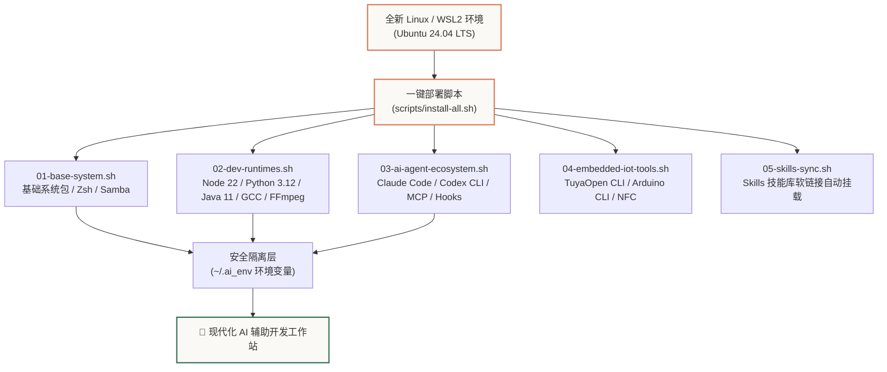

# 全栈开发与 AI Agent 运行时环境迁移与自动化配置手册

本手册完整记录了当前 Linux/WSL2 生产环境中的**软件栈清单、核心配置文件、多语言运行时、AI Agent 工具链（Claude Code、Codex CLI）、MCP 服务器架构以及嵌入式物联网开发环境**。

通过本手册与配套自动化脚本，无论是新机器迁移、虚拟机重建，还是由 **AI Agent 自动化部署**，均可实现标准化的一键极速恢复与零密钥泄露落地。

---

## 1. 系统架构与自动化部署全景



---

## 2. 软件栈与组件清单矩阵

| 领域 / 类别 | 组件名称 | 当前版本 / 规范 | 路径 / 管理方式 | 作用与职责 |
| :--- | :--- | :--- | :--- | :--- |
| **操作系统** | Ubuntu LTS | `24.04.4 LTS (x86_64)` | `/etc/os-release` | 基础 Linux 发行版与包管理 |
| **Shell & 终端** | Zsh + Oh My Zsh | `5.9` + 插件体系 | `~/.oh-my-zsh`, `~/.zshrc` | 终端交互、自动补全、语法高亮 |
| **共享存储** | Samba Server | `smbd` 4.x | `/home/share/samba` | 跨系统 (Windows/macOS) 局域网高速代码共享 |
| **JavaScript / Node** | Node.js | `v22.22.0 (LTS)` | NVM (`~/.nvm`) | 前端、MiniApp 及 AI CLI 运行环境 |
| | npm / pnpm / yarn | `10.9.4` / `10.30.3` / `1.22` | 全局安装 / Corepack | 现代包管理与依赖隔离 |
| **Python 生态** | Python 3 | `3.12.3` | `/usr/bin/python3` | 脚本编写、AI 工具与数据处理 |
| | pip / uv & 模块库 | `24.0` / `0.5+` | `~/.local/bin` | Requests, Kconfiglib, PySerial, PyYAML, Cryptography, CMake 等 |
| **Java 生态** | OpenJDK / Javac | `11.0.31` | `/usr/bin/java` | 跨平台后端与 Android/嵌入式相关工具 |
| **C / C++ 工具链** | GCC / G++ | `13.3.0` | `/usr/bin/gcc`, `/usr/bin/g++` | 原生 C/C++ 项目编译 |
| | CMake & Ninja | `4.0.2` / `1.11.1` | `~/.local/bin/cmake`, `ninja` | 现代构建系统与极速并行编译 |
| | GDB & Clang/Clangd | `13.x` / `18.x` | `/usr/bin/gdb`, `clangd` | 代码调试与 LSP 智能补全感知 |
| **多媒体** | FFmpeg & FFprobe | `6.1.1` | `/usr/bin/ffmpeg` | 音视频转码、流媒体与图像处理 |
| **AI Agent CLI** | Claude Code | `@anthropic-ai/claude-code` | 全局 npm | Anthropic 原生 CLI 智能编程 Agent |
| | OpenAI Codex CLI | `@openai/codex` | 全局 npm | OpenAI / LongCat 兼容智能编程 Agent |
| | Pencil & OpenCode | `@pencil.dev/cli`, `opencode-ai` | 全局 npm | UI 原型设计与开源 AI 编码助手 |
| **网络与隧道** | Cloudflared | 最新稳定版 | `/usr/local/bin/cloudflared` | Cloudflare Zero Trust 远程安全穿透 |
| **IoT / 嵌入式** | TuyaOpen CLI | `@tuya/tuyaopen-cli` | 全局 npm | 涂鸦开源物联网框架开发与固件构建 |
| | Arduino CLI | `1.2.2` | `~/.local/bin/arduino-cli` | 嵌入式单片机编译与板卡管理 |
| | LibNFC 系列工具 | `1.8.0` | `nfc-poll`, `nfc-list` 等 | NFC / RFID 读写器硬件调试 |

---

## 3. 安全隔离架构（Zero-Plaintext-Secret 原则）

为了确保代码仓库与配置文档可以安全公开与分享，所有敏感凭证（API Token、密码、私钥）严格遵循**三层安全隔离机制**：

1. **零明文入库**：Git 仓库与文档中严禁写入真实 Key，统一使用标准环境变量占位符 `${VARIABLE_NAME}`。
2. **独立环境配置 (`~/.ai_env`)**：所有密钥统一汇总在本地家目录的 `~/.ai_env` 中（权限设为 `chmod 600`）。
3. **Shell 自动动态加载**：在 `~/.zshrc` 与 `~/.bashrc` 中通过 `[ -f "$HOME/.ai_env" ] && source "$HOME/.ai_env"` 自动载入。

### 环境变量模板 (`scripts/env.template`)

```bash
# ==============================================================================
# AI & 开发环境敏感配置模板 (~/.ai_env)
# ==============================================================================

# 1. 智谱 / BigModel API Key (用于 web-reader, web-search-prime, zread 等 MCP 服务)
export ZHIPU_API_KEY="${ZHIPU_API_KEY:-your_zhipu_api_key_here}"

# 2. Z.AI 平台 API Key (用于 @z_ai/mcp-server)
export Z_AI_API_KEY="${Z_AI_API_KEY:-your_z_ai_api_key_here}"

# 3. OpenAI / LongCat API Key (用于 Codex CLI 自定义 Provider)
export OPENAI_API_KEY="${OPENAI_API_KEY:-your_openai_or_longcat_key_here}"

# 4. 涂鸦 AI 网关凭证
export TUYA_AI_GATEWAY_API_KEY="${TUYA_AI_GATEWAY_API_KEY:-your_tuya_gateway_key_here}"

# 5. Claude Code 检索优化
export ENABLE_TOOL_SEARCH="true"
```

---

## 4. AI Agent 体系与核心配置文件详解

### 4.1 Claude Code 配置 (`~/.claude/settings.json`)

配置了预授权常用命令白名单、自定义 HUD 状态栏（claude-hud）、Pre/Post 钩子函数及官方与社区插件：

```json
{
  "env": {
    "ENABLE_TOOL_SEARCH": "true"
  },
  "permissions": {
    "allow": [
      "Bash(rtk *)",
      "Bash(git *)",
      "Bash(ls *)",
      "Bash(cat *)",
      "Bash(grep *)",
      "Bash(find *)",
      "Bash(wc *)",
      "Bash(head *)",
      "Bash(tail *)",
      "Bash(diff *)",
      "Bash(pwd)",
      "Bash(echo *)",
      "Bash(jq *)",
      "Bash(which *)",
      "mcp__pencil"
    ],
    "defaultMode": "auto"
  },
  "model": "sonnet",
  "hooks": {
    "PostToolUse": [
      {
        "matcher": "Skill",
        "hooks": [
          {
            "type": "command",
            "command": "$HOME/.ferry/bin/ferry event skill-read --stdin --platform claude-code",
            "timeout": 10,
            "async": true
          }
        ]
      }
    ],
    "PreToolUse": [
      {
        "matcher": "Bash",
        "hooks": [
          {
            "type": "command",
            "command": "rtk hook claude"
          }
        ]
      }
    ]
  },
  "worktree": {
    "baseRef": "fresh"
  },
  "statusLine": {
    "type": "command",
    "command": "bash ~/.claude/statusline-command.sh"
  },
  "enabledPlugins": {
    "clangd-lsp@claude-plugins-official": true,
    "claude-hud@claude-hud": true,
    "code-simplifier@claude-plugins-official": true,
    "frontend-design@claude-plugins-official": true,
    "superpowers@claude-plugins-official": true,
    "ui-ux-pro-max@ui-ux-pro-max-skill": true
  },
  "extraKnownMarketplaces": {
    "claude-hud": {
      "source": {
        "source": "github",
        "repo": "jarrodwatts/claude-hud"
      }
    },
    "ui-ux-pro-max-skill": {
      "source": {
        "source": "github",
        "repo": "nextlevelbuilder/ui-ux-pro-max-skill"
      }
    }
  },
  "effortLevel": "high",
  "skipWorkflowUsageWarning": true,
  "theme": "dark-daltonized",
  "skipAutoPermissionPrompt": true,
  "autoMode": {
    "soft_deny": [
      "$defaults",
      "Bash(rtk:reset*)",
      "Bash(tyx:publish*)"
    ]
  }
}
```

### 4.2 MCP (Model Context Protocol) 增强服务 (`~/.claude.json`)

```json
{
  "mcpServers": {
    "web-reader": {
      "type": "http",
      "url": "https://open.bigmodel.cn/api/mcp/web_reader/mcp",
      "headers": {
        "Authorization": "Bearer ${ZHIPU_API_KEY}"
      }
    },
    "web-search-prime": {
      "type": "http",
      "url": "https://open.bigmodel.cn/api/mcp/web_search_prime/mcp",
      "headers": {
        "Authorization": "Bearer ${ZHIPU_API_KEY}"
      }
    },
    "zread": {
      "type": "http",
      "url": "https://open.bigmodel.cn/api/mcp/zread/mcp",
      "headers": {
        "Authorization": "Bearer ${ZHIPU_API_KEY}"
      }
    },
    "zai-mcp-server": {
      "type": "stdio",
      "command": "npx",
      "args": ["-y", "@z_ai/mcp-server"],
      "env": {
        "Z_AI_API_KEY": "${Z_AI_API_KEY}"
      }
    }
  }
}
```

### 4.3 Codex CLI 配置 (`~/.codex/config.toml`)

```toml
model_provider = "custom"
model = "LongCat-2.0"
disable_response_storage = true
model_reasoning_effort = "medium"
personality = "pragmatic"
model_catalog_json = "cc-switch-model-catalog.json"
web_search = "disabled"
approvals_reviewer = "user"

[model_providers.custom]
name = "longcat"
base_url = "https://api.longcat.chat/openai/v1"
wire_api = "responses"
requires_openai_auth = true

[features]
codex_hooks = true
```

---

## 5. 快速部署与恢复指南（针对 Agent 与开发者）

### 5.1 一键极速部署（推荐）

在新 Linux 或 WSL 环境中，直接拉取本仓库并执行主调度脚本：

```bash
# 1. 克隆 Wiki 与脚本仓库
git clone https://github.com/Xepanda/wiki.git ~/wiki

# 2. 进入脚本目录并赋予执行权限
cd ~/wiki/scripts
chmod +x *.sh

# 3. 执行全套自动化部署
./install-all.sh
```

### 5.2 分步执行模块化脚本

如果只需要部署特定模块，可以单独调用子脚本：

```bash
# 仅初始化基础系统、Zsh 与 Samba
./01-base-system.sh

# 仅配置 Node/Python/Java/GCC 等编译与运行时
./02-dev-runtimes.sh

# 仅配置 Claude Code、Codex CLI 与 MCP 服务
./03-ai-agent-ecosystem.sh

# 仅配置 Arduino、TuyaOpen 与嵌入式硬件工具
./04-embedded-iot-tools.sh

# 仅刷新同步 Skills 技能库软链接
./05-skills-sync.sh
```

### 5.3 填写凭证与激活

```bash
# 编辑凭证文件
nano ~/.ai_env

# 重新加载环境变量
source ~/.zshrc
```

---

## 6. 环境健康度校验命令集

安装完成后，运行以下命令验证各项工具链是否正常就绪：

```bash
echo "=== 1. 语言与编译器 ==="
gcc --version | head -n 1
cmake --version | head -n 1
python3 --version
node -v
java -version 2>&1 | head -n 1

echo "=== 2. AI CLI 工具 ==="
claude --version 2>/dev/null || echo "Claude Code 已安装"
codex --version 2>/dev/null || echo "Codex CLI 已安装"

echo "=== 3. 物联网与硬件 ==="
arduino-cli version
tuyaopen --version 2>/dev/null || echo "TuyaOpen CLI Ready"
ffmpeg -version | head -n 1

echo "=== 4. 共享服务状态 ==="
systemctl status smbd --no-pager 2>/dev/null || service smbd status
```
