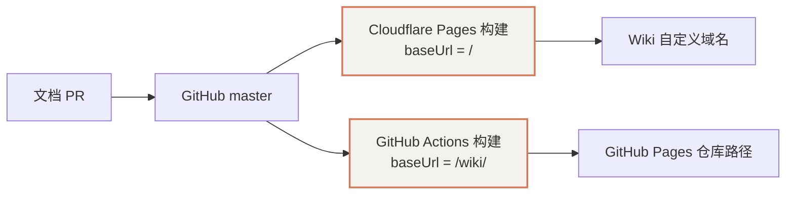

# Cloudflare Pages 与 GitHub Pages 双平台部署

本 Wiki 是 Docusaurus 静态网站，源文件保存在 `Xepanda/wiki`。Cloudflare Pages 从 GitHub 构建并托管产物，访问者无需连接 Linux 虚拟机。Collie 的 Tunnel / Access 属于另一套入口，配置此次 Wiki 托管时不修改它。

## 1. 项目配置

截至 **2026-10-11（Asia/Shanghai）**，所有者已完成 Pages 项目与自定义域配置：

| 项目 | 值 |
|---|---|
| Pages 项目 | `wiki` |
| GitHub 授权范围 | 仅 `Xepanda/wiki` |
| 生产分支 | `master` |
| 构建命令 | `npm run build` |
| 输出目录 | `build` |
| 默认域名 | `wiki-366.pages.dev` |
| 自定义域名 | `wiki.epanda.dpdns.org` |

自定义域在 Pages 项目中关联后，Pages 创建 `wiki` 的 CNAME，指向默认域名；所有者确认域名激活、SSL 启用。上述网站域名用于公开文档的部署配置，不包含 Tunnel、账户或配对凭据。



## 2. 根路径与仓库路径适配

首次 Pages 构建提交 `e53ee5d` 成功，但仍使用 GitHub Pages 的 `/wiki/`。首页引用 `/wiki/assets/...`，而静态资源实际部署在 `/assets/...`，导致页面无法正确渲染。构建成功不代表上线验收通过；资源请求返回 200 时，也要检查是否误返回 HTML 回退页面。

Cloudflare Pages 构建环境会注入 `CF_PAGES=1`。仓库据此选择 URL 和路径，无需额外更改控制台构建命令：

```typescript
const isCloudflarePages = process.env.CF_PAGES === '1';

// docusaurus.config.ts 中的相关配置
url: isCloudflarePages ? 'https://wiki.epanda.dpdns.org' : 'https://Xepanda.github.io',
baseUrl: isCloudflarePages ? '/' : '/wiki/',
```

这个片段展示配置字段，不是独立 TypeScript 文件。Cloudflare 的默认域名和预览部署同样使用根路径；canonical URL 使用生产自定义域。GitHub Actions 未设置 `CF_PAGES`，继续生成 `/wiki/` 路径。

参考 [Pages 构建环境变量](https://developers.cloudflare.com/pages/configuration/build-configuration/)和 [Docusaurus 部署说明](https://developers.cloudflare.com/pages/framework-guides/deploy-a-docusaurus-site/)。

## 3. 本地验证与更新

```bash
rtk proxy npm ci --no-audit --no-fund
rtk proxy npm run build
rtk proxy env CF_PAGES=1 npm run build -- --out-dir build-cloudflare
```

默认构建输出 `build`，检查资源路径含 `/wiki/assets/`；Cloudflare 模式输出 `build-cloudflare`，检查资源路径为 `/assets/`。两个输出目录用于分别核对，不覆盖对方的产物。Cloudflare 生产构建仍输出 `build`。

日常修改通过 PR 审阅并合入 `master`，两平台各自构建部署。若部署后仍空白，检查生产部署对应的提交、首页资源路径、JS/CSS 的状态码和 Content-Type，并检查浏览器控制台。新增文档路由也应能直接打开及刷新。

自定义域应先在 Pages 项目关联，再按提示配置 DNS。不要仅手动加 CNAME，或把 Wiki 路由到本机 Collie 端口。参考 [Pages 自定义域](https://developers.cloudflare.com/pages/configuration/custom-domains/)。

## 4. PR 中的 Cloudflare 机器人

[`cloudflare-workers-and-pages[bot]`](https://github.com/apps/cloudflare-workers-and-pages) 是 Cloudflare GitHub 集成的自动账号。授权 Pages 访问仓库后，它会在 PR 中报告部署状态、对应提交、预览 URL 和日志入口。本次授权范围仅为 `Xepanda/wiki`。

[PR #4 的机器人评论](https://github.com/Xepanda/wiki/pull/4#issuecomment-6099467601)显示分支提交 `1b51cfd` 预览部署成功。它不是人工协作者或终端 Agent，也不会替代内容评审。预览成功只证明该分支的部署结果；生产网站更新要以 `master` 对应的部署和实际访问为准。

## 5. 修复后的生产验收

**2026-10-11（Asia/Shanghai）**，[PR #4](https://github.com/Xepanda/wiki/pull/4) 合入提交 `ac3f7e5`，GitHub build / deploy 与 Cloudflare Pages 检查均成功。随后检查的是自定义域生产页面，而非仅检查 PR 预览：

| 检查 | 实际结果 |
|---|---|
| 首页 canonical | `https://wiki.epanda.dpdns.org/` |
| CSS、runtime JS、main JS | 均使用 `/assets/`，返回 200 及正确的 CSS / JavaScript Content-Type |
| 新部署文档与 Agent 平台文档 | 跟随路径规范化重定向后返回对应文档页面 |
| 独立 headless Chrome 加载首页 | 退出 0，`data-has-hydrated=true`，客户端初始化完成 |
| 修复前对照 | `/wiki/assets/` 资源返回 404 HTML，首页 `data-has-hydrated=false` |

验收原始结论还保存在 [PR #4 评论](https://github.com/Xepanda/wiki/pull/4#issuecomment-6099495365)。此次检查覆盖资源加载、文档读取及首页初始化，没有逐项验收所有交互组件。

## 6. 与 Tailscale 和 Collie 的关系

Wiki 托管在 Pages，Linux 虚拟机关闭不影响已经发布的静态文档。Collie 使用 Cloudflare Tunnel + Access，仍依赖 Linux 上的服务运行；Tailscale 提供 tailnet 内设备连接和 Serve 入口。三者分别管理，Pages 构建成功不代表 Collie 或 Tailscale 功能通过验收。

2026-10-11 本机复查：Tailscale 为 Running，主机在线、无健康告警，Serve HTTPS 映射仍指向 `http://127.0.0.1:8787`。这确认旧映射存在，未重新完成旧入口的浏览器读写验收。保留 Tailscale 可用于远程管理；日常 Collie 浏览器访问继续使用已配置的 Cloudflare 入口。
