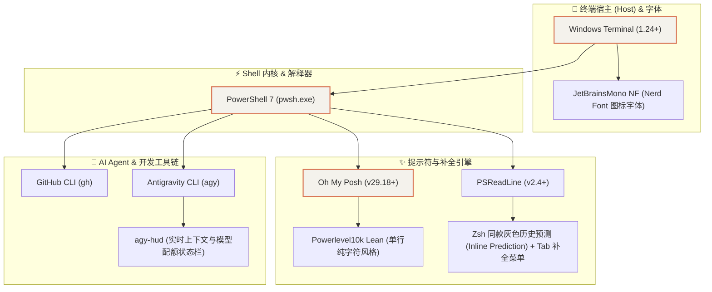

# Windows Terminal + PowerShell 7 + Oh My Posh 现代化终端全流程配置

本指南完整记录了在 Windows 环境下构建媲美 macOS/Linux Zsh (Oh My Zsh + Powerlevel10k) 体验的现代化终端工作流。涵盖字体渲染、提示符美化、Zsh 级智能补全、GitHub CLI 授权及 AI Agent 终端状态栏集成。

---

## 1. 终端全景架构 (Architecture Matrix)



---

## 2. 基础依赖与字体安装

### 2.1 Git 与 GitHub CLI (`gh`)
通过 Windows 官方包管理器 `winget` 安装并验证开发工具链：

```powershell
# 1. 安装 GitHub CLI
winget install --id GitHub.cli --exact --silent --accept-source-agreements --accept-package-agreements

# 2. 登录 GitHub (Web 授权流程)
gh auth login --web -h github.com -p https

# 3. 验证登录状态
gh auth status
```

### 2.2 安装 Nerd Font (解决图标方块/问号乱码)
现代化终端提示符大量使用 Unicode Private Use Area (PUA) 扩展图标字符（如分支图标 `\uE725`、重置 `\u21BB` 等）。必须安装打过补丁的 Nerd Font：

```powershell
# 通过 winget 安装 JetBrainsMono Nerd Font
winget install --id DEVCOM.JetBrainsMonoNerdFont --exact --silent --accept-source-agreements --accept-package-agreements
```

### 2.3 绑定 Windows Terminal 字体
在 Windows Terminal 的配置文件 `settings.json`（路径：`%LOCALAPPDATA%\Packages\Microsoft.WindowsTerminal_8wekyb3d8bbwe\LocalState\settings.json`）中，为默认 Profile 配置字体：

```json
{
  "profiles": {
    "defaults": {
      "font": {
        "face": "JetBrainsMono NF"
      }
    }
  }
}
```

---

## 3. Oh My Posh 与 Powerlevel10k 提示符配置

### 3.1 安装 Oh My Posh
```powershell
winget install JanDeDobbeleer.OhMyPosh -s winget
```

### 3.2 Powerlevel10k Lean（极简单行纯字符风格）配置
在 `$HOME\Documents\PowerShell\powerlevel10k_lean.omp.json` 中定义主题结构：

```json
{
  "$schema": "https://raw.githubusercontent.com/JanDeDobbeleer/oh-my-posh/main/themes/schema.json",
  "version": 4,
  "blocks": [
    {
      "type": "rprompt",
      "segments": [
        {
          "type": "executiontime",
          "style": "plain",
          "foreground": "#FFE700",
          "options": { "threshold": 500 },
          "template": "{{ .FormattedMs }} "
        },
        {
          "type": "time",
          "style": "plain",
          "foreground": "#666666",
          "options": { "time_format": "15:04:05" },
          "template": "{{ .CurrentDate | date .Format }}"
        }
      ]
    },
    {
      "type": "prompt",
      "alignment": "left",
      "segments": [
        {
          "type": "path",
          "style": "plain",
          "foreground": "#77E4F7",
          "options": {
            "style": "full",
            "folder_separator_icon": "/",
            "home_icon": "~"
          },
          "template": "{{ .Path }} "
        },
        {
          "type": "git",
          "style": "plain",
          "foreground": "#FFE700",
          "options": { "branch_icon": "", "fetch_status": true },
          "template": "{{ .HEAD }}{{ if or .Working.Changed .Staging.Changed }}*{{ end }} "
        },
        {
          "type": "text",
          "style": "plain",
          "foreground": "#43D426",
          "foreground_templates": ["{{ if gt .Code 0 }}#FF5555{{ end }}"],
          "template": "\u276f "
        }
      ]
    }
  ]
}
```

---

## 4. PSReadLine 深度集成（Zsh 级智能补全）

编辑 PowerShell 用户 Profile（`$PROFILE`，路径位于 `~/Documents/PowerShell/Microsoft.PowerShell_profile.ps1`）：

```powershell
# 1. 启动 Oh My Posh 提示符
oh-my-posh init pwsh --config "$env:USERPROFILE\Documents\PowerShell\powerlevel10k_lean.omp.json" | Invoke-Expression

# 2. 注入 PSReadLine 增强（交互终端中生效，防止输出重定向报错）
if (-not [Console]::IsOutputRedirected) {
    try {
        Import-Module PSReadLine -ErrorAction SilentlyContinue
        
        # 开启历史预测（灰色提示，按右箭头 → 采纳）
        Set-PSReadLineOption -PredictionSource History -ErrorAction SilentlyContinue
        Set-PSReadLineOption -PredictionViewStyle InlineView -ErrorAction SilentlyContinue
        Set-PSReadLineOption -Colors @{ InlinePrediction = '#767676' } -ErrorAction SilentlyContinue
        
        # Tab 键弹出可视选择菜单
        Set-PSReadLineKeyHandler -Key Tab -Function MenuComplete -ErrorAction SilentlyContinue
        
        # 上下键基于当前输入前缀搜索历史记录
        Set-PSReadLineKeyHandler -Key UpArrow -Function HistorySearchBackward -ErrorAction SilentlyContinue
        Set-PSReadLineKeyHandler -Key DownArrow -Function HistorySearchForward -ErrorAction SilentlyContinue
    } catch {}
}
```

---

## 5. Google Antigravity HUD 状态栏配置 (`agy-hud`)

### 5.1 插件安装
```powershell
# 下载 release 包并提取安装
agy plugin install "C:\path\to\extracted\agy-hud"
```

### 5.2 激活 Statusline
在 Antigravity CLI 会话中运行：
```text
/statusline node C:/Users/<YourUser>/.gemini/config/plugins/agy-hud/dist/agy-hud.js statusline
```

### 5.3 状态栏显示特性解析
* **双窗口配额显示**：如果同时存在 5 小时滚动窗口和周窗口，显示为：
  `Usage ████████░░ 80% (↻ 1h 52m) | 95% (↻ 4d 21h)`
* **100% 满额倒计时隐藏机制**：当周配额处于 100%（0 消耗）时，插件会自动隐藏倒计时标记；一旦产生消耗（低于 100%），重置倒计时 `(↻ Xd Xh)` 会自动显现。

---

## 6. 排坑与常见问题 (Troubleshooting)

| 问题现象 | 根因分析 | 解决方案 |
| :--- | :--- | :--- |
| **图标显示为问号 `?` 或方块 `□`** | 终端未配置打过补丁的 Nerd Font 字体 | 安装 `JetBrainsMono NF` 并修改 Windows Terminal 字体设置。 |
| **子进程执行时 PSReadLine 报错** | 重定向输出时控制台不支持虚拟终端序列 | 在 `$PROFILE` 中加入 `if (-not [Console]::IsOutputRedirected)` 保护逻辑。 |
| **Windows 下 `agy-hud quota refresh` 失败** | 探针底层调用 Unix 命令 `ps` / `lsof` | Windows 原生环境无需手动探测，依赖 Antigravity 官方每次对话推送的 statusline payload 即可。 |
