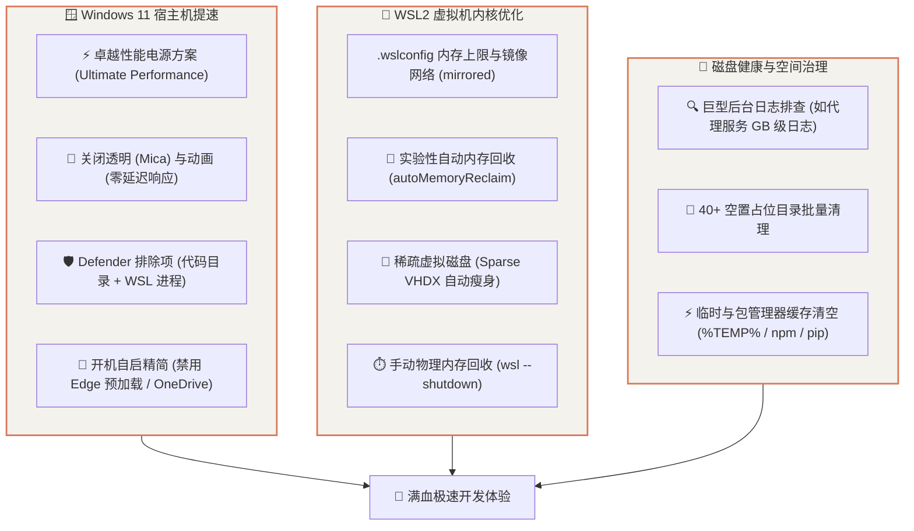

# Windows 11 宿主机与 WSL2 深度性能调优全景指南

本指南系统性总结了在 Windows 11 开发环境下，针对高性能多核 CPU（如 AMD Ryzen 7 5800H）、16GB 物理内存及 WSL2 虚拟化的全套极限性能调优与磁盘管理方案。

---

## 1. 性能优化矩阵 (Architecture Matrix)



---

## 2. Windows 11 宿主机性能解锁

### 2.1 激活「卓越性能 (Ultimate Performance)」电源计划
Windows 11 默认隐藏了专为高端工作站设计的“卓越性能”电源模式。激活后将彻底解除 CPU 积极降频与核心睡眠限制，消除输入和编译微卡顿：

```powershell
# 1. 复制并解锁卓越性能方案
powercfg -duplicatescheme e9a42b02-d5df-448d-aa00-03f14749eb61

# 2. 激活该方案（以输出的 GUID 为准）
powercfg /setactive e9a42b02-d5df-448d-aa00-03f14749eb61

# 3. 验证当前生效方案
powercfg /getactivescheme
```

### 2.2 关闭毛玻璃透明与动画特效（UI 响应零延迟）
Win11 的 Mica/亚克力特效由核显实时渲染，关闭后窗口缩放与拖动极其干脆：

```powershell
# 关闭全局透明度
Set-ItemProperty -Path "HKCU:\Software\Microsoft\Windows\CurrentVersion\Themes\Personalize" -Name "EnableTransparency" -Value 0 -Type DWord -Force

# 关闭窗口最小化/最大化动画
Set-ItemProperty -Path "HKCU:\Control Panel\Desktop\WindowMetrics" -Name "MinAnimate" -Value "0" -Force

# 关闭任务栏与系统动画
Set-ItemProperty -Path "HKCU:\Software\Microsoft\Windows\CurrentVersion\Explorer\Advanced" -Name "TaskbarAnimations" -Value 0 -Type DWord -Force
Set-ItemProperty -Path "HKCU:\Software\Microsoft\Windows\CurrentVersion\Explorer\VisualEffects" -Name "VisualFXSetting" -Value 3 -Type DWord -Force
```

### 2.3 Windows Defender 开发者白名单（编译与 Git 提速 2~5 倍）
Defender 默认会拦截并实时扫描 `npm install`、`cargo build` 产生的所有海量小文件。以管理员身份在 PowerShell 中执行以下排除规则：

```powershell
# 1. 排除 WSL 核心进程
Add-MpPreference -ExclusionProcess "wsl.exe", "wslhost.exe", "vmmem.exe", "vmmemWSL.exe"

# 2. 排除本地项目工作区与 Agent 缓存
Add-MpPreference -ExclusionPath "D:\Projects", "$env:USERPROFILE\.gemini"

# 3. 排除 WSL 虚拟磁盘镜像目录
Get-ChildItem "$env:LOCALAPPDATA\Packages\CanonicalGroupLimited*" -Directory | ForEach-Object {
    Add-MpPreference -ExclusionPath $_.FullName
}
```

### 2.4 开机自启项精简
移除后台无感常驻进程（如 Edge 浏览器预加载、OneDrive 同步）：

```powershell
# 禁用 Edge 浏览器开机后台预加载
Remove-ItemProperty -Path "HKCU:\Software\Microsoft\Windows\CurrentVersion\Run" -Name "MicrosoftEdgeAutoLaunch_*" -Force -ErrorAction SilentlyContinue

# 禁用 OneDrive 开机启动
Remove-ItemProperty -Path "HKCU:\Software\Microsoft\Windows\CurrentVersion\Run" -Name "OneDrive" -Force -ErrorAction SilentlyContinue
```

### 2.5 升级 TCP 网络拥塞控制算法为 CUBIC（网络吞吐与代理提速）
Windows 默认使用传统的 TCP 算法。以管理员身份将其升级为现代 Linux/macOS 标配的 **CUBIC 算法**，显著增强网络高并发、高延迟与代理环境下的吞吐表现：

```powershell
# 切换 Internet 拥塞控制提供程序为 CUBIC
netsh int tcp set supplemental template=internet congestionprovider=cubic
netsh int tcp set supplemental template=internetfallback congestionprovider=cubic

# 开启 ECN (Explicit Congestion Notification 显式拥塞通知)
netsh int tcp set global ecncapability=enabled
```

### 2.6 禁用微软后台遥测诊断服务 (`DiagTrack`)
停用微软用户体验与诊断跟踪服务（`Connected User Experiences and Telemetry`），阻断定期的后台事件扫描与云端数据回传：

```powershell
Stop-Service -Name "DiagTrack" -Force -ErrorAction SilentlyContinue
Set-Service -Name "DiagTrack" -StartupType Disabled -ErrorAction SilentlyContinue
```

---

## 3. WSL2 核心调优与内存控制

### 3.1 生产级 `.wslconfig` 配置
在 Windows 用户根目录 `%USERPROFILE%\.wslconfig` 中配置资源上限、内核参数与现代化网络模式：

```ini
[wsl2]
# 针对 16GB 物理内存宿主机（AMD R7 5800H 8C/16T），建议分配 8GB + 10核
memory=8GB
processors=10
# 建议配置 4GB Swap（配合 swappiness=10，平时不乱占，但能防止大型编译/模型推断时 OOM 崩溃）
swap=4GB

# 镜像网络模式（与 Windows 共享相同 IP 与 localhost，无需繁琐代理脚本）
networkingMode=mirrored
dnsTunneling=true
autoProxy=true
firewall=true
guiApplications=true

# Linux 内核参数微调（降低 Swap 倾斜度，保持目录/inode 缓存）
kernelCommandLine=sysctl.vm.swappiness=10 sysctl.vm.vfs_cache_pressure=50

[experimental]
# 自动内存回收（逐步释放 Linux 中未使用的缓存给宿主机）
autoMemoryReclaim=gradual
# 稀疏虚拟磁盘支持（删除文件时自动回缩宿主机 VHDX 占用空间）
sparseVhd=true
```

### 3.2 物理内存秒级释放
当发现 WSL2 后台进程 `vmmemWSL` 占用较多内存时，在 Windows 终端中运行：

```powershell
wsl --shutdown
```
即可瞬间收回全部占用的物理内存。

### 3.3 WSL2 内部现代化极速工具链配置
除了宿主机与 VM 资源调优外，在 WSL2 内部使用 Rust/Go 编写的现代化工具替换传统 CLI，能带来数量级的日常开发提速：

| 场景 | 传统工具 | 现代化替代工具 | 优势与性能提升 |
| :--- | :--- | :--- | :--- |
| **Python 包管理** | `pip` / `poetry` | **`uv`** (Rust) | 依赖解析与轮子安装提速 **10~100 倍**，瞬时完成 |
| **Node.js 包管理** | `npm` | **`pnpm`** | 硬链接共享机制，大幅节省 WSL2 ext4 磁盘 I/O |
| **代码/文本全文搜索**| `grep` | **`rg` (ripgrep)** | 基于 Rust 并行正则引擎，数秒扫完千万行代码 |
| **文件/目录极速查找**| `find` | **`fd`** | 智能忽略 `.gitignore`，速度远超传统 `find` |
| **状态栏与资源监控** | 无 / 复杂脚本 | **`agy-hud`** | 专为 Antigravity 设计的超紧凑状态栏插件 |

* **极速安装命令（WSL 终端）**：
```bash
# 安装 uv
curl -LsSf https://astral.sh/uv/install.sh | sh

# 安装 pnpm
npm install -g pnpm

# 安装 ripgrep & fd
# Ubuntu 24.04 可直接下载静态 release 或通过包管理器安装
```

---

## 4. WSL2 稀疏磁盘 (Sparse VHDX) 自动瘦身实战

### 4.1 传统 WSL2 磁盘的痛点
默认情况下，WSL2 的虚拟磁盘文件 (`ext4.vhdx`) 具有**“单向膨胀”**特性：在 Linux 内部安装依赖或下载大文件时磁盘会变大；但在 Linux 中执行 `rm -rf` 删除文件后，宿主机 Windows 上的 `ext4.vhdx` 文件**不会自动缩小**，长期使用会导致 C 盘空间严重虚耗。

### 4.2 开启稀疏磁盘 (Sparse VHD)
WSL 2.0+ 提供了原生的稀疏磁盘支持，当 Linux 内部删除文件时，宿主机磁盘空间会自动秒级释放：

```powershell
# 1. 先安全关闭 WSL
wsl --shutdown

# 2. 将指定发行版（如 Ubuntu-24.04）转换为稀疏磁盘
wsl.exe --manage Ubuntu-24.04 --set-sparse true --allow-unsafe
```

> **注意**：转换只需执行一次，后续无论在 Linux 中拉取 Docker 镜像还是编译大项目，删除后宿主机 SSD 都会自动收缩！

---

## 5. C 盘空间排毒与巨型日志排查

### 5.1 代理与系统服务巨型日志排查
某些后台守护进程（如 `com.vortex.helper`、Clash 辅助服务）如果配置了 `log-level: info` 且按天切分日志，会将每一笔 TCP 连接请求全量落盘，几天内可产生 **10GB+ 的巨型文本日志**：

* **清理方法**：删除 `%USERPROFILE%\.config\<服务名>\service_*.log` 历史日志。
* **根治方法**：在其 `config.yaml` 中将 `log-level` 调整为 `warning` 或 `error`，彻底阻断日志无限膨胀。

### 5.2 批量清理 0 文件空置占位目录
许多第三方工具卸载后会遗留大量空目录（如 `.claude`, `.continue`, `.codeium` 等），可通过以下脚本批量清理：

```powershell
$targetFolders = @(".adal", ".claude", ".continue", ".tabnine", ".trae", ".codeium", ".autohand")
foreach ($f in $targetFolders) {
    $p = "$env:USERPROFILE\$f"
    if (Test-Path -LiteralPath $p) {
        $files = Get-ChildItem -LiteralPath $p -Recurse -File -Force -ErrorAction SilentlyContinue
        if (($files | Measure-Object).Count -eq 0) {
            Remove-Item -LiteralPath $p -Recurse -Force -ErrorAction SilentlyContinue
        }
    }
}
```

### 5.3 固态硬盘主动 TRIM 优化 (Re-Trim)
在大量删除文件或安装大型项目后，主动通知 NVMe/SSD 固态硬盘主控回收废弃闪存块，恢复全盘峰值写入性能：

```powershell
Optimize-Volume -DriveLetter C -ReTrim
Optimize-Volume -DriveLetter D -ReTrim
```

### 5.4 开启 Windows 11 原生「存储感知 (Storage Sense)」自动化维护
让 Windows 每周自动静默清理无用临时文件并清空超期回收站：

```powershell
$storageSenseKey = "HKCU:\Software\Microsoft\Windows\CurrentVersion\StorageSense\Parameters\StoragePolicy"
if (-not (Test-Path $storageSenseKey)) { New-Item -Path $storageSenseKey -Force | Out-Null }
Set-ItemProperty -Path $storageSenseKey -Name "01" -Value 1 -Type DWord -Force  # 启用存储感知
Set-ItemProperty -Path $storageSenseKey -Name "04" -Value 7 -Type DWord -Force  # 每周自动运行
Set-ItemProperty -Path $storageSenseKey -Name "32" -Value 1 -Type DWord -Force  # 自动清理临时文件
Set-ItemProperty -Path $storageSenseKey -Name "08" -Value 30 -Type DWord -Force # 清理超 30 天回收站
```

---

## 6. 常见问题与维护清单 (FAQ)

| 场景 / 需求 | 推荐操作 |
| :--- | :--- |
| **开机想要极速进入系统** | 保持自启动项精简，关闭 Edge 预加载与云盘开机自启。 |
| **打游戏 / 跑大型编译** | 确认当前电源模式为 `卓越性能 (Ultimate Performance)`。 |
| **WSL 内存占用过大** | 运行 `wsl --shutdown` 或在 `.wslconfig` 中开启 `autoMemoryReclaim=gradual`。 |
| **SSD 磁盘空间不够用** | 执行 `wsl --manage <Distro> --set-sparse true --allow-unsafe`，并清理 `%TEMP%` 及服务历史日志。 |
