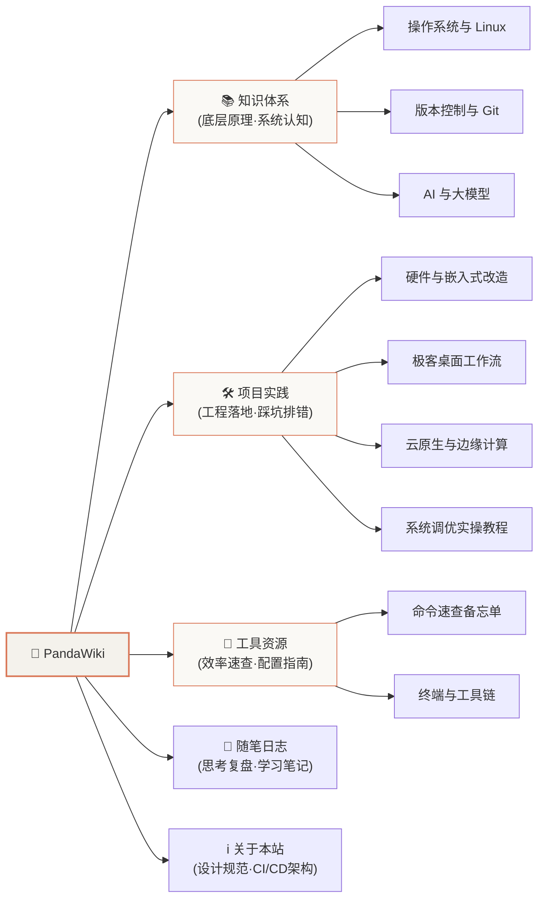

# 🏠 PandaWiki · 全站导览中枢

> “思考、实践与技术沉淀 · 个人极客技术知识库”

欢迎来到 **PandaWiki**。本知识库采用「**顶层分类 + 纵向分层 + 横向领域拆分**」的四层架构，致力于提供低检索成本、高可复用性的技术沉淀。

---

## 🗺️ 全站内容架构地图

---

## 📚 一级分区快速导航

### 0. 💻 [新机装机与环境初始化 · 换机必备](/category/workstation-bootstrap)
换新电脑时的极速装机与全套开发环境一键复现指南：
* **[Windows 宿主机新机装机与极致配置手册](/workstation/windows-host-setup)**：
  * winget 官方包管理器核心软件矩阵
  * PowerShell 7 + Oh My Posh (p10k 极简单行) 终端配置
  * 卓越性能、零延迟动画、Defender 排除项与 CUBIC 网络栈调优
* **[WSL2 Linux 必备环境与开发全家桶手册](/workstation/wsl2-linux-setup)**：
  * `.wslconfig` 资源调优与稀疏虚拟磁盘 (Sparse VHD) 自动瘦身
  * 全套开发运行时（Node fnm, Python uv, Rust, Go, 原生 Docker）
  * `scripts/install-all.sh` 一键全自动部署流水线

---

### 1. 📚 [知识体系 · 核心主库](/category/knowledge)
可复用、结构化的核心技术知识点与基础原理：
* **[操作系统与 Linux](/category/knowledge/os-and-linux)**：
  * [Linux 基础配置与终端环境](/knowledge/linux-fundamentals)
  * [WSL 日常运维与使用技巧](/knowledge/wsl-tips)
* **[版本控制与 Git](/category/knowledge/version-control)**：
  * [Git 核心工作流与多账号协作指南](/knowledge/git-workflow)
  * [Git Worktree 多分支并行开发实战](/knowledge/git-worktree)
* **[AI 与大模型](/category/knowledge/ai-and-agents)**：
  * [AI 与 Agent 生态概览与知识地图](/knowledge/ai-and-agents)

---

### 2. 🛠️ [项目实践 · 落地工程](/category/projects)
具体场景的落地应用、保姆级步骤与深度排错踩坑录：
* **[硬件与嵌入式改造](/category/projects/hardware-embedded)**：
  * **[Kindle 墨水屏改造专栏](/category/projects/kindle)**（12 篇全景指南）：
    * [01. 越狱、OTA阻断与 KUAL 部署](/projects/kindle/jailbreak-guide)
    * [02. Wi-Fi 纯无线 SSH 开发环境搭建](/projects/kindle/wifi-ssh-setup)
    * [03. Kindle 8 硬件架构与底层控制手册](/projects/kindle/system-architecture)
    * [04. 墨水屏 6 大开发方向与路线图](/projects/kindle/dev-roadmap)
    * [05. 极客开发资源与开源社区汇总](/projects/kindle/resources-and-community)
    * [06. 路线 1 · 桌面智能万年历与天气看板](/projects/kindle/weather-dashboard-dev)
    * [07. 路线 2 · PC 性能与 Git 工作流实时监控副屏](/projects/kindle/pc-hud-monitor-dev)
    * [08. 路线 3 · AI 每日极客早报与墨水报纸](/projects/kindle/ai-newspaper-dev)
    * [09. 路线 4 · 局域网免数据线无线传书服务](/projects/kindle/wifi-transfer-service-dev)
    * [10. 路线 5 · 本地脱机 KUAL 极客工具箱插件](/projects/kindle/kual-standalone-toolbox)
    * [11. 专题 · 局域网免线推书全平台实战](/projects/kindle/wireless-ftp-user-guide)
    * [12. 专题 · 极客开发常见避坑指南 (FAQ)](/projects/kindle/troubleshooting-and-faq)
  * **[4.2寸多色墨水屏高品质渲染](/category/projects/epaper)**（4 篇）：
    * [01. 硬件架构、引脚映射与双控制器规范](/projects/epaper/hardware-architecture-and-pinout)
    * [02. 图像算法：边缘保护、16阶灰度与Kindle级光影](/projects/epaper/image-dithering-and-color-algorithms)
    * [03. TuyaOpen 固件架构与串口 CLI 交互指南](/projects/epaper/firmware-driver-and-cli-guide)
    * [04. Python 图像处理管线与嵌入式点阵工具](/projects/epaper/python-image-pipeline-and-tools)
  * **[泰山派 All-in-One 智能中枢](/category/projects/taishanpi)**（6 篇）：
    * [01. RK3566 硬件评估与架构设计](/projects/taishanpi/hardware-eval-and-architecture)
    * [02. 系统底层优化与 ZRAM 内存压缩](/projects/taishanpi/base-environment-and-tuning)
    * [03. Docker 容器底座与镜像加速](/projects/taishanpi/docker-and-proxy-acceleration)
    * [04. OpenWrt 旁路由搭建与互通实战](/projects/taishanpi/openwrt-bypass-gateway-setup)
    * [05. 全屋透明代理与分流配置](/projects/taishanpi/transparent-proxy-and-clients)
    * [06. MQTT + Home Assistant + ESP32 联动](/projects/taishanpi/mqtt-homeassistant-esp32)
* **[极客工作流与桌面改造](/category/projects/desktop-workflow)**：
  * **[双笔记本单屏工作站](/category/projects/dual-laptop-kvm)**（4 篇）：
    * [01. 整体架构与最终方案设计](/projects/dual-laptop-kvm/architecture-and-final-solution)
    * [02. Deskflow 跨屏键鼠共享部署](/projects/dual-laptop-kvm/deskflow-cross-screen-setup)
    * [03. 信号偷取法一键切屏实战](/projects/dual-laptop-kvm/signal-steal-hotkey-switching)
    * [04. 踩坑实录与 DDC/CI 故障排除](/projects/dual-laptop-kvm/pitfalls-and-troubleshooting)
* **[云原生与边缘计算](/category/projects/cloudflare)**：
  * [Cloudflare 开发者生态与极客实战全指南](/projects/cloudflare/cloudflare-ecosystem)
* **[实操与调优教程](/category/projects/tutorials)**：
  * [全栈开发与 AI Agent 运行时环境配置手册](/projects/tutorials/linux-wsl-full-environment-setup)
  * [Windows 11 宿主机与 WSL2 深度性能调优指南](/projects/tutorials/windows11-system-and-wsl2-tuning)
* **[AI 视频与自动化工坊](/category/projects/ai-video-automation)**：
  * [Remotion + 免费神经 TTS 自动化视频流水线](/projects/ai-video-automation/remotion-edge-tts-pipeline)

---

### 3. 🧰 [工具资源 · 效率速查](/category/resources)
* **[命令与速查表](/category/resources/cheatsheets)**：
  * [Docker 常用命令速查备忘单](/resources/docker-cheatsheet)
* **[终端与工具链指南](/category/resources/toolchain)**：
  * [Windows Terminal + PowerShell 7 + Oh My Posh 现代化配置](/resources/windows-terminal-powershell-p10k)

---

### 4. 📝 [随笔日志 · 思考复盘](/category/journal)
* [技术思考、架构选型复盘与学习笔记](/journal/tech-notes)

---

### 5. 📌 [归档与草稿 · 缓冲隔离](/category/archive)
* [待写草稿箱 (Drafts)](/archive/drafts)
* [历史归档 (Legacy)](/archive/legacy)

---

### 6. ℹ️ [关于本站 · 规范与设计](/category/about)
* [关于 PandaWiki：初衷与架构](/about/welcome)
* [PandaWiki 写作与图表规范 (Mermaid vs React)](/about/wiki-authoring-standards)
* [Docusaurus + GitHub Pages CI/CD 自动化构建](/about/docusaurus-github-pages-cicd)

---

## 🎨 视觉设计哲学
本知识库视觉体系深度参考 **Anthropic Claude Editorial 极简设计系统**：
* **色彩基调**：象牙温润白（`#FAF9F5`）画布底色 + 陶土砖红（`#D97757`）核心点缀；
* **排版系统**：古典衬线大标题（`Newsreader`）+ 现代无衬线正文（`Inter`）+ 极客等宽代码（`JetBrains Mono`）；
* **图表优先**：原生集成 Mermaid 图表引擎，深浅色自适应。
