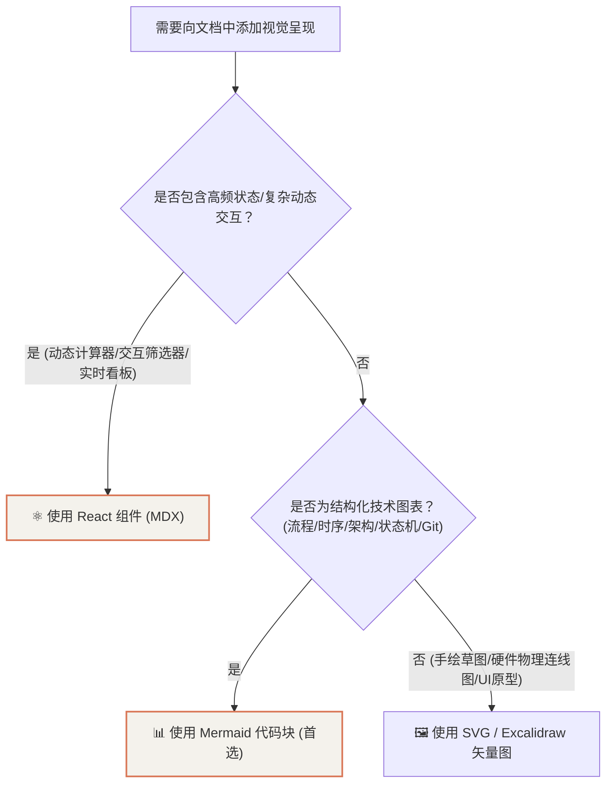

# PandaWiki 写作与图表规范

本篇定义了 **PandaWiki** 的视觉设计规范与可视化决策准则，供文档作者与 AI Agent 在编写新文档时查阅与遵循。

---

## 1. 可视化图表选型矩阵（Mermaid vs React vs SVG）



### 1.1 什么时候使用 Mermaid？（首选方案）
* **场景**：系统架构流转、通信调用时序、生命周期状态迁移、Git 分支历史、模块类图；
* **优势**：纯文本代码维护，Git diff 清晰，自动根据 Claude 主题深色/浅色自适应反色，零打包体积；
* **语法示例**：直接使用 ` ```mermaid ` 代码块。

### 1.2 什么时候使用 React 组件（MDX）？
* **场景**：动态交互式小工具、动态数据图表（带鼠标悬停 Tooltip / 缩放切换）、交互式硬件针脚定义卡片；
* **规范**：组件存放在 `src/components/`，在 `.mdx` 中通过 `import Component from '@site/src/components/...'` 引入。

### 1.3 什么时候使用 SVG / Excalidraw？
* **场景**：手绘风格草图、复杂电路板实物接线拓扑图；
* **规范**：导出为 `.svg` 矢量图存入 `static/img/`，在 Markdown 中使用 `` 引用。

---

## 2. 视觉设计系统（Anthropic Claude Editorial）

* **色彩基调**：
  * **浅色模式**：象牙温润白画布（`#FAF9F5`）+ 陶土砖红点缀（`#D97757`）+ 发丝发灰暖边（`#E6E2D8`）；
  * **深色模式**：暖木炭黑画布（`#181716`）+ 暖珊瑚点缀（`#E28768`）；
* **排版原则**：
  * 大标题采用古典衬线体 **`Newsreader`** 与 `Georgia`；
  * 正文采用高可读性现代无衬线 **`Inter`**，行高 `1.78`；
  * 代码采用 **`JetBrains Mono`**。

---

## 3. 文档 Frontmatter 元数据标准

每个 `.mdx` 文件顶部必须包含标准元数据：

```yaml
---
title: 页面标题
sidebar_position: 1
description: 简要摘要（用于 SEO 与索引展示）
---
```
