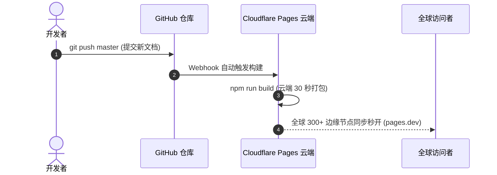
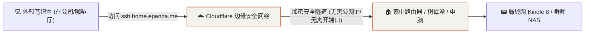

# Cloudflare 开发者生态与极客实战全指南

在现代互联网基础设施中，**Cloudflare** 被全球开发者戏称为“赛博菩萨”。它不仅提供免费的 CDN 加速和防攻击服务，更构建了一整套极客级的全球无服务器（Serverless）云生态系统。

---

## 1. 架构本质：Serverless 边缘网络 vs 传统云主机

Cloudflare 并不是一台装了 Linux 系统的传统云服务器（VPS），而是由全球 300+ 边缘数据中心构成的分布式无服务器算力网：

```mermaid
flowchart LR
    subgraph 传统云服务器 (VPS)
        A["👤 访问者"] -->|"长距离跨国公网链路"| B["🏢 单一地域机房 (如北京/硅谷)\n需要手动维护 Nginx / SSL / 系统补丁"]
    end

    subgraph Cloudflare 边缘生态 (Serverless)
        C["👤 访问者"] -->|"就近 Anycast 路由 (几毫秒)"| D["⚡ 距离最近的边缘节点 (300+ 城市)\n自动提供 CDN / DDoS 防护 / SSL"]
        D --> E["🚀 Pages (静态网站)"]
        D --> F["⚙️ Workers (边缘代码)"]
        D --> G["🚇 Tunnels (内网穿透)"]
    end

    style D fill:#f4f2ec,stroke:#d97757,stroke-width:2px
    style E fill:#f4f2ec,stroke:#d97757,stroke-width:1.5px
    style F fill:#f4f2ec,stroke:#d97757,stroke-width:1.5px
    style G fill:#f4f2ec,stroke:#d97757,stroke-width:1.5px
```

### 全维度对比矩阵

| 对比维度 | 传统云主机 (阿里云 / 腾讯云 / AWS EC2) | Cloudflare 开发者生态 (Pages / Workers) |
| :--- | :--- | :--- |
| **底层形态** | 独立的虚拟机（有 SSH 终端黑窗口） | **全球分布式 Serverless 边缘容器** |
| **费用成本** | 每年需支付几百至数千元服务器年费 | **核心功能对个人永久免费 (0 元)** |
| **流量与带宽** | 通常限制 1~5 Mbps 小水管，超量扣费 | **完全无限流量 (Unlimited Bandwidth)** |
| **冷启动延迟** | 数秒至数分钟（虚拟机启动） | **`< 5 ms`**（基于 Chrome V8 隔离区技术） |
| **运维负担** | 需配置环境、升级系统补丁、防黑客爆破 | **零运维**，连上 GitHub 自动构建发布 |
| **并发防护** | 突发大流量或 DDoS 攻击容易死机打满 | **原生集成全球骨干网 TB 级流量清洗** |

---

## 2. 核心神器 1：Cloudflare Pages（极速建站与托管）

专门用于托管静态知识库（Docusaurus、VuePress、Hexo）和前端单页应用（React、Vue、Next.js）：



### 核心特性：
* **无限流量与无限请求**：完全免费，不计流量费用；
* **免费赠送域名**：分配专属 `https://<项目名>.pages.dev` 域名；
* **一键绑定独立域名**：支持绑定任意购买的域名，**免费自动申请并终身续期 HTTPS 证书**；
* **每月 500 次云端免费构建**：平均每天可推送 16 次更新。

---

## 3. 核心神器 2：Cloudflare Workers（免费边缘计算 / API）

不需要开通后端服务器，直接在云端编写运行轻量后端 JavaScript / TypeScript / Python 代码：

* **免费额度**：**每日免费调用 100,000 次请求**！
* **典型开发场景**：
  * **API 代理网关**：转发与加速第三方 API（如大模型 OpenAI / Claude API 代理中转）；
  * **轻量自动化爬虫**：定时获取天气、汇率、股票数据并推送至钉钉 / 企业微信 / 邮件；
  * **Webhook 处理中枢**：接收外部事件并处理业务逻辑。

---

## 4. 核心神器 3：Cloudflare Tunnels（免费内网穿透与远程 SSH）

解决家庭网络没有公网 IP、无法从外网访问内网设备的痛点：



* **原理解析**：在局域网内运行一个轻量级守护进程 `cloudflared`，它主动向 Cloudflare 建立一条双向长连接加密隧道；
* **杀手级优势**：
  * **不需要公网 IP**（即使是大内网移动宽带也能穿透）；
  * **不需要路由器做端口映射 (Port Forwarding)**，大幅降低家庭局域网被黑客扫描攻击的风险；
  * **支持多种协议**：不仅支持 Web 网站穿透，还支持 **SSH 终端直连** 与 **Windows 远程桌面 (RDP)**。

---

## 5. 核心神器 4：Cloudflare R2（0 流量出网费的对象存储）

对比阿里云 OSS、腾讯云 COS、AWS S3，Cloudflare R2 是全球首个**彻底免除出网流量费（Zero Egress Fees）**的对象存储服务：

* **免费额度**：**每月免费 10 GB 存储空间**；
* **核心优势**：通常云厂商在图片被大量访问时会收取昂贵的出网流量费，而 R2 **流量完全免费**，是搭建个人图床、电子书附件下载站的最佳选择；
* **标准兼容**：完全兼容 AWS S3 API 接口，直接使用现成图床工具（PicGo 等）即可一键上传。

---

## 6. 核心神器 5：免费专属域名企业邮箱 (Email Routing)

如果你拥有自己的独立域名（例如 `epanda.me`）：
1. 可以在 Cloudflare 后台开启 **Email Routing**；
2. 免费创建类似 `hi@epanda.me`、`admin@epanda.me` 的个性域名邮箱；
3. 当有人给该邮箱发信时，Cloudflare 会**自动且免费将邮件转发到你的个人 QQ 邮箱或 Gmail**，无需购买昂贵的企业邮箱服务！
