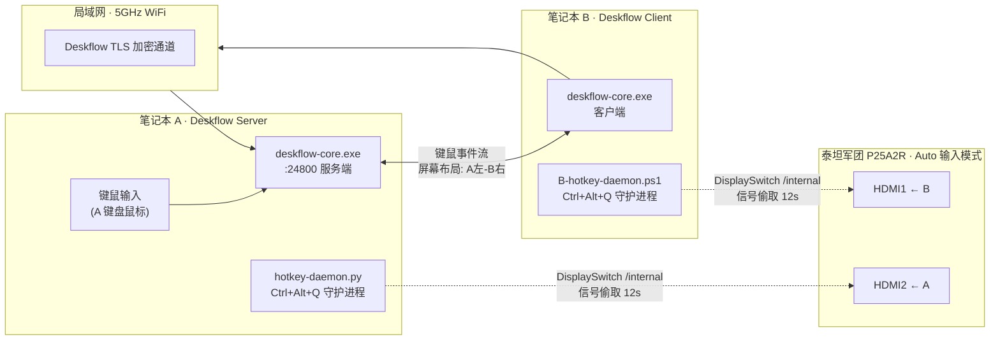
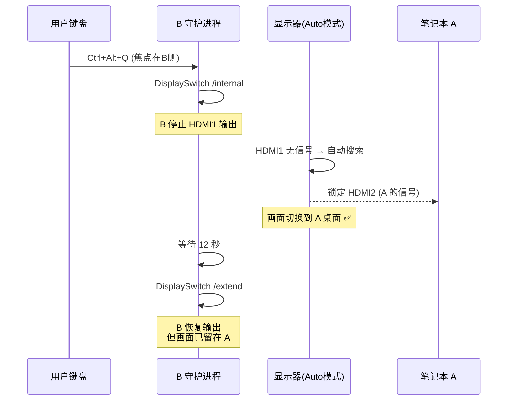
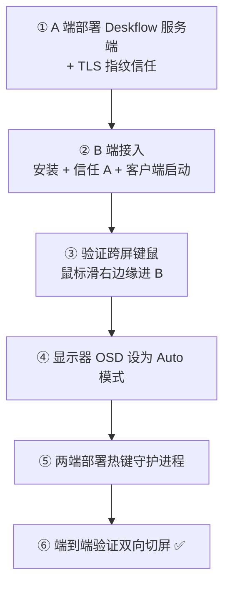

# 方案总览与最终架构

两台笔记本（A 日常主力 + B 辅助机）共用**一台**外接显示器，目标是零成本实现：

* **日常形态**：A 笔记本左屏 + 外接右屏双屏扩展，鼠标滑出右边缘即可**无缝控制 B 笔记本**（盲操作，键鼠共享）；
* **一键切屏**：任意一端按 `Ctrl+Alt+Q`，显示器整屏切换到**对面**那台笔记本的桌面，键鼠同步接管。

最终方案零硬件投入：不买 KVM 切换器、不买第二台显示器，全部由开源软件 + Windows 原生能力实现。

---

## 1. 硬件与网络清单

| 角色 | 设备 | 关键参数 |
|------|------|---------|
| 笔记本 A（服务端） | LAPTOP-8KJBDOP9 | IP `192.168.31.152`，Realtek RTL8852AE WiFi 6 |
| 笔记本 B（客户端） | LAPTOP-MSHUJLQO | IP `192.168.31.156`，WiFi 接入 |
| 外接显示器 | 泰坦军团 P25A2R | 双 HDMI 输入，**OSD 输入源必须设为 Auto 模式** |
| 接线 | A → HDMI2，B → HDMI1 | 两根 HDMI 线常插 |
| 网络 | 小米路由器 192.168.31.1 | 5GHz SSID `Xiaomi_724_5G`（强烈建议） |

> **显示器 Auto 模式是整套切屏方案的唯一硬件前提**：在 OSD 菜单中将输入源设置为"自动搜索/Auto"，且此后不要用机身按键手动固定 HDMI1/HDMI2。

---

## 2. 系统总体架构

两条相互独立的通道：

1. **键鼠通道（Deskflow）**：A 作为服务端监听 `24800` 端口，B 作为客户端接入。鼠标滑过 A 屏右边缘即进入 B 桌面，键盘焦点跟随鼠标；A、B 之间剪贴板同步。
2. **切屏通道（信号偷取）**：显示器处于 Auto 输入模式时，会自动搜索**有信号**的输入口。按热键的一方暂时停止自己的 HDMI 输出，显示器找不到信号就跳到对面那台，随后按热键一方恢复输出，画面留在对面。

---

## 3. 一键切屏时序（信号偷取法）

以"画面当前显示 A，用户想切到 B"为例——**注意是 B 侧按键**（谁有键盘焦点谁触发，永远切向对面）：

反方向（A → B）完全对称：A 侧守护进程执行同样的 `/internal → 12s → /extend` 序列，显示器自动跳回 HDMI1。

> **记忆口诀：谁按热键，谁让路。** 按键一方"让出"信号 12 秒，显示器自然漂到对面。

### 3.1 为什么是这套机制（方案演进）

| 阶段 | 方案 | 结局 |
|------|------|------|
| v1 | ControlMyMonitor 写 DDC/CI VCP60 + 开始菜单快捷方式热键 | ❌ 快捷方式热键由 Explorer 注册，焦点冲突即失效；工具在部分环境静默失效 |
| v2 | 原生 dxva2 API 写 DDC + RegisterHotKey 常驻守护进程 | ⚠️ 热键链路稳定了，但显示器固件假死后 DDC 指令"只应答不执行" |
| v3 | DDC + 显示器断电重启修复假死 | ⚠️ 治标不治本：固件只实现了"DDC 切到 HDMI1"，反向根本不支持 |
| **v4（最终）** | **RegisterHotKey 守护进程 + DisplaySwitch 信号偷取 + 显示器 Auto 模式** | ✅ 两端对称、零 DDC 依赖、已验证闭环 |

详细踩坑过程见 [踩坑实录与故障排除](./04-pitfalls-and-troubleshooting.mdx)。

---

## 4. 方案边界与已知限制

* **切换耗时约 12~15 秒**：信号偷取法需要按住"让路"窗口期，不适合高频来回切换；若需秒切，硬件 HDMI 切换器（几十元）是唯一正解；
* **20 秒节流**：守护进程内置节流窗口，防止连按导致信号反复断开把显示器搞晕；
* **依赖显示器 Auto 模式**：若手动固定输入源，自动跳转失效；
* **WiFi 质量影响鼠标手感**：Deskflow 数据走空口，两台都建议连 5GHz 并关闭网卡空闲省电（详见[性能优化](./04-pitfalls-and-troubleshooting.mdx#4-wifi-延迟抖动与鼠标卡顿调优)）；
* **扩展模式前提**：两台笔记本都必须保持"扩展"显示模式（`Win+P` → 扩展），信号偷取依赖 `/internal → /extend` 的往返。

---

## 5. 部署路线图

* 第 ①②③ 步：[Deskflow 跨屏键鼠共享](./02-deskflow-cross-screen-setup.mdx)
* 第 ④⑤⑥ 步：[信号偷取法一键切屏](./03-signal-steal-hotkey-switching.mdx)
