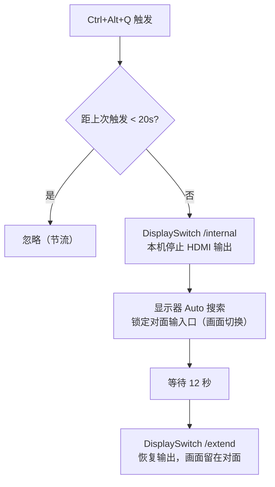

# 信号偷取法一键切屏

热键切屏的核心是两个组件：**全局热键捕获**（`RegisterHotKey` API，系统级注册，不依赖 Explorer）和 **DisplaySwitch 信号偷取序列**（`/internal` 停输出 12 秒 → `/extend` 恢复）。

> 为什么不用 DDC/CI 切输入源？这台泰坦军团 P25A2R 的固件在 Auto 模式下忽略所有 DDC 输入切换指令，且历史上还出现过"休眠后假死、指令只 ACK 不执行"。完整排障史见[下一篇](./04-pitfalls-and-troubleshooting.mdx)。

---

## 1. 前提条件（缺一不可）

| 条件 | 设置方法 |
|------|---------|
| 显示器输入源 = **Auto 模式** | OSD 菜单 → 输入源 → 自动搜索。此后不要用机身按键手动固定 HDMI1/HDMI2 |
| 两台笔记本均为**扩展模式** | `Win+P` → 扩展（信号偷取依赖 `/internal → /extend` 往返） |
| Deskflow 已连通 | 热键规则依赖"谁有键盘焦点谁触发"，焦点跟随 Deskflow 的鼠标位置 |

---

## 2. 热键规则：谁按热键，谁让路

Deskflow 下键盘事件发给**鼠标所在的一侧**。因此：

* 画面在 A、鼠标滑回 A 侧 → 按 `Ctrl+Alt+Q` → **A 让路 → 切到 B**
* 画面在 B、鼠标在 B 侧 → 按 `Ctrl+Alt+Q` → **B 让路 → 切到 A**

用户正在操作哪台，按键就属于哪台，永远切向对面——不需要任何状态跟踪文件，天然不会切错方向。

### 2.1 执行序列



* **12 秒窗口**：给显示器留足搜索+锁定时间；期间本机桌面收成单屏，鼠标可能卡两秒，属正常；
* **20 秒节流**：防连按。节流期内按键只记日志不执行；
* 恢复模式变量：两端都是 `/extend`（若某台机器习惯用别的模式，改守护进程里的 `RESTORE_MODE` / `$restoreMode` 即可）。

---

## 3. A 端守护进程（Python 版）

A 端恰好有可用的 Python 运行时，用 `ctypes` 直接调 `user32.RegisterHotKey`，无需任何第三方依赖。核心逻辑：

```python
# hotkey-daemon.py（节选，完整脚本见 SimpleKVM 工具目录）
MOD_ALT, MOD_CONTROL, VK_Q, WM_HOTKEY = 0x0001, 0x0002, 0x51, 0x0312
HOLD_SECONDS, THROTTLE_SECONDS = 12, 20
RESTORE_MODE = "/extend"

def steal_signal():
    subprocess.Popen(["cmd", "/c", "start", "", "/b", "DisplaySwitch.exe", "/internal"],
                     creationflags=subprocess.CREATE_NO_WINDOW)
    time.sleep(HOLD_SECONDS)
    subprocess.Popen(["cmd", "/c", "start", "", "/b", "DisplaySwitch.exe", RESTORE_MODE],
                     creationflags=subprocess.CREATE_NO_WINDOW)

def main():
    if not user32.RegisterHotKey(None, 1, MOD_CONTROL | MOD_ALT, VK_Q):
        return 1  # 热键被占用（通常意味着已有实例在跑）
    msg = wintypes.MSG()
    while user32.GetMessageW(ctypes.byref(msg), None, 0, 0) > 0:
        if msg.message == WM_HOTKEY:
            # 节流检查后，后台线程执行 steal_signal()
            ...
```

要点：

* 用 **`pythonw.exe`** 启动（无控制台窗口）；
* `RegisterHotKey` 失败 = 热键已被占用 = 已有实例在跑，天然防重复启动；
* 切换序列放**后台线程**，不阻塞消息泵；
* 日志写在脚本同目录 `hotkey-daemon.log`，每次启动/触发/完成各一行，是排障的第一现场。

### 3.1 部署步骤

```bash
# 1. 手动启动（验证用）
pythonw.exe C:\Tools\SimpleKVM\hotkey-daemon.py

# 2. 确认日志出现
#    START OK: Ctrl+Alt+Q -> signal-steal to Laptop B | mode=/extend
```

开机自启：在 `shell:startup` 放一个 `A-HotkeyDaemon.bat`：

```bat
@echo off
start "" /b "C:\Python\pythonw.exe" "C:\Tools\SimpleKVM\hotkey-daemon.py"
```

> 更新脚本后必须**杀旧进程再启动**（旧实例还握着热键注册，新实例会 `START FAILED`）。用任务管理器结束 `pythonw.exe` 或 PowerShell `Stop-Process`，再重新拉起。

---

## 4. B 端守护进程（PowerShell 版）

B 端不装 Python，用 PowerShell `Add-Type` 内联 C# 实现 `RegisterHotKey`，机制与 A 端完全对称：

```powershell
# B-hotkey-daemon.ps1（结构示意）
Add-Type -TypeDefinition @"
using System;
using System.Runtime.InteropServices;
public static class Hotkey {
    [DllImport("user32.dll")] public static extern bool RegisterHotKey(IntPtr h, int id, uint mod, uint vk);
    [DllImport("user32.dll")] public static extern int GetMessage(out MSG m, IntPtr h, uint a, uint b);
    public struct MSG { public IntPtr hwnd; public uint message; public IntPtr wParam; public IntPtr lParam; }
}
"@

# 注册 Ctrl+Alt+Q → 消息循环收到 WM_HOTKEY 后：
#   1. 节流检查（20s）
#   2. 启动隐藏子进程执行序列：
#        DisplaySwitch.exe /internal
#        Start-Sleep 12
#        DisplaySwitch.exe /extend
```

### 4.1 一键安装

双击 `install-B-hotkey.bat` 即完成全部动作：

1. 按 CommandLine 匹配**杀掉旧的守护进程**（可安全重复执行）；
2. 删除开始菜单里的旧式 `.lnk` 热键（如果装过旧版，避免抢注 `Ctrl+Alt+Q`）；
3. 在 `shell:startup` 创建自启项；
4. 以隐藏窗口拉起新版守护进程。

验证：同目录 `B-hotkey-daemon.log` 出现

```
START OK: Ctrl+Alt+Q -> signal-steal to Laptop A | mode=/extend
```

---

## 5. 为什么用 RegisterHotKey 而不是快捷方式热键

最初的实现是"开始菜单快捷方式 + 快捷键属性"（Windows 原生全局热键），实测**不可靠**：

* 热键由 **Explorer 进程**注册，焦点被其他程序占用、Explorer 重启、甚至创建快捷方式后未重启 Explorer，都会导致热键静默失效；
* 没有任何报错——按了就是没反应，排障无从下手。

`RegisterHotKey` 是 Win32 系统级 API：注册即生效、全局捕获、进程死了热键自动释放、被占用时立刻返回失败（可检测）。凡是"全局热键"需求，**优先常驻进程 + RegisterHotKey，绕开快捷方式热键**。

---

## 6. 日常使用与自检

| 场景 | 操作 |
|------|------|
| 切到对面 | 鼠标滑到当前画面那台一侧，按 `Ctrl+Alt+Q`，等约 15 秒 |
| 按了没反应 | ① 看鼠标焦点是否在当前画面那台；② 等满 20 秒节流；③ 查两端 daemon 日志有没有 `hotkey fired` |
| 日志有 `fired` 但画面没切 | 检查显示器是否还在 Auto 模式（最常见）；其次显示器 DDC 固件假死 → 断电重启显示器 |
| 开机后热键失效 | 查自启项是否生效：任务管理器看 `pythonw.exe`（A）/ `powershell.exe`（B）进程是否存在 |
