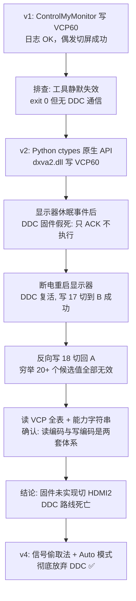

# 踩坑实录与故障排除

这篇记录把方案从 v1 推到 v4 的全部排障过程。核心教训一句话：**DDC/CI 在消费级显示器上是"薛定谔的可用"——协议活着，固件不一定执行。**

---

## 1. DDC/CI 切输入源的完整排障史

### 1.1 事件时间线



### 1.2 四个关键发现

**① 显示器只执行"活动输入线缆"上的 DDC 指令。**

从 A（非活动输入）发指令，写入被 ACK 但完全忽略——连**亮度**指令（VCP 0x10）都不执行。用亮度做对照实验可以零成本验证这一点：变暗 = 通道活，没反应 = 指令发在了非活动线上。

> 这也解释了为什么"谁有键盘焦点谁按热键"的架构是必须的：**有焦点 = 画面在这台 = 这台是活动输入**。

**② 休眠会触发 DDC/CI 固件假死。**

这台泰坦军团 P25A2R 在显示器休眠/信号切换事件后，DDC 通道在 I2C 层面仍然应答（SetVCPFeature 返回成功），但固件**不执行任何指令**——亮度、电源（VCP D6）、输入源全部失灵。恢复方法唯一：**显示器电源键关机 10 秒再开机**。

**③ 读编码与写编码是两套体系。**

通过 ControlMyMonitor 读出的 VCP 全表：

| 项 | 值 |
|----|----|
| VCP60 当前值 | `5`（HDMI1 活动时）/ `6`（HDMI2 活动时） |
| VCP60 Possible Values（文档声明） | `17, 18, 15, 16` |

能力字符串（`CapabilitiesRequestAndCapabilitiesReply`）：

```
vcp(02 04 05 08 10 12 14 16 18 1A 52 60( 11 12 0F 10) ...)
```

即固件声明写入用 `0x11/0x12/0x0F/0x10`（17/18/15/16），但内部状态读数却是 5/6 这套索引。实测从活动输入写入 17 可以切到 HDMI1，**写入任何值都切不到 HDMI2**——固件压根没实现反向切换。

**④ Auto 模式下 DDC 输入切换彻底失效。**

显示器设为 Auto 输入模式后（信号偷取法的前提），连"写 17 切到 HDMI1"也不再被执行。DDC 切屏路线全灭，这是最终转向信号偷取法的直接原因。

### 1.3 排障方法论沉淀

* **拓扑监测判真伪**：DDC 写入返回值不可信（假 ACK）。写切屏指令后轮询 `GetSystemMetrics(SM_CMONITORS)`，显示拓扑没变 = 没真切（注意：部分显示器 HDMI 链路切换后保持活跃，拓扑不变不一定代表没切，需结合肉眼观察）；
* **亮度是最好的 DDC 探针**：VCP 0x10 几乎所有显示器都支持，"变暗了吗"一个 yes/no 就能定位问题层（通道 / 固件 / 指令值）；
* **能力字符串是权威答案**：`GetCapabilitiesStringLength` + `CapabilitiesRequestAndCapabilitiesReply` 能直接列出固件声明支持的 VCP 及取值，比盲试快得多；
* **逐值探测是最后手段**：蜂鸣 + 屏幕大字提示当前测试值 + 每值间隔 5 秒，画面切换瞬间的数字就是答案（本例穷举 20+ 值证明无解，也是有价值的结论）。

---

## 2. 热键体系踩坑

| 坑 | 现象 | 结论 |
|----|------|------|
| 快捷方式热键不注册 | 创建 `.lnk` 后按热键无反应 | Explorer 注册机制，需重启 Explorer 才生效；之后还会随机失效 |
| 快捷方式热键静默失效 | 用着用着热键没反应 | 同上。**放弃此机制，改 RegisterHotKey 常驻进程** |
| Deskflow 焦点劫持 | 鼠标在 B 侧时按热键"没反应" | 按键发给了 B，A 的热键根本没收到。属正常，切屏架构按"焦点侧触发"设计 |
| 守护进程旧实例占热键 | 新版脚本 `START FAILED: RegisterHotKey rejected` | 更新脚本后先杀旧进程（按 pid 或按进程名），再启动 |
| 连按热键状态错乱 | 反复断信号显示器行为异常 | 加 20 秒节流窗口 |

---

## 3. 显示器休眠与防复发

显示器休眠是 DDC 假死的触发器，也是"切屏后黑屏等不回来"的元凶。两端都执行：

```bash
powercfg /change monitor-timeout-ac 0
powercfg /change standby-timeout-ac 0
```

（交流电源下显示器永不休眠、系统永不睡眠。）

若已发生假死：**显示器电源键关机 → 等 10 秒 → 开机**，DDC 复活，无需动任何软件。

---

## 4. WiFi 延迟抖动与鼠标卡顿调优

Deskflow 数据 A↔B 全程走无线空口，**每个数据包要经过两次空中传输**，两端链路质量都影响鼠标手感。

### 4.1 诊断路径

```bash
netsh wlan show interfaces   # 看频段/信道/协商速率/信号
ping -n 20 192.168.31.1      # 看网关延迟与抖动
```

实测数据（调优前后）：

| 指标 | 2.4GHz（调优前） | 5GHz + 关省电（调优后） |
|------|-----------------|----------------------|
| 协商速率 | 144 Mbps (802.11n) | 866.7 Mbps |
| 网关平均延迟 | 9 ms | 3 ms |
| 延迟峰值 | 20 ms | 16 ms → 持续观察 |

偶发"卡一下"= 延迟尖峰，鼠标数据包撞上即卡顿。

### 4.2 三个层级的优化

1. **连 5GHz**：2.4GHz 信道拥挤且协商速率低，若路由器只广播 2.4G，先去管理页开启 5GHz；
2. **关网卡空闲省电**：Realtek 的"空闲省电"（`LpsEn`）空闲时让收发器打盹，数据撞上唤醒窗口就卡一下：
   ```powershell
   # 管理员执行：省电档位设为 Low（无彻底关闭选项）
   Set-NetAdapterAdvancedProperty -Name WLAN -DisplayName '空闲省电' -DisplayValue 'Low'
   # 电源计划：无线网卡最高性能
   powercfg /setacvalueindex SCHEME_CURRENT 19cbb8fa-5279-450e-9fac-8a3d5fedd0c1 12bbebe6-58d6-4636-95bb-3217ef867c1a 0
   powercfg /setactive SCHEME_CURRENT
   ```
3. **终极方案——插网线**：任一台接路由器 LAN 口，空口传输减半，延迟能稳定 1~2ms，任何 WiFi 调优都达不到。

### 4.3 判断技巧

* `ping B` 100% 丢包 ≠ 链路断：多半是 B 防火墙拦 ICMP；
* Deskflow 连接稳定不掉线但鼠标卡 = 网络质量问题，不是软件问题；
* 优先测 `ping 网关`：排除内网转发因素，纯看空口质量。

---

## 5. FAQ 故障排除总表

| 症状 | 优先排查 |
|------|---------|
| B 连不上 Deskflow | ① A 的 24800 是否在监听（服务端没启动是头号原因）；② TLS 指纹互信；③ 计算机名拼写（字母 O vs 数字 0） |
| 鼠标滑不过屏 | 服务端 conf 的 `links` 布局与实际方向不符 |
| 热键按了完全没反应 | ① 鼠标焦点在哪侧；② 守护进程活着吗（日志 + 进程）；③ 20 秒节流窗口 |
| 日志有 `hotkey fired` 但画面不切 | ① 显示器还在 Auto 模式吗；② DDC 固件假死 → 断电重启显示器；③ 显示模式是否被改成"仅电脑屏幕"（恢复不了 `/extend`） |
| 切屏后键鼠失灵 | Deskflow 焦点和显示器画面不同步：把鼠标滑向当前画面那台的方向（画面在 A 就往左滑）即可找回 |
| 切屏期间桌面图标乱跑 | `/internal → /extend` 往返会触发分辨率重协商，Windows 可能把桌面图标重排。属已知代价 |

---

## 6. 经验教训总结

1. **消费级显示器的 DDC/CI 不可作为核心依赖**：协议存在 ≠ 固件实现。写 ACK ≠ 执行。凡涉及硬件控制指令，先设计一个可观测的验证手段（拓扑监测/亮度探针），再谈"成功"；
2. **信号偷取是显示器控制的万能兜底**：不依赖任何固件配合，只要显示器支持 Auto 输入搜索（绝大多数都支持），`DisplaySwitch /internal` 停输出就能逼它换台——代价是慢（12 秒级）；
3. **全局热键只有一条正路**：常驻进程 + `RegisterHotKey`。快捷方式热键、注册表热键都是坑；
4. **"谁有焦点谁触发"是跨机热键的自然架构**：不需要状态同步文件，不可能切错方向；
5. **WiFi 上的实时键鼠流对延迟抖动极敏感**：5GHz 是底线，网卡空闲省电必关，追求极致就插网线；
6. **排障时给每个"成功返回"找证据**：本次 `exit 0`、`switch result: OK` 出现了几十次，全部是假象。日志说 OK 不算 OK，物理世界变了才算 OK。
