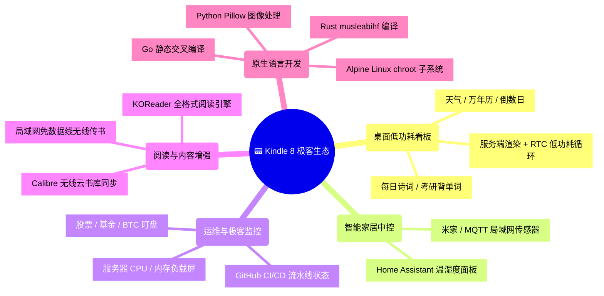

# Kindle 墨水屏 6 大开发方向与实战路线

> 💻 **官方开源代码仓库**：[github.com/Xepanda/kindle-geek-toolbox](https://github.com/Xepanda/kindle-geek-toolbox)（包含万年历、PC 监控副屏、AI 早报、无线传书与 KUAL 插件全套源码）。

随着 Wi-Fi SSH 与底层硬件控制的打通，Kindle 8 可以衍生出丰富多彩的物联网、嵌入式与极客改造项目：



---

## 1. 桌面智能天气与日历看板（黄金方案）

* **架构选型**：服务端渲染（Node.js Puppeteer 或 Python + Pillow）生成 800×600 PNG，Kindle 定时通过 `curl` 拉取并用 `eips -g` 刷新；
* **低功耗运行循环脚本 (`/mnt/us/dashboard/loop.sh`)**：
  ```bash
  #!/bin/sh
  INTERVAL=1800 # 30分钟更新一次

  while true; do
      # 1. 开启 Wi-Fi 芯片供电
      lipc-set-prop com.lab126.wifid enable 1
      sleep 8

      # 2. 拉取服务端渲染好的图片
      curl -s -m 20 "http://192.168.31.50:5000/render/weather.png" -o /tmp/view.png
      if [ -f /tmp/view.png ]; then
          eips -c
          eips -g /tmp/view.png
      fi

      # 3. 彻底断开 Wi-Fi 射频模块 (省电核心)
      lipc-set-prop com.lab126.wifid enable 0

      # 4. 设定 RTC 闹钟进入深度挂起 (Suspend to RAM)
      rtcwake -d /dev/rtc0 -m mem -s $INTERVAL
  done
  ```

---

## 2. 智能家居墨水屏中控 (Home Assistant)

* **应用场景**：玄关温湿度面板、桌面全屋智能中控；
* **实现方案**：
  * 通过局域网 REST API / MQTT 订阅传感器状态；
  * 使用 Python 脚本或 Node 服务将 Lovelace 极简墨水屏主题自动生成 800×600 灰度图推送到屏幕。

---

## 3. 服务器与 CI/CD 运维大屏

* **应用场景**：实时显示主力开发机、NAS 或 VPS 的负载；
* **实现方案**：
  * SSH 远程连接运行 Glances 终端监控；
  * 定时拉取 Prometheus / Uptime Kuma 监控指标，实时展示服务可用率与 GitHub Actions 编译流水线状态。

---

## 4. 全能电子书生态增强 (KOReader)

* **功能亮点**：
  * 全格式原生支持：EPUB、MOBI、AZW3、DJVU、CBZ 漫画、PDF；
  * 强大的 PDF 智能重排与双栏自动裁边算法；
  * 支持 Calibre 局域网云书库无线同步与 OPDS 协议。

---

## 5. 原生跨平台开发与交叉编译

Kindle 8 运行 32 位 ARMv7 Linux 系统，完美支持 Go、Rust 与 C/C++ 静态编译：

### 5.1 Go 语言极速交叉编译（最推荐）
```bash
# 一条命令生成 Kindle 原生零依赖二进制可执行文件
CGO_ENABLED=0 GOOS=linux GOARCH=arm GOARM=7 go build -ldflags="-s -w" -o my_app main.go

# 通过 SSH 传输到 Kindle 执行
scp my_app root@kindle:/mnt/us/
ssh kindle "chmod +x /mnt/us/my_app && /mnt/us/my_app"
```

### 5.2 Rust 交叉编译
```bash
# 目标架构 Target
cargo zigbuild --release --target armv7-unknown-linux-musleabihf
```

---

## 6. 十大改造玩法与 GitHub 开源项目精选

| 序号 | 改造方向 | 功能说明 | 核心技术方案 | 推荐 GitHub 开源项目 |
| :---: | :--- | :--- | :--- | :--- |
| **1** | **桌面天气/万年历看板** | 实时天气预报、农历节气、倒数日 | 服务端渲染 + RTC 深度低功耗 | • [mpetroff/kindle-weather-display](https://github.com/mpetroff/kindle-weather-display)<br/>• [scolby33/weather_kindle](https://github.com/scolby33/weather_kindle) |
| **2** | **Home Assistant 中控** | 全屋温湿度、空气质量、灯光状态 | HA REST API / 网页快照 | • [rbuisson/homeassistant-dashboard-kindle](https://github.com/rbuisson/homeassistant-dashboard-kindle) |
| **3** | **极客服务器运维监控屏** | CPU/内存负载、网络 IO 实时看板 | Kterm + Glances / API 轮询 | • [nicolargo/glances](https://github.com/nicolargo/glances)<br/>• [yuxiao1231/kindle-dashboard](https://github.com/yuxiao1231/kindle-dashboard) |
| **4** | **金融与股票/BTC 盯盘屏** | 实时大盘走势图、自选股盈亏 | Python 爬虫 + Pillow 绘图 | • [alexishida/kindle-dashboard](https://github.com/alexishida/kindle-dashboard) |
| **5** | **离线沉浸式写作机** | 无干扰终端码字、运行 Vim/Nano | Kterm 终端 + 局域网键盘桥接 | • [kterm](https://github.com/dsmid/kterm) |
| **6** | **全能阅读器增强** | 支持 EPUB / PDF 重排 / 双链笔记 | KOReader 引擎 (LuaJIT) | • [koreader/koreader](https://github.com/koreader/koreader) |
| **7** | **无线传书与文件管理器** | 网页端免数据线拖拽传书 | Go / Python 嵌入式 Web 传输 | • [mzlogin/kual-wifi-transfer](https://github.com/mzlogin/kual-wifi-transfer) |
| **8** | **自定义锁屏与动态壁纸** | 随心更换名言警句、背单词封面 | ScreenSavers Hack 插件 | • [mzlogin/kual-screensaver-sync](https://github.com/mzlogin/kual-screensaver-sync) |
| **9** | **低刷新电脑副屏/参考屏** | 显示代码文档、API 手册缓解疲劳 | VNC Client 映射电脑屏幕 | • [everydayanchovies/eink-vnc](https://github.com/everydayanchovies/eink-vnc) |
| **10** | **复古交互文字游戏机** | 运行 Z-Machine 互动小说与国际象棋 | C/C++ 静态移植 | • Frotz 互动小说引擎<br/>• Gnuchess 国际象棋 |
