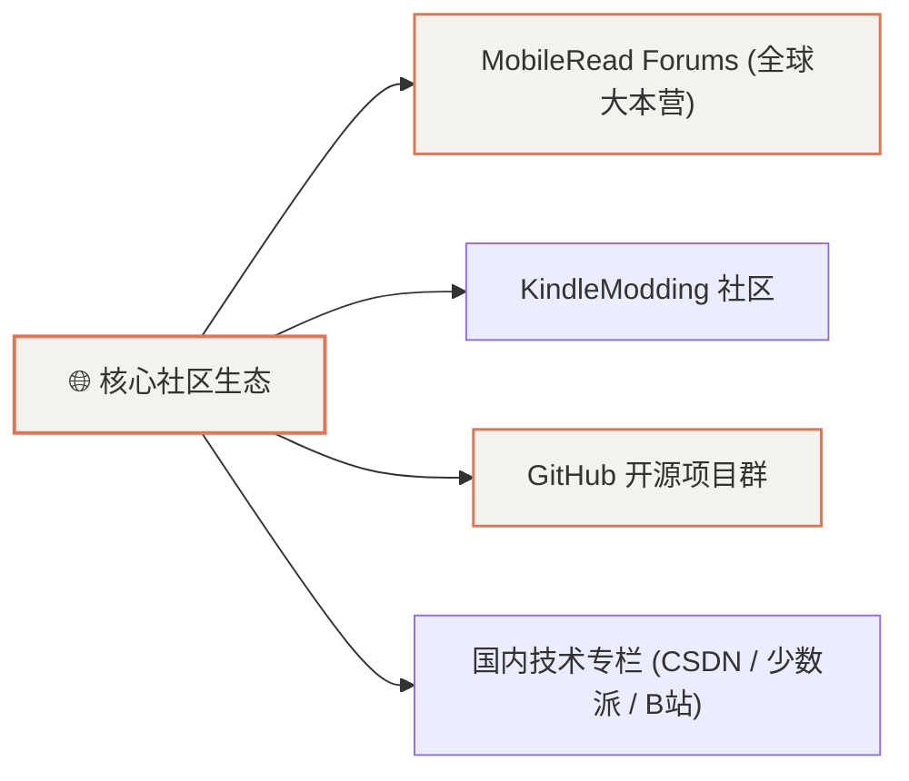

# Kindle 极客开发资源汇总与社区链接

本篇汇总了 Kindle 8 (KT3) 越狱、底层工具链、常用软件包下载镜像与全球极客社区的核心参考链接。

---

## 1. 国际极客核心论坛与官方发布页

* **[MobileRead 官方论坛 (Kindle Developer Corner)](https://www.mobileread.com/forums/forumdisplay.php?f=150)**
  * 全球最大的 Kindle 越狱与逆向工程大本营。
* **[NiLuJe's Kindle Hacks & Tools 官方构建发布贴](https://www.mobileread.com/forums/showthread.php?t=225030)**
  * 包含最新版 **MRPI**、**USBNetwork**、**KUAL**、**Python 3**、**FBInk**、**Kterm**、**ScreenSavers** 与工具链的每日自动构建快照。
* **[KUAL: Kindle Unified Application Launcher 官方发布页](https://www.mobileread.com/forums/showthread.php?t=203380)**
  * 适用于各版本固件的 KUAL Booklet 与启动器合集。
* **[KindleModding 社区维基](https://kindlemodding.org/)**
  * 涵盖 Kindle 越狱方案（LanguageBreak / WatchThis / WinterBreak）与防变砖安全指南。

---

## 2. 国内优质实战参考与技术专栏

* **[CSDN - Kindle 8 越狱、SSH 配置与墨水屏看板开发实战专栏](https://blog.csdn.net/)**
  * 记录国内 Wi-Fi 环境配置、小米/华为路由器 AP 隔离规避、局域网免密登录与天气看板部署细节。
* **[少数派 (sspai) - 旧物改造：将吃灰的 Kindle 变为桌面时钟与天气看板](https://sspai.com/)**
  * 介绍服务端 Node.js / Python 渲染与低功耗 RTC 唤醒架构的高颜值实现方案。
* **[书伴 (BookFere) - Kindle 越狱与插件专题教程](https://bookfere.com/)**
  * 详尽的中文版越狱术语字典、固件版本对照表与常见报错排查。

---

## 3. 核心工具包与离线下载清单

| 工具包名称 | 最新版本 | 核心用途 | 官方直链 / 来源 |
| :--- | :--- | :--- | :--- |
| **`kual-mrinstaller`** | `1.7.N` | MRPI 底层离线插件安装器 | [MobileRead NiLuJe Snapshots](https://www.mobileread.com/forums/showthread.php?t=225030) |
| **`KUAL Booklet`** | `v2.7+ (Coplate)` | 5.14+ 固件不白屏的图形插件桌面 | [KUAL GitHub Releases](https://github.com/NiLuJe/KUAL) |
| **`USBNetwork`** | `0.22.N` | Wi-Fi / USB SSH 与 SFTP 远程服务 | [MobileRead USBNetwork Thread](https://www.mobileread.com/forums/showthread.php?t=225030) |
| **`Python 3`** | `3.9.N (NiLuJe)` | 包含 Pillow、requests、py-fbink | [NiLuJe Snapshots](https://www.mobileread.com/forums/showthread.php?t=225030) |
| **`FBInk`** | `v1.25.N` | 高性能 Direct Framebuffer 墨水屏绘制库 | [NiLuJe/FBInk GitHub](https://github.com/NiLuJe/FBInk) |
| **`KOReader`** | 最新稳定版 | 全格式 EPUB/PDF 极致排版阅读器 | [koreader/koreader](https://github.com/koreader/koreader) |

---

## 4. 固件历史镜像与官方安全归档

* **Amazon 官方固件更新日志库**：用于查询 Kindle 8 (KT3) 的各个版本发布时间与特性；
* **防升级建议**：越狱设备切记**保留 `update.bin.tmp.partial` 占位锁**与已屏蔽的 `otad.bak` 进程，防止自动推送新固件破坏越狱环境。
