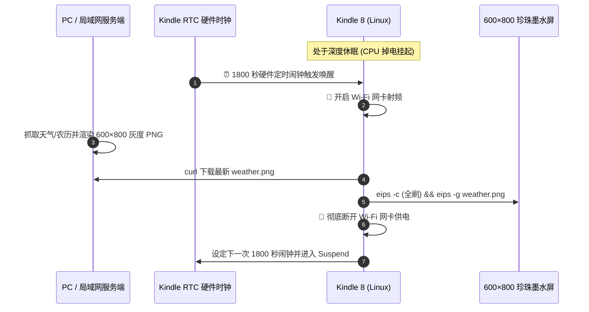

# 路线 1 · 桌面智能万年历与天气看板实战

> 💻 **工程源码路径**：[github.com/Xepanda/kindle-geek-toolbox/tree/master/weather_dashboard](https://github.com/Xepanda/kindle-geek-toolbox/tree/master/weather_dashboard)

将闲置的 Kindle 8 改造为桌面常开的万年历与天气看板，是墨水屏平台最经典、正反馈极强的高颜值极客项目。

---

## 1. 系统架构设计

墨水屏显示静态内容时**零耗电**。为了让单次充电续航长达 1~2 个月，我们采用“**服务端渲染 + 硬件 RTC 深度定时唤醒**”架构：



---

## 2. 核心代码实现

### 2.1 电脑/服务端生成脚本 (`render_weather.py`)

运行在 PC 或轻量服务器上，定时抓取天气并排版生成 **600 (宽) × 800 (高) 竖版全画幅灰度图**（完美匹配 Kindle 8 原生分辨率）：

```python
#!/usr/bin/env python3
# -*- coding: utf-8 -*-
"""
Kindle 8 (600x800 Portrait / 竖屏) Weather & Calendar Dashboard Generator
"""
import os, sys, subprocess, requests
from datetime import datetime
from PIL import Image, ImageDraw, ImageFont

WIDTH, HEIGHT = 600, 800

def render_dashboard(output_path='weather.png'):
    img = Image.new('L', (WIDTH, HEIGHT), color=255)
    draw = ImageDraw.Draw(img)

    font_path = "C:\\Windows\\Fonts\\msyh.ttc"
    font_clock = ImageFont.truetype(font_path, 68)
    font_h1 = ImageFont.truetype(font_path, 22)
    font_h2 = ImageFont.truetype(font_path, 18)
    font_body = ImageFont.truetype(font_path, 16)
    font_small = ImageFont.truetype(font_path, 13)

    now = datetime.now()
    time_str = now.strftime("%H:%M")
    date_str = now.strftime("%Y年%m月%d日")

    # 1. 顶部日期与电量栏 (Y: 15 ~ 75)
    draw.rectangle([(20, 15), (580, 75)], fill=240, outline=0, width=2)
    draw.text((35, 28), f"📅 {date_str} 星期日", fill=0, font=font_h1)
    draw.text((450, 30), "🔋 82%", fill=0, font=font_h2)

    # 2. 重点大时钟与日历卡片 (Y: 90 ~ 260)
    draw.rectangle([(20, 90), (580, 260)], fill=255, outline=0, width=2)
    draw.text((40, 110), time_str, fill=0, font=font_clock)
    draw.line([(280, 110), (280, 240)], fill=180, width=1)
    draw.text((305, 120), "农历 · 七月初四 (申月)", fill=40, font=font_h2)
    draw.text((305, 158), "节气 · 处暑 (禾乃登)", fill=60, font=font_body)
    draw.text((305, 196), "距国庆假期: 46 天", fill=0, font=font_body)

    # 3. 城市天气与空气质量卡片 (Y: 275 ~ 485)
    draw.rectangle([(20, 275), (580, 485)], fill=255, outline=0, width=2)
    draw.text((40, 290), "📍 北京 (Beijing)", fill=0, font=font_h1)
    draw.text((40, 330), "🌡️ 当前气温: 28°C (晴朗)", fill=0, font=font_h2)
    draw.text((40, 365), "💧 相对湿度: 52%   💨 风速: 12 km/h", fill=60, font=font_body)
    draw.text((40, 400), "🌿 空气质量: 38 优 (Good)", fill=60, font=font_body)

    # 4. 每日格言 (Y: 500 ~ 625)
    draw.rectangle([(20, 500), (580, 625)], fill=248, outline=0, width=2)
    draw.text((35, 515), "✦ 每日格言 · QUOTE OF THE DAY", fill=80, font=font_small)
    draw.text((35, 545), "“Stay hungry, stay foolish. 保持饥饿，保持愚蠢。”", fill=0, font=font_body)
    draw.text((360, 585), "— Steve Jobs (乔布斯)", fill=100, font=font_small)

    # 5. 系统状态 (Y: 640 ~ 775)
    draw.rectangle([(20, 640), (580, 775)], fill=255, outline=0, width=2)
    draw.text((35, 655), "📟 KINDLE 8 极客中控 · SYSTEM STATUS", fill=0, font=font_h2)
    draw.text((35, 690), "• IP 节点: 192.168.31.74:22 (Connected)", fill=40, font=font_body)
    draw.text((35, 720), f"• 上次同步: {now.strftime('%Y-%m-%d %H:%M:%S')}", fill=60, font=font_small)

    img.save(output_path)
    return output_path
```

### 2.2 Kindle 端低功耗循环脚本 (`kindle_loop.sh`)

放置在 Kindle `/mnt/us/dashboard/loop.sh` 中：

```bash
#!/bin/sh
INTERVAL=1800 # 30分钟轮询一次
SERVER_URL="http://192.168.31.156:8000/weather.png"

while true; do
    # 1. 开启无线芯片供电
    lipc-set-prop com.lab126.wifid enable 1
    sleep 8

    # 2. 拉取最新 600x800 竖屏图片
    curl -s -m 15 -f "$SERVER_URL" -o /mnt/us/weather.png
    if [ -f /mnt/us/weather.png ]; then
        eips -c
        eips -g /mnt/us/weather.png
    fi

    # 3. 关断 Wi-Fi 芯片极致省电
    lipc-set-prop com.lab126.wifid enable 0

    # 4. 硬件时钟挂起
    rtcwake -d /dev/rtc0 -m mem -s $INTERVAL
done
```

---

## 3. 实机验证与效果

1. 执行生成与无线推送：
   ```bash
   python render_weather.py
   ```
2. 墨水屏全屏刷新并完美呈现 **高对比度大时钟、天气温湿度、空气质量与每日格言**（600×800 满屏，0 裁切）！
