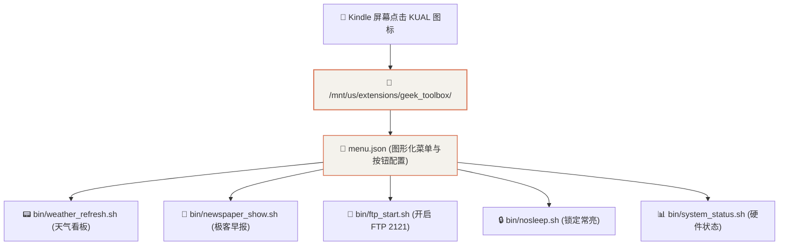

# 路线 5 · Kindle 本地脱机 KUAL 极客工具箱实战

真正的极客设备必须具备 **100% 本地脱机独立运行** 的能力。我们将所有开发的功能封装成标准的 **KUAL 图形插件**，无需打开电脑，手指在 Kindle 屏幕上点击即可直接调用！

---

## 1. KUAL 插件架构与目录规范

KUAL 插件遵循标准的 JSON 菜单与 Shell 动作解耦模型，统一存放于 `/mnt/us/extensions/`：



---

## 2. 菜单定义与动作脚本

### 2.1 菜单配置文件 (`menu.json`)

```json
{
  "items": [
    {
      "name": "极客工具箱 (Geek Toolbox)",
      "priority": 1,
      "items": [
        {
          "name": "📟 显示万年历与天气看板",
          "priority": 1,
          "action": "./bin/weather_refresh.sh",
          "exitmenu": true
        },
        {
          "name": "📰 显示极客每日晨报",
          "priority": 2,
          "action": "./bin/newspaper_show.sh",
          "exitmenu": true
        },
        {
          "name": "📁 开启无线传书 FTP 服务 (2121)",
          "priority": 3,
          "action": "./bin/ftp_start.sh",
          "exitmenu": false
        },
        {
          "name": "🛑 停止无线传书 FTP 服务",
          "priority": 4,
          "action": "./bin/ftp_stop.sh",
          "exitmenu": false
        },
        {
          "name": "🔒 锁定常亮 (防止黑屏休眠)",
          "priority": 5,
          "action": "./bin/nosleep.sh",
          "exitmenu": false
        },
        {
          "name": "🔓 恢复自动休眠锁屏",
          "priority": 6,
          "action": "./bin/sleep.sh",
          "exitmenu": false
        },
        {
          "name": "📊 查看设备硬件与网络状态",
          "priority": 7,
          "action": "./bin/system_status.sh",
          "exitmenu": true
        },
        {
          "name": "✨ 全屏反转清除墨水屏残影",
          "priority": 8,
          "action": "./bin/screen_clear.sh",
          "exitmenu": false
        }
      ]
    }
  ]
}
```

---

## 3. 脱机使用体验

1. 打开 Kindle 桌面上的 **KUAL 图标**；
2. 点击 **【极客工具箱 (Geek Toolbox)】** 进入二级菜单；
3. 直接手指点选功能，Kindle 会在后台执行对应的 Shell 脚本并在屏幕上即时反馈，完全脱离对 PC 电脑的依赖！
