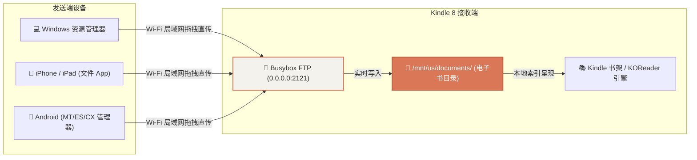

# 专题 · 局域网免数据线传书全平台实战指南

频繁插拔 Kindle 的 Micro-USB 接口容易导致接口磨损或松动。基于我们部署在 Kindle 原生 Busybox 上的 **匿名无线 FTP 传书服务（端口 2121）**，在局域网内任意手机与电脑均可像访问本地移动硬盘一样极速拖拽传书！

---

## 1. 核心工作原理



---

## 2. 第一步：在 Kindle 屏幕上一键启动服务

1. 打开 Kindle 主屏幕上的 **【KUAL】** 图标；
2. 点击 **【Helper+】** $\rightarrow$ **【⚡ 极客工具箱 ⚡】**；
3. 点击 **【📁 开启无线传书 (端口2121)】**；
4. 屏幕顶部出现状态提示，代表 FTP 守护进程已就绪。

---

## 3. 各终端操作步骤

### 3.1 💻 Windows 电脑端（最爽、最快）

无需安装任何第三方 FTP 软件，使用 Windows 自带的 **文件资源管理器** 即可：

1. 按下快捷键 `Win + E` 打开电脑上的任意文件夹；
2. 点击窗口顶部的 **地址栏**（平时显示 `此电脑 > D盘` 的输入框）；
3. 输入以下连接地址并按下回车：
   ```text
   ftp://192.168.31.74:2121/
   ```
4. 窗口中会瞬间展示 Kindle 书库内部的全部电子书；
5. 直接用鼠标将电脑上的 `.epub`、`.mobi`、`.pdf`、`.azw3`、`.txt` 电子书文件 **复制粘贴或拖拽** 扔进窗口；
6. 传输速度跑满 Wi-Fi 物理速率（每秒 3~8MB），极速秒传！

---

### 3.2 📱 苹果 iOS 端（iPhone / iPad）

利用 iOS 原生自带的 **“文件 (Files)”** App 即可实现直连：

1. 打开 iPhone 自带的 **【文件】** App；
2. 点击屏幕右上角的 **`···`** 图标 $\rightarrow$ 选择 **【连接服务器】**；
3. 服务器地址输入：
   ```text
   ftp://192.168.31.74:2121
   ```
4. 点击右上角【连接】，选择 **【客人 (Guest)】** 模式登录；
5. 在手机上下载的书籍，直接点击“共享/移动”即可存入 Kindle 书库！

---

### 3.3 📱 安卓 Android 端

支持任意具备局域网 FTP 功能的文件管理器（如 **MT 管理器**、**CX 文件管理器**、**Solid Explorer**）：

1. 打开文件管理器 $\rightarrow$ 切换至 **【网络 / 局域网 / 本地网络】**；
2. 点击 **【新建连接】** $\rightarrow$ 选择 **【FTP】**；
3. 配置参数：
   * **服务器 / 主机**：`192.168.31.74`
   * **端口**：`2121`
   * **身份验证**：勾选“匿名登录 (Anonymous)”；
4. 点击保存并连接，即可随意双向传输文件。

---

## 4. 传书完毕后的省电处理

传输完成后，在 Kindle 屏幕上点击 **【🛑 停止无线传书服务】**，Kindle 会自动杀死后台 `tcpsvd` 与 `ftpd` 进程，设备回归极致省电休眠状态。
