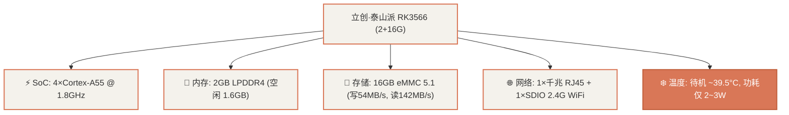
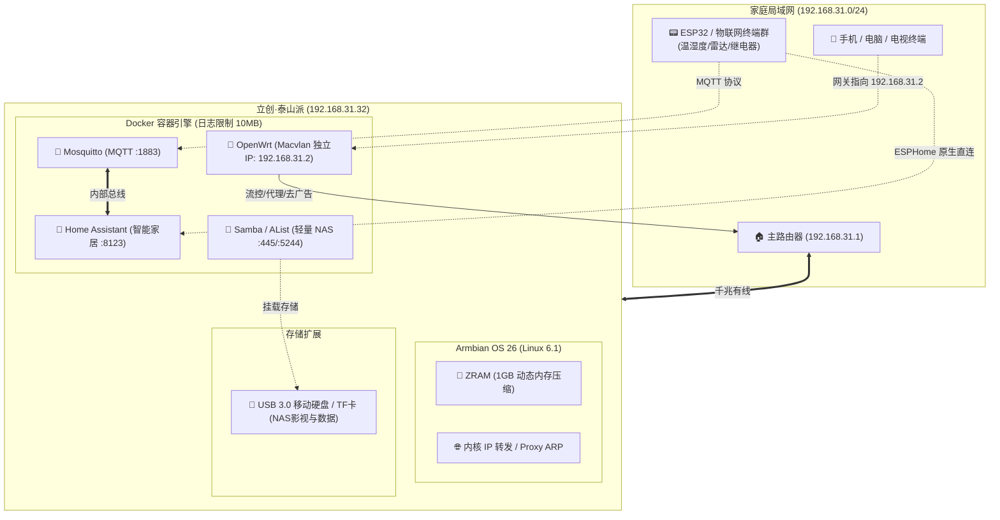

# 泰山派 RK3566 (2+16G) 硬件实测与 All-in-One 架构设计

本篇记录了对**立创·泰山派（Rockchip RK3566，2GB RAM + 16GB eMMC）**在刷入 Ophub Armbian 26.08.0 (Debian 13 Trixie) 系统后的底层深度性能体检与 **MQTT + Home Assistant + 轻量 NAS + Docker 旁路由** 四合一 All-in-One 架构设计。

---

## 1. 硬件规格与实测性能数据

通过对板载硬件的底层探测与压力测速，关键硬件指标如下：

### 1.1 实测基准数据汇总表

| 硬件模块 | 实测底层参数 | 评估结论 |
| :--- | :--- | :--- |
| **SoC / CPU** | Rockchip RK3566 (4-core A55 @ 408MHz~1800MHz) | 四核多任务调度能力充裕，日常 4 合一待机负载 `< 8%` |
| **内存 (RAM)** | 2GB LPDDR4（系统底模占用 ~150MB，剩余 ~1.6GB） | 需开启 ZRAM 压缩扩容，杜绝多容器突发 OOM |
| **内置存储** | 16GB eMMC (HS200 MMC)，实测写入 **53.9 MB/s**，读取 **142 MB/s** | 适合部署 Docker 镜像与容器，NAS 数据需外挂存储 |
| **网络接口** | 单口千兆 RTL8211F (1000M Full Duplex) + SDIO WiFi | 单网口适合 **Macvlan 旁路由**，无需双网口改装 |
| **操作系统** | Armbian 26.08.0 trixie (Debian 13)，内核 Linux `6.1.141-rk35xx` | 内核原生开启 `cgroup_memory` / `swapaccount`，容器支持极佳 |

---

## 2. All-in-One 四合一整体架构设计

由于泰山派为单网口设计且内置 16GB eMMC，架构设计需遵循**轻量化、容器化、旁路化、存储外挂**原则。

---

## 3. 资源开销与容量测算模型

| 组件 | 部署形态 | 预估 RAM 消耗 | 镜像与持久化存储 | CPU 占用 (日常) |
| :--- | :--- | :--- | :--- | :--- |
| **Armbian 系统** | Linux Headless | ~150 MB | ~1.7 GB (已安装) | 0.5% |
| **Mosquitto** | Docker C 原生容器 | ~15 MB | ~15 MB | < 0.1% |
| **Home Assistant** | Docker 官方镜像 | ~380 MB | ~1.6 GB + 1GB DB | 1.5% ~ 3% |
| **OpenWrt 旁路由** | Docker Macvlan 模式 | ~120 MB | ~150 MB | 1% ~ 4% |
| **Samba / AList** | 容器/原生轻量服务 | ~40 MB | ~100 MB (数据走外置) | 0.5% |
| **Docker 守护进程** | containerd + dockerd | ~80 MB | ~200 MB | 0.5% |
| **合计** | **四合一全量运行** | **~785 MB** | **~4.8 GB** | **~5% - 8%** |
| **硬件物理余量** | 2GB RAM / 16GB eMMC | **剩余 ~1.2 GB** | **剩余 ~7.5 GB** | **算力极其富余** |

---

## 4. ESP32 物联网接入双模式说明

针对 ESP32 物联网节点与泰山派智能中枢的通讯，支持两种互补的连接模式：

1. **MQTT 模式（传统标准化协议）**：
   * ESP32 运行 Arduino C++ / Tasmota，发布温湿度或继电器状态到 `192.168.31.32:1883`；
   * Home Assistant 配置 MQTT 集成自动订阅与双向控制。
2. **ESPHome 模式（HA 原生最佳拍档）**：
   * ESP32 烧录 ESPHome 固件，基于局域网 Native API (TCP :6053) 与 HA 直连；
   * 无需手动维护 MQTT Topic，HA 自动发现实体，支持 OTA 在线一键升级固件。
