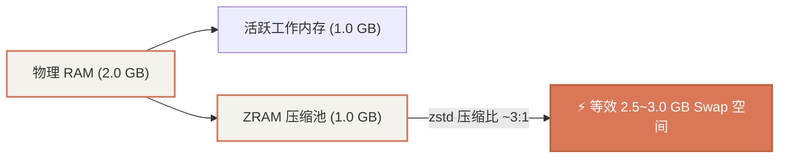

# 系统底层优化：镜像源换源、ZRAM 内存压缩与内核网络调优

在部署 Docker 容器前，必须对 Armbian 系统进行底层基准调优，重点解决**软件下载速度、物理内存防爆（OOM）、旁路由数据包转发支持、eMMC 寿命保护**等核心问题。

---

## 1. APT 软件源配置（中科大 / 清华镜像）

Armbian 26 (Debian 13 Trixie) 采用了最新的 Deb822 格式（`.sources` 文件）。我们将 Debian 与 Armbian 软件源切换至国内高速镜像：

### 1.1 配置 `/etc/apt/sources.list.d/debian.sources`
```ini
Types: deb
URIs: http://mirrors.ustc.edu.cn/debian
Suites: trixie trixie-updates trixie-backports
Components: main contrib non-free non-free-firmware
Signed-By: /usr/share/keyrings/debian-archive-keyring.gpg

Types: deb
URIs: http://mirrors.ustc.edu.cn/debian-security
Suites: trixie-security
Components: main contrib non-free non-free-firmware
Signed-By: /usr/share/keyrings/debian-archive-keyring.gpg
```

### 1.2 配置 `/etc/apt/sources.list.d/armbian.sources`
```ini
Types: deb
URIs: http://mirrors.ustc.edu.cn/armbian
Suites: trixie
Components: main trixie-utils trixie-desktop
Signed-By: /usr/share/keyrings/armbian-archive-keyring.gpg
```

执行更新：
```bash
apt-get update
```

---

## 2. 内核网络与路由参数优化 (`sysctl`)

软路由与 Docker Macvlan 模式必须依赖内核的数据包路由转发能力与 Proxy ARP：

```bash
cat << 'EOF' > /etc/sysctl.d/99-router-docker.conf
# 开启 IPv4 与 IPv6 内核数据转发（软路由/旁路由核心）
net.ipv4.ip_forward = 1
net.ipv4.conf.all.forwarding = 1
net.ipv4.conf.default.forwarding = 1
net.ipv4.conf.all.proxy_arp = 1
net.ipv4.conf.default.proxy_arp = 1
net.ipv6.conf.all.forwarding = 1
net.ipv6.conf.default.forwarding = 1

# 网桥与防火墙过滤优化
net.bridge.bridge-nf-call-iptables = 1
net.bridge.bridge-nf-call-ip6tables = 1

# 文件监听句柄扩容（防止 Home Assistant / Node.js 句柄耗尽）
fs.inotify.max_user_watches = 524288
fs.inotify.max_user_instances = 8192
EOF

# 使配置立即生效
sysctl --system
```

---

## 3. 启用 ZRAM 动态压缩内存（防 OOM 救命神器）

泰山派物理内存为 2GB。当同时启动 Docker、Home Assistant 与 OpenWrt 时，突发加载可能导致系统 OOM（内存溢出）被内核强杀进程。

通过 `zram-tools` 将部分物理内存作为高速压缩 Swap（采用 `zstd` 算法，压缩比约 2.5:1 ~ 3:1），等于将 2GB 物理内存等效扩容至 **3.2GB+**，且几乎无性能损耗。



### 3.1 安装与配置步骤
```bash
apt-get install -y zram-tools

cat << 'EOF' > /etc/default/zramswap
# 为 2GB 内存分配 50% 的 ZRAM 动态压缩池
ALGO=zstd
PERCENT=50
PRIORITY=100
EOF

systemctl restart zramswap
systemctl enable zramswap
```

### 3.2 验证 ZRAM 状态
```bash
zramctl
swapon --show
free -h
```
预期输出：存在名为 `/dev/zram0` 的交换空间，大小约 `984M`，算法为 `zstd`。
